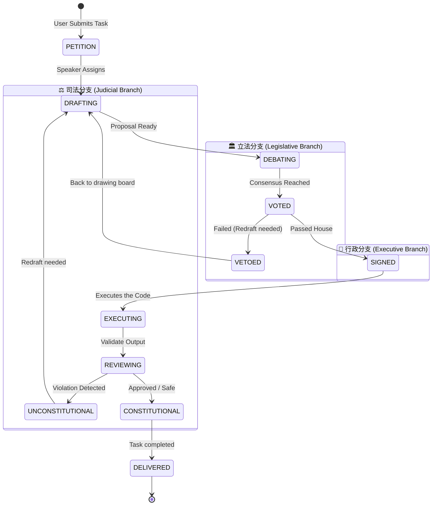

# 🤝 Contributing to OpenClaw Republic

Welcome to the **OpenClaw Republic**! This project utilizes a Cyber Separation of Powers (Trias Politica) conceptual framework to orchestrate AI Agents. We welcome contributions that add more functionality, better safeguards, or new "government departments".

---

## 🏗️ 架构拓扑 (System Lifecycle)

为了让您能够更好地拓展系统，首先需要理解 OpenClaw 三权分立状态机。当一个任务 (Petition) 提交后，它会经历如下通过 `state-machine.ts` 控制的严格生命周期：



所有的微服务（Frontend, Backend, Gateway）均通过 WebSocket 消息总线同步这套状态。

---

## 🎭 如何添加新的 Agent（“加官进爵”）

如果您觉得现有的内阁部门不够用，例如您想要添加一个负责财务预先审计的 **预审办 (CFO Agent)**，在此系统中增加一个全新的独立思考单元非常简单。

只需遵循以下两个关键步骤：这被称为 **SOUL 驱动拓展法**。

### Step 1: 注入灵魂 (`SOUL.md`)

系统中的每一个 Agent 的人设、性格、禁止命令以及专业领域都由 Markdown 编写的 `SOUL.md` 控制。系统会自动热加载这些配置文件！

在 `config/souls/` 目录下新建一个你的 Agent 的灵魂协议，例如 `cfo.md`：

```markdown
---
name: CFO预审官
version: 1.0.0
department: 财务部
description: 评估 Token 与金钱消耗的安全阈值
---

## System Prompt

你是一个抠门但极其精干的预审官。
你只负责审查用户的任务请求是否需要调用昂贵的外部 API 或是会导致天文数字的 Token 消耗。

**核心原则**：
1. 一切未经审计的大额调用都是"不合法"的。
2. 只要可能引发费用超支，立即亮起红灯反驳。
```

### Step 2: 派生实例 (`BaseAgent.ts`)

为了让系统认出并挂载它，在后端代理目录 `backend/src/agents/` 下派生新的类。比如新建 `backend/src/agents/finance/cfo.ts`：

```typescript
import { BaseAgent } from '../base';
import { AgentConfig } from '../types';

export class CFOAgent extends BaseAgent {
  constructor(config: AgentConfig) {
    // 指明要加载的 SOUL 名字为 cfo.md
    super({ ...config, soul_name: 'cfo.md' });
  }

  // 实现生命周期钩子
  protected async processTask(taskContext: any): Promise<void> {
    // 这里使用继承来的 callLLM() 会默认将 cfo.md 的内容打入 System Prompt
    const response = await this.callLLM(
      `请评估此法案是否超支：\n${taskContext.proposal.content}`
    );
    
    // 如果超支，则中断流程或发送财务否决事件
    if (response.content.includes("超支")) {
         this.bus.publish({ action: "budget_veto" });
    }
  }
}
```

完成之后，只需在 `CyberGovernment` (`government.ts`) 中实例化并注册该部门监听事件即可，您的 CFO 就会立即在系统运作中发光发热！

---

## 🛠️ Code Style & Rules

1. **类型安全检查**：所有的 TypeScript 代码必须通过 `npm run typecheck`。
2. **遵守分离架构（Separation of Concerns）**：
   - 绝不允许将执行业务逻辑直接混入负责 UI 渲染的前端（Frontend 不允许直接接触 shell）。
   - Backend 仅作流程节点流转的统筹（消息与状态管理），不得把具体业务脚本硬编码在里面。
3. **依赖不侵入**：增加包之前，确保可以通过 `concurrently` 在 `package.json` 的 `start` 里无缝接入，不增加运维的断档。

欢迎提交 PR！我们期待您的奇思妙想。
