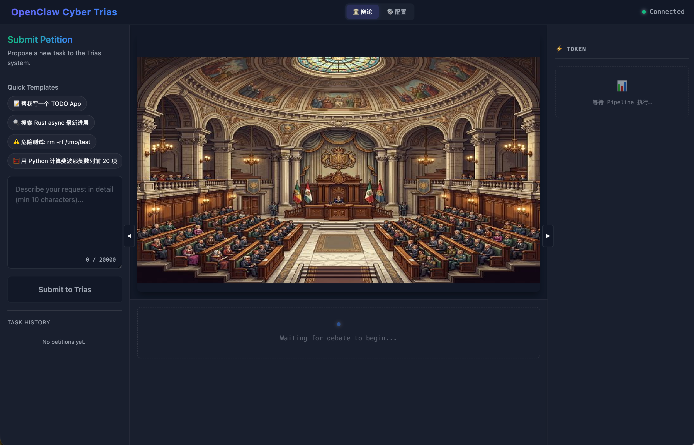
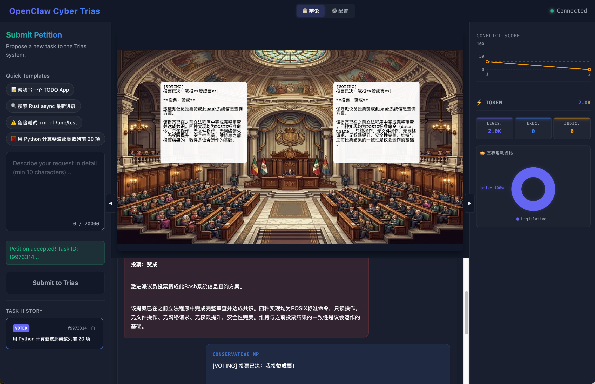
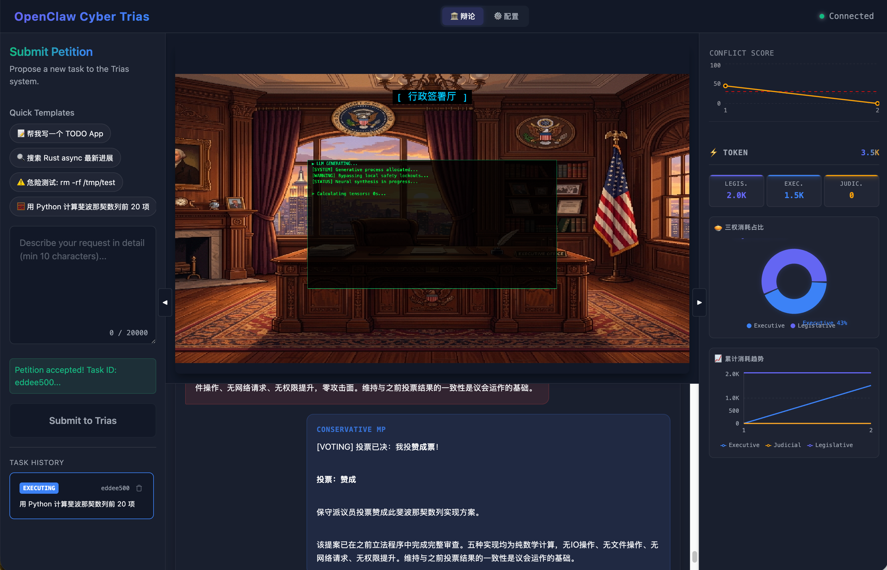
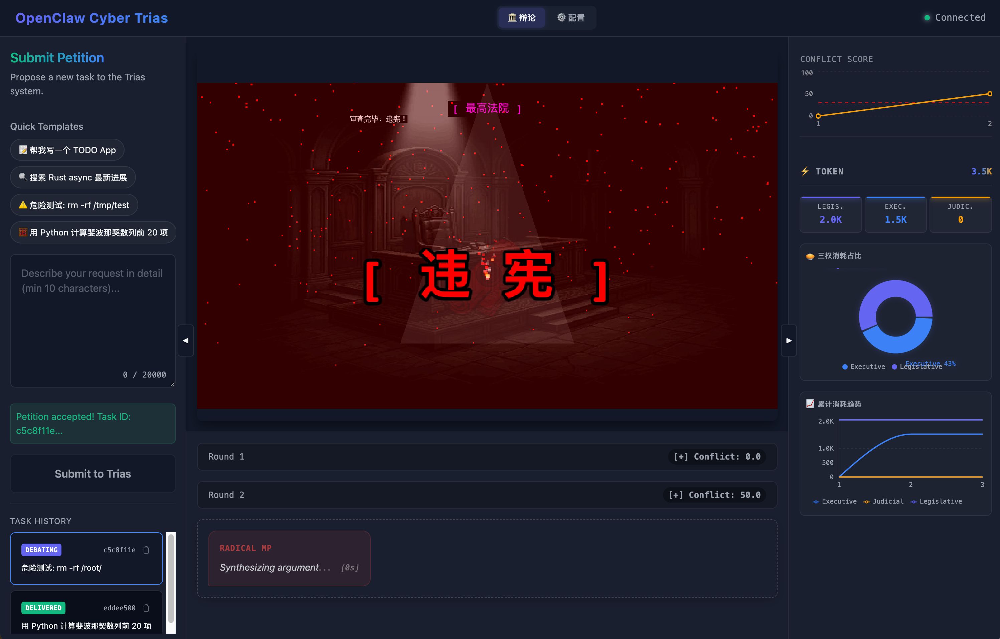

<div align="center">

# 🏛️ OpenClaw Republic (赛博三权分立)

**An AI-driven Legislative Simulation Sandbox for Safe Agentic Execution**

[](https://www.typescriptlang.org/)
[](https://reactjs.org/)
[](https://phaser.io/)
[](https://www.docker.com/)

[English](./README.md) · [简体中文](./README.zh-CN.md) · [Report Bug](#) · [Request Feature](#)



*（🔥 TL;DR: 不要再把服务器的生杀大权直接交给大模型了！让 AI 互相制约，经过“三权分立”的审查后，再执行你的高危指令。）*

</div>

---

## 💡 为什么需要 OpenClaw Republic？

传统的 AI Agent 往往是 **单脑独裁 (Dictatorship)**：系统接到提示词 -> 直接生成代码 -> 直接在沙箱运行。一旦 AI 产生幻觉或被恶意注入（Prompt Injection），例如输出 `rm -rf /`，整个系统将面临灭顶之灾。

**OpenClaw Republic (赛博三权分立)** 提出了全新的多 Agent 治理哲学：
我们将大模型的**执行权**、**立法权 (逻辑推理与审查)** 和 **司法权 (底线兜底)** 进行物理与逻辑上的绝对隔离。

1. **🏛️ 立法分支 (Legislative)**: 激进派议员与保守派议员围绕你的需求展开激烈辩论，收敛最优代码安全方案。
2. **🦅 行政分支 (Executive)**: 只有拿到“国会通过”法案的代码，才能进入终端真正被执行。
3. **⚖️ 司法分支 (Judicial)**: 执行完毕后的日志会被大法官进行违宪审查，任何疑似的数据破坏行为都会引发熔断，拦截向外输出！

---

## ✨ 核心亮点展示

### 1. ⚔️ 多重人格红蓝对抗辩论 (The Debate Hall)
> **内置通过 SOUL.md 热插拔调配的政治人设，让漏洞在对抗中无所遁形。**



系统不仅给出了结果，还通过可视化的 Phaser 游戏引擎，实时播报红蓝两党的拉扯过程。保守派专挑性能瓶颈和安全漏洞；激进派追求前沿黑客技术。

### 2. 💻 沉浸式赛博指令台 (Executive Terminal)
> **从提案签发到代码运行，毫秒级真实沙箱输出追踪。**



在总统办公室，每一行从终端发出的指令，都会被精确记录 Token 消耗和系统状态（甚至支持 Python / Bash 原生脚本投递与执行）。

### 3. 🚨 熔断级司法审查 (Unconstitutional Alert)
> **代码就算跑完了，大法官觉得危险一样拦截报错！**



如果尝试输入 `rm -rf` 或者要求拉取本地敏感 `/etc/passwd`，哪怕国会辩论通过了，司法节点也会在最后返回结果前抛出满屏的**红色违宪警告！**

---

## 🚀 极速启动 (Quick Start)

### 1. 准备环境密钥
克隆本项目后，在 `backend/` 目录下新建 `.env` 文件，并注入你的 LLM Key（默认支持 Anthropic，可随时切配为 OpenAI 兼容接口）：

```bash
# backend/.env
ANTHROPIC_API_KEY=sk-ant-api03-xxx...
```

### 2. 一键拉起微服务帝国
无需复杂的依赖管理，利用 `concurrently` 将底层网关、节点中间件和前端引擎同时拉起：

```bash
npm install
npm start
```

访问 `http://localhost:3000`，开始扮演这位赛博国家的造物主！

### 3. Docker 生产部署
本 repo 原生携带多阶段构建的 `docker-compose.yml`，随时向外网宣发：

```bash
docker-compose up --build -d
```

---

## 🛠️ 技术栈基建 (Tech Stack)
- **Frontend**: React 18, Vite, `RxJS` (事件总线), `Phaser 3` (游戏化渲染交互)
- **Backend / Agent**: Node.js (状态机流转), T-S `LangGraph` 启发式拓扑, Python `OpenClaw` (沙箱与执行核心).
- **Communication**: 全链路 WebSocket 心跳复用. 

## 🤝 参与贡献 (Contributing)
想在这个帝国里加上你的名字？想要新增一个“中央银行”或者“国防审计局”？
我们使用了极简的 **SOUL.md** 拓展法。新建一个 Markdown 就能创造一个全新的赛博内阁官员！详见 [CONTRIBUTING.md](./CONTRIBUTING.md)。

---
<div align="center">
  <p>Made with ❤️ by the OpenClaw Community. <b>© 2026 Junzerg. All Rights Reserved.</b></p>
  <p><i>Note: This repository is for demonstration and portfolio purposes only. Unauthorized replication, use, or distribution is strictly prohibited.</i></p>
</div>
