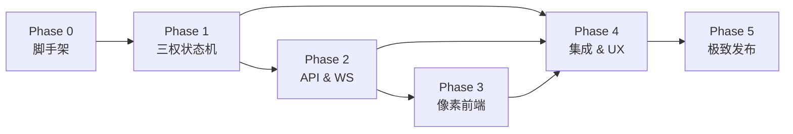

# OpenClaw Trias — 开发总体规划 (Development Master Plan)

> 基于 [PRD v1](file:///Users/junzerg/Projects/private/openclaw_trias/docs/prds/PRD_v1.md) 拆分的多阶段开发路线图。
> 每个 Phase 在后续会话中逐步细化并实施。

---

## Phase 0 · 项目脚手架 & 基础设施

**目标**：搭好项目骨架，让后续所有 Phase 有可运行的根基。

| 序号 | 工作项 | 说明 |
|------|--------|------|
| 0.1 | **Python 项目初始化** | 建 `pyproject.toml`、包结构 (`openclaw_trias/`)、开发依赖 (pytest, ruff, mypy) |
| 0.2 | **Monorepo 目录规划** | `backend/`、`frontend/`、`docs/`、`assets/`、`scripts/` 五大目录 |
| 0.3 | **Dev 工具链** | pre-commit、CI (GitHub Actions)、Docker Compose (开发环境一键启动) |
| 0.4 | **日志 & 配置系统** | structlog / loguru 统一日志；pydantic-settings 管理各分支 Agent 配置 |

**产出**：`pip install -e .` 可装、`pytest` 可跑、`docker compose up` 可启。

---

## Phase 1 · 后端核心：三权 Agent 状态机

**目标**：实现三个 Branch 的 Agent Persona、状态流转和协作协议。**这是整个系统的心脏。**

### 1.1 立法分支 (Legislative Branch)

| 序号 | 工作项 | 说明 |
|------|--------|------|
| 1.1.1 | **议长 Agent** | 流程编排器：接收用户 Prompt → 发起提案 → 控制辩论轮次 → 发起表决 |
| 1.1.2 | **激进派议员 Agent** | Persona: 追求效率、大胆方案；对保守派的批评进行 Rebuttal |
| 1.1.3 | **保守派议员 Agent** | Persona: 注重边界条件、安全处理；特别关注异常路径 |
| 1.1.4 | **议会辩论协议** | 多轮 Critique → Rebuttal → 共识 → 投票机制的状态机定义 |
| 1.1.5 | **《执行法案》Schema** | JSON Schema 定义法案格式：目标、步骤列表、工具调用声明、预估 Token |

### 1.2 行政分支 (Executive Branch)

| 序号 | 工作项 | 说明 |
|------|--------|------|
| 1.2.1 | **总统 Agent** | 接收法案 → 技术可行性评估 → 分发给内阁部长 → 行使否决权 (Veto) |
| 1.2.2 | **内阁部长 Agent(s)** | 按 Skill 类型路由：CodeExecution、FileOperations、WebSearch 等 |
| 1.2.3 | **执行引擎** | 执行法案中的步骤列表，管理 Token 预算，收集执行结果 |
| 1.2.4 | **Veto 机制** | Token 不足 / Skill 不可用时，总统否决并附理由打回立法分支 |

### 1.3 司法分支 (Judicial Branch)

| 序号 | 工作项 | 说明 |
|------|--------|------|
| 1.3.1 | **首席大法官 Agent** | 旁路监听行政动作，判定是否违宪 |
| 1.3.2 | **违宪规则引擎** | 可配置的规则集：危险命令检测 (`rm -rf`, `DROP TABLE`, etc.)、死循环检测、产出偏离度评估 |
| 1.3.3 | **物理熔断机制** | 违宪判定后中断执行、回滚状态、生成违宪理由报告，打回立法重做 |

### 1.4 三权协作总线

| 序号 | 工作项 | 说明 |
|------|--------|------|
| 1.4.1 | **消息总线** | 三分支间的异步消息传递协议 (内存队列即可，后续可扩展为 Redis/NATS) |
| 1.4.2 | **全局状态管理** | 法案生命周期状态机：`Draft → Debating → Voted → Executing → Reviewing → Done/Rejected` |
| 1.4.3 | **事件日志** | 所有 Agent 的 action 统一记录为结构化事件 (给 Phase 2、3 用) |

**产出**：纯命令行可运行的三权协作 demo。输入 Prompt → 议会辩论 → 法案通过 → 行政执行 → 司法审查 → 返回结果。

---

## Phase 2 · 通信桥接层 (API & WebSocket)

**目标**：将后端 Agent 的运行时状态暴露为 API 和实时流，供前端消费。

| 序号 | 工作项 | 说明 |
|------|--------|------|
| 2.1 | **FastAPI 应用骨架** | API 路由：`POST /task`（提交 Prompt）、`GET /task/{id}/status` |
| 2.2 | **WebSocket 端点** | `/ws/task/{id}` — 推送实时 Agent 事件流 |
| 2.3 | **事件序列化** | Phase 1 的事件日志 → PRD §4 定义的 JSON 消息格式 (`action`, `text`, `intensity` 等) |
| 2.4 | **会话管理** | 任务队列、并发控制、任务状态持久化 (SQLite / Redis) |
| 2.5 | **REST 查询 API** | 查询历史任务、法案内容、辩论记录、审判结果 |

**产出**：`curl` / Postman 可发 Prompt；`wscat` 可收到实时事件 JSON 流。

---

## Phase 3 · 像素演播厅前端 (Pixel Art Frontend)

**目标**：PRD 中的核心高光 — 将 Agent 行为映射为 8-bit 像素动画。

### 3.1 工程基础

| 序号 | 工作项 | 说明 |
|------|--------|------|
| 3.1.1 | **前端项目搭建** | Vite + React (TypeScript)；集成 Phaser.js 或 PixiJS 作为 2D 渲染引擎 |
| 3.1.2 | **WebSocket 客户端** | 连接 Phase 2 的 WS 端点，事件解析 → 渲染指令分发 |
| 3.1.3 | **场景管理器** | 三大场景 (议会/行政/法院) 切换引擎 |

### 3.2 场景实现

| 序号 | 工作项 | 说明 |
|------|--------|------|
| 3.2.1 | **🏛️ 议会大厅** | 左右对称议席、演讲台、信使动画、气泡打字机效果 |
| 3.2.2 | **议员吵架系统** | Lv1 正常辩论 → Lv2 扔纸团/皮鞋 (抛物线物理) → Lv3 议长控场 (屏幕震动 + ORDER!) |
| 3.2.3 | **🏢 行政格子间** | 总统签字盖章特效、部长敲键盘、代码流闪烁、报错冒烟 |
| 3.2.4 | **⚖️ 最高法院** | 聚光灯、法槌落下、合宪/违宪判定动画 |

### 3.3 美术资源

| 序号 | 工作项 | 说明 |
|------|--------|------|
| 3.3.1 | **Sprite Sheets** | 角色帧动画：议员(站/坐/说话/扔东西/变红)、总统、法官 |
| 3.3.2 | **场景背景** | 三大场景的像素画背景 Tilemap |
| 3.3.3 | **特效/道具** | 纸团、皮鞋、咖啡杯、卷轴、法槌、印章、火焰等 |
| 3.3.4 | **8-bit 音效** | 法槌敲击、扔东西碰撞、打字机、议会喧嚣等音效 |

**产出**：浏览器打开即为像素风演播厅，实时渲染 Agent 的辩论/执行/审判过程。

---

## Phase 4 · 集成、端到端串联 & UX 优化

**目标**：三层打通，全流程可跑，用户体验打磨。

| 序号 | 工作项 | 说明 |
|------|--------|------|
| 4.1 | **端到端集成测试** | 完整 Prompt → 辩论 → 执行 → 审判 → 前端动画 全链路验证 |
| 4.2 | **Prompt 输入 UI** | 用户输入面板：提交需求、查看任务状态 |
| 4.3 | **结果展示 UI** | 任务完成后的成果展示面板 (代码/文件/文本输出) |
| 4.4 | **辩论回放 & 日志** | 可点击查看每轮辩论/执行/审判的详细 CoT 日志 |
| 4.5 | **Token 仪表盘** | 实时展示各分支的 Token 消耗、执行耗时等指标 |
| 4.6 | **错误处理 & 重试** | 全链路异常处理：LLM 超时、API 限流、执行失败等 |

**产出**：一个完整可用的产品 — 既能跑任务，也好看。

---

## Phase 5 · 极致发布 (`import antigravity`)

**目标**：致敬 Python 极客精神，实现 PRD 的终极飞行体验。

| 序号 | 工作项 | 说明 |
|------|--------|------|
| 5.1 | **极简启动脚本** | `from openclaw_trias import CyberParliament` → `CyberParliament.launch(port=8080)` |
| 5.2 | **一键部署** | Docker Compose 包含后端 + 前端 + 反代 (Nginx/Caddy) 全栈 |
| 5.3 | **README & Docs** | 项目 README 美化、使用文档、架构图、GIF 演示 |
| 5.4 | **PyPI 发布** | 可 `pip install openclaw-trias` 安装使用 |
| 5.5 | **开源宣发** | GitHub Release、社区 Demo 文章、录屏截图 |

**产出**：用户 `pip install openclaw-trias` 后三行代码启动整个系统。

---

## 各 Phase 依赖关系

---

## 开发节奏建议

| Phase | 预估复杂度 | 优先级 | 备注 |
|-------|----------|--------|------|
| Phase 0 | ⭐ 低 | 🔴 首先 | 一次性搭好，后续所有工作基于此 |
| Phase 1 | ⭐⭐⭐⭐ 高 | 🔴 核心 | 系统灵魂，建议拆 4-5 个会话迭代 |
| Phase 2 | ⭐⭐ 中 | 🟡 紧跟 | Phase 1 CLI demo 跑通后立即开始 |
| Phase 3 | ⭐⭐⭐⭐ 高 | 🟡 并行 | 美术资源和渲染可与 Phase 2 并行 |
| Phase 4 | ⭐⭐⭐ 中高 | 🟢 后续 | Phase 1-3 基本就绪后串通 |
| Phase 5 | ⭐ 低 | 🟢 收尾 | 最后的发布打磨 |

> **建议下一步**：从 **Phase 0（项目脚手架）** 开始，在下个会话中搭建项目骨架和目录结构。
