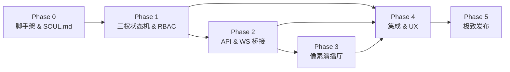

# OpenClaw Republic — 开发总体规划 (Development Master Plan)

> 基于 [PRD v3](file:///d:/Projects/Privates/openclaw_trias/docs/prds/PRD_v3.md) 拆分的多阶段开发路线图。
> 每个 Phase 在后续会话中逐步细化并实施。
> 项目代号：**OpenClaw-Republic / DangZongTong (当总统)**

---

## Phase 0 · 项目脚手架 & 基础设施

**目标**：搭好项目骨架，让后续所有 Phase 有可运行的根基。

| 序号 | 工作项 | 说明 |
|------|--------|------|
| 0.1 | **Python 项目初始化** | 建 `pyproject.toml`（包名 `openclaw-republic`）、包结构 (`openclaw_republic/`)、开发依赖 (pytest, ruff, mypy) |
| 0.2 | **Monorepo 目录规划** | 按 PRD v3 架构搭建标准化目录（详见下方目录树） |
| 0.3 | **SOUL.md 人设配置框架** | `config/souls/` 目录，编写所有 Agent 的 SOUL.md 人设文件（`speaker.md`, `radical_mp.md`, `conservative_mp.md`, `president.md`, `sec_engineering.md`, `sec_state.md`, `chief_justice.md`）|
| 0.4 | **宪法配置系统** | `constitution.yaml` 全局红线配置；`pydantic-settings` 加载 & 校验 |
| 0.5 | **日志 & 事件系统** | structlog / loguru 统一日志；定义结构化事件基类（为 Phase 2 WebSocket 事件流铺路）|
| 0.6 | **Dev 工具链** | pre-commit、CI (GitHub Actions)、Docker Compose (开发环境一键启动) |

### 0.2.1 目录结构规划

```
openclaw_trias/                         # Git 仓库根目录
├── openclaw_republic/                  # Python 主包
│   ├── __init__.py
│   ├── government.py                   # CyberGovernment 入口类
│   ├── agents/                         # Agent 定义
│   │   ├── __init__.py
│   │   ├── base.py                     # Agent 基类 & RBAC 权限模型
│   │   ├── legislative/                # 立法分支
│   │   │   ├── __init__.py
│   │   │   ├── speaker.py              # 议长
│   │   │   ├── radical_mp.py           # 激进派议员
│   │   │   ├── conservative_mp.py      # 保守派议员
│   │   │   └── debate.py              # 议会辩论协议 & 表决引擎
│   │   ├── executive/                  # 行政分支
│   │   │   ├── __init__.py
│   │   │   ├── president.py            # 总统（Veto 机制）
│   │   │   ├── sec_engineering.py      # 工程部长
│   │   │   └── sec_state.py            # 国务卿
│   │   └── judicial/                   # 司法分支
│   │       ├── __init__.py
│   │       ├── chief_justice.py        # 首席大法官
│   │       └── rules_engine.py         # 违宪规则引擎
│   ├── schemas/                        # 数据模型
│   │   ├── __init__.py
│   │   ├── act.py                      # 《执行法案》JSON Schema
│   │   ├── events.py                   # WebSocket 事件模型
│   │   └── verdict.py                  # 司法判决模型
│   ├── bus/                            # 三权通信总线
│   │   ├── __init__.py
│   │   ├── message_bus.py              # 消息传递协议
│   │   └── state_machine.py            # 法案生命周期状态机
│   ├── config/                         # 配置加载
│   │   ├── __init__.py
│   │   ├── loader.py                   # constitution.yaml & SOUL.md 加载器
│   │   └── models.py                   # 配置 Pydantic 模型
│   └── server/                         # API & WebSocket (Phase 2)
│       ├── __init__.py
│       ├── app.py                      # FastAPI 应用
│       ├── routes.py                   # REST API 路由
│       └── websocket.py                # WebSocket 事件推送
├── config/                             # 用户可编辑配置区
│   ├── souls/                          # SOUL.md 人设文件
│   │   ├── speaker.md
│   │   ├── radical_mp.md
│   │   ├── conservative_mp.md
│   │   ├── president.md
│   │   ├── sec_engineering.md
│   │   ├── sec_state.md
│   │   └── chief_justice.md
│   └── constitution.yaml               # 宪法全局红线
├── frontend/                            # 像素演播厅前端 (Phase 3)
│   └── ...
├── assets/                              # 美术资源
│   ├── sprites/                         # Sprite Sheets
│   ├── tilemaps/                        # 场景背景
│   ├── sfx/                             # 音效
│   └── props/                           # 道具特效
├── scripts/                             # 开发/部署脚本
├── tests/                               # 测试
│   ├── unit/
│   ├── integration/
│   └── e2e/
├── docs/                                # 文档
│   ├── prds/
│   └── development_master_plan.md
├── docker-compose.yml
├── pyproject.toml
├── README.md
└── LICENSE
```

**产出**：`pip install -e .` 可装、`pytest` 可跑、`docker compose up` 可启。所有 SOUL.md 人设就位。

---

## Phase 1 · 后端核心：三权 Agent 状态机

**目标**：实现三个 Branch 的 Agent Persona、RBAC 权限隔离、状态流转和协作协议。**这是整个系统的心脏。**

### 1.1 Agent 基础框架 & RBAC

| 序号 | 工作项 | 说明 |
|------|--------|------|
| 1.1.1 | **Agent 基类** | 定义 `BaseAgent`：SOUL.md 加载、LLM 调用接口、权限声明、消息收发 |
| 1.1.2 | **RBAC 权限模型** | 定义权限枚举：`PLAN`（规划权）、`EXECUTE`（执行权）、`MONITOR`（监控权）、`VETO`（否决权）、`KILL`（熔断权）。Agent 实例化时按角色分配，运行时强制校验 |
| 1.1.3 | **Workspace 物理隔离** | 立法分支无法调用 CodeExecution/FileOps 等工具（物理层面不挂载），行政分支无法生成规划文本 |
| 1.1.4 | **SOUL.md 加载引擎** | 读取 `config/souls/*.md`，注入 Agent 的 System Prompt，支持热更新 |

### 1.2 立法分支 (Legislative Branch)

| 序号 | 工作项 | 说明 |
|------|--------|------|
| 1.2.1 | **议长 Agent (Speaker)** | 流程编排器：接收选民请愿 → 发起提案 → 控制辩论 Token 预算 → 判定终止 → 发起表决 → 产出《执行法案》JSON |
| 1.2.2 | **激进派议员 Agent (Radical MP)** | 通过 `SOUL.md` 注入极客/激进人设。偏好前沿技术栈、代码极简，提议大胆，容易产生边界幻觉 |
| 1.2.3 | **保守派议员 Agent (Conservative MP)** | 通过 `SOUL.md` 注入防御性/保守人设（Red Team）。专挑性能瓶颈、内存泄漏、安全漏洞 |
| 1.2.4 | **议会辩论协议** | 多轮 Critique → Rebuttal → 分歧度 (Conflict Score) 计算 → 阈值判定 → 共识 → 投票表决 |
| 1.2.5 | **《执行法案》Schema** | JSON Schema：目标、步骤列表、每步所需 Skill、工具参数声明、预估 Token、验收标准 |
| 1.2.6 | **Conflict Score 引擎** | 量化辩论分歧度，驱动前端 Lv1/Lv2/Lv3 动画切换 |

### 1.3 行政分支 (Executive Branch)

| 序号 | 工作项 | 说明 |
|------|--------|------|
| 1.3.1 | **总统 Agent (President)** | 接收法案 → Token 预算校验 → Skill 可用性校验 → 行使 Veto 或签署 → 拆解 Task 派发内阁 |
| 1.3.2 | **工程部长 Agent (Sec. of Engineering)** | 挂载 `CodeExecution`, `Python_Interpreter`, `GitHub` 技能，负责实际编码与环境操作 |
| 1.3.3 | **国务卿 Agent (Sec. of State)** | 挂载 `WebBrowser`, `Search` 技能，负责外部信息检索与 API 交互 |
| 1.3.4 | **执行引擎** | 按法案步骤列表顺序/并行调用 Skill，管理 Token 预算，收集执行结果 |
| 1.3.5 | **Veto 机制** | Token 不足 / Skill 不可用时，总统否决并附 reason 打回立法分支 |

### 1.4 司法分支 (Judicial Branch)

| 序号 | 工作项 | 说明 |
|------|--------|------|
| 1.4.1 | **首席大法官 Agent (Chief Justice)** | 最高安全审查 Prompt，旁路监听行政动作 |
| 1.4.2 | **违宪规则引擎** | 从 `constitution.yaml` 加载规则集：黑名单命令、Token 预算上限、最大辩论轮次、产出偏离度阈值 |
| 1.4.3 | **过程违宪审查** | 实时沙箱监听：危险命令检测 (`rm -rf`, `DROP TABLE`, 越权读取私钥)、死循环检测 |
| 1.4.4 | **结果违宪审查** | 交付验收：比对《选民原始请愿》vs《最终产物》，评估产出偏离度（大模型幻觉检测）|
| 1.4.5 | **物理熔断机制 (Kill Switch)** | 违宪判定后：强制 Kill 容器/进程 → 回滚状态 → 生成判决书 → 打回立法重做 |

### 1.5 三权协作总线

| 序号 | 工作项 | 说明 |
|------|--------|------|
| 1.5.1 | **消息总线** | 三分支间的异步消息传递协议 (内存队列，后续可扩展 Redis/NATS) |
| 1.5.2 | **法案生命周期状态机** | `Petition → Drafting → Debating → Voted → Signed/Vetoed → Executing → Reviewing → Constitutional/Unconstitutional → Delivered` |
| 1.5.3 | **结构化事件日志** | 所有 Agent 的 action 统一记录为结构化事件（含 emotion、intensity 等字段），直接对标 PRD §4 的 WebSocket 事件格式 |

**产出**：纯命令行可运行的三权协作 demo。输入 Prompt → 议会辩论 → 法案表决 → 总统签署/否决 → 行政执行 → 司法审查 → 返回结果。

---

## Phase 2 · 通信桥接层 (API & WebSocket)

**目标**：将后端 Agent 的运行时状态暴露为 API 和实时流，供前端消费。

| 序号 | 工作项 | 说明 |
|------|--------|------|
| 2.1 | **FastAPI 应用骨架** | API 路由：`POST /petition`（提交选民请愿/Prompt）、`GET /task/{id}/status` |
| 2.2 | **WebSocket 端点** | `/ws/task/{id}` — 推送实时 Agent 事件流 |
| 2.3 | **事件序列化** | Phase 1.5.3 的结构化事件 → PRD §4 定义的 JSON 消息格式 (`action`, `emotion`, `intensity` 等) |
| 2.4 | **完整事件映射** | 实现 PRD §4 所有事件类型：`propose`, `brawl`, `order`, `vote_passed`, `sign_act`, `veto`, `tool_call`, `constitutional`, `unconstitutional` |
| 2.5 | **会话管理** | 任务队列、并发控制、任务状态持久化 (SQLite / Redis) |
| 2.6 | **REST 查询 API** | 查询历史任务、法案内容、辩论记录（含 Conflict Score 曲线）、审判结果 |

**产出**：`curl` / Postman 可发 Petition；`wscat` 可收到实时 PRD §4 格式的事件 JSON 流。

---

## Phase 3 · 像素演播厅前端 (Pixel Art Frontend)

**目标**：PRD 中的核心高光 — 将 Agent 行为映射为 8-bit 像素动画。

### 3.1 工程基础

| 序号 | 工作项 | 说明 |
|------|--------|------|
| 3.1.1 | **前端项目搭建** | Vite + React (TypeScript)；集成 Phaser.js 或 PixiJS 作为 2D 渲染引擎 |
| 3.1.2 | **WebSocket 客户端** | 连接 Phase 2 的 WS 端点，事件解析 → 渲染指令分发 |
| 3.1.3 | **场景管理器** | 三大场景 (议会/行政/法院) 自动切换引擎，根据法案生命周期状态机决定当前场景 |

### 3.2 场景实现

| 序号 | 工作项 | 说明 |
|------|--------|------|
| 3.2.1 | **🏛️ 议会大厅** | 左右对称阶梯议席、中央演讲台、信使送信动画、气泡打字机效果、表决亮灯 |
| 3.2.2 | **议员吵架系统 (3 级)** | Lv1 正常辩论气泡 → Lv2 扔纸团/皮鞋/咖啡杯 (Conflict Score > 80 触发，含抛物线物理) → Lv3 议长控场 (屏幕震动 + `ORDER!` 飘字 + 8-bit 法槌音效) |
| 3.2.3 | **🏢 行政格子间** | 总统签字 + `APPROVED` 盖章特效、`VETO` 盖章弹回、部长敲键盘、代码流闪烁、报错冒烟 💨 |
| 3.2.4 | **⚖️ 最高法院** | 全黑聚光灯、法槌落下、`CONSTITUTIONAL` 绿光 / `UNCONSTITUTIONAL` 红色印章 + 卷轴碎裂燃烧 + 全屏震动 |

### 3.3 美术资源

| 序号 | 工作项 | 说明 |
|------|--------|------|
| 3.3.1 | **Sprite Sheets** | 角色帧动画：议员(站/坐/说话/扔东西/脸红)、总统(签字/盖章)、法官(敲槌/宣判)、信使 |
| 3.3.2 | **场景背景 Tilemap** | 三大场景的像素画背景：议会大厅、白宫办公室+格子间、法院 |
| 3.3.3 | **道具特效** | 纸团、皮鞋、咖啡杯（带抛物线物理）、卷轴、APPROVED/VETO 印章、火焰碎裂 |
| 3.3.4 | **8-bit 音效** | 法槌敲击、扔东西碰撞、打字机、议会喧嚣、红色警报 |

**产出**：浏览器打开即为像素风演播厅，实时渲染 Agent 的辩论/执行/审判过程。

---

## Phase 4 · 集成、端到端串联 & UX 优化

**目标**：三层打通，全流程可跑，用户体验打磨。

| 序号 | 工作项 | 说明 |
|------|--------|------|
| 4.1 | **端到端集成测试** | 完整 Petition → 辩论 → 表决 → 签署/否决 → 执行 → 审判 → 前端动画 全链路验证 |
| 4.2 | **选民请愿 UI** | 用户输入面板：提交需求 (Petition)、查看任务状态、Conflict Score 实时可视化 |
| 4.3 | **结果展示 UI** | 任务完成后的『总统交付备忘录』展示面板 (代码/文件/文本输出) |
| 4.4 | **辩论回放 & 日志** | 可点击查看每轮辩论的详细 CoT 日志、Conflict Score 变化曲线 |
| 4.5 | **Token 仪表盘** | 实时展示各分支的 Token 消耗、辩论轮次、执行耗时等指标 |
| 4.6 | **错误处理 & 重试** | 全链路异常处理：LLM 超时、API 限流、执行失败、Veto 重入、违宪重做 |
| 4.7 | **SOUL.md 热编辑** | 前端提供 SOUL.md 编辑器，用户可在线"给官员换脑子"，调整政策基调 |

**产出**：一个完整可用的产品 — 既能跑任务，也好看。

---

## Phase 5 · 极致发布 (`import antigravity`)

**目标**：致敬 Python 极客精神，实现 PRD 的终极飞行体验。

| 序号 | 工作项 | 说明 |
|------|--------|------|
| 5.1 | **极简启动脚本** | `from openclaw_republic import CyberGovernment` → `republic.inaugurate(port=8080)` |
| 5.2 | **`load_constitution()` API** | 宪法配置加载：`load_constitution("constitution.yaml")` 返回校验后的配置对象 |
| 5.3 | **一键部署** | Docker Compose 包含后端 + 前端 + 反代 (Nginx/Caddy) 全栈 |
| 5.4 | **README & Docs** | 项目 README 美化、二创指南（如何编写自定义 SOUL.md）、架构图、GIF 演示 |
| 5.5 | **PyPI 发布** | 可 `pip install openclaw-republic` 安装使用 |
| 5.6 | **开源宣发** | GitHub Release、社区 Demo 文章、录屏截图 |

**产出**：用户 `pip install openclaw-republic` 后三行代码启动整个系统。

---

## 各 Phase 依赖关系



---

## PRD v1 → v3 关键变更追踪

| 维度 | v1 | v3 (当前) |
|------|-----|----------|
| **包名** | `openclaw_trias` | `openclaw_republic` |
| **入口 API** | `CyberParliament.launch()` | `CyberGovernment.inaugurate()` |
| **架构原则** | 概念性描述 | RBAC + Workspace 物理隔离 + SOUL.md 配置驱动 |
| **行政角色** | 泛化的部长 | 明确为工程部长 (CodeExec, Python_Interpreter, GitHub) + 国务卿 (WebBrowser, Search) |
| **辩论量化** | 定性描述 | Conflict Score 量化，阈值 > 80 触发 Lv2 动画 |
| **配置体系** | 无 | `SOUL.md` 人设 + `constitution.yaml` 宪法红线 |
| **违宪审查** | 单一 | 双通道：过程违宪（实时沙箱监听）+ 结果违宪（交付偏离度检测）|
| **事件类型** | 5 种 | 9 种（新增 `sign_act`, `veto`, `order`, `brawl`）|

---

## 开发节奏建议

| Phase | 预估复杂度 | 优先级 | 备注 |
|-------|----------|--------|------|
| Phase 0 | ⭐ 低 | 🔴 首先 | 一次性搭好，含 SOUL.md 编写和 constitution.yaml |
| Phase 1 | ⭐⭐⭐⭐ 高 | 🔴 核心 | 系统灵魂，建议拆 5-6 个会话迭代（RBAC + 每个分支 + 总线） |
| Phase 2 | ⭐⭐ 中 | 🟡 紧跟 | Phase 1 CLI demo 跑通后立即开始 |
| Phase 3 | ⭐⭐⭐⭐ 高 | 🟡 并行 | 美术资源和渲染可与 Phase 2 并行 |
| Phase 4 | ⭐⭐⭐ 中高 | 🟢 后续 | Phase 1-3 基本就绪后串通 |
| Phase 5 | ⭐ 低 | 🟢 收尾 | 最后的发布打磨 |

> **建议下一步**：从 **Phase 0（项目脚手架 & SOUL.md 人设配置）** 开始，搭建项目骨架、编写宪法配置和所有角色的 SOUL.md。
