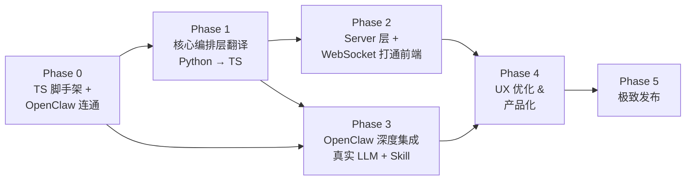

# OpenClaw Republic — TypeScript 重构开发总体规划

> **前置背景**：基于 [Python 版开发总体规划](./development_master_plan.md)（Phase 0~3 已完成），
> 本文档定义 **TypeScript 重构版** 的技术路线图。
>
> **核心思想**：保留三权分立的编排架构，底层 Skill 引擎 → OpenClaw，后端 → TypeScript，前端像素演播厅 → 直接复用。
>
> 项目代号：**OpenClaw-Republic / DangZongTong (当总统)**

---

## 0. 架构总览

### 0.1 重构目标

将现有 Python 后端（`openclaw_republic/`）迁移至 TypeScript (Node.js)，同时：

1. **底层能力委托 OpenClaw**：LLM 调用、Skill 执行（代码、浏览器、GitHub、搜索等）、渠道接入全部交给 OpenClaw Gateway
2. **编排层使用 TypeScript 重写**：三权分支、RBAC、辩论引擎、状态机、消息总线、Pipeline 编排
3. **前端完全复用**：Phaser.js 像素演播厅（ParliamentScene / ExecutiveScene / JudicialScene）零改动，仅保持 WebSocket JSON 事件协议一致

### 0.2 架构拓扑

```
┌──────────────────────────────────────────────────────┐
│  📺 像素演播厅前端 (Vite + React + Phaser.js / TS)    │
│  ├── ParliamentScene   (议会大厅)                     │
│  ├── ExecutiveScene    (行政格子间)                    │
│  ├── JudicialScene     (最高法院)                     │
│  ├── EventMapper       (事件→动画)                    │
│  ├── SceneManager      (场景切换)                     │
│  └── SoundManager      (音效)                        │
│  状态: ✅ 已完成，直接复用，零改动                       │
└──────────────────┬───────────────────────────────────┘
                   │ WebSocket JSON 事件流
                   │ (保持与 Python 版完全一致的消息协议)
┌──────────────────▼───────────────────────────────────┐
│  🏛️  三权编排后端 (TypeScript / Node.js)  ← 本次重写   │
│  ├── agents/                                         │
│  │   ├── base.ts           (BaseAgent + RBAC)        │
│  │   ├── legislative/      (Speaker, RadicalMP,      │
│  │   │                      ConservativeMP, Debate)  │
│  │   ├── executive/        (President, SecEng,       │
│  │   │                      SecState, Engine)        │
│  │   └── judicial/         (ChiefJustice, Rules)     │
│  ├── bus/                                            │
│  │   ├── message-bus.ts    (消息总线)                  │
│  │   └── state-machine.ts  (BillLifecycle)           │
│  ├── schemas/                                        │
│  │   ├── events.ts         (WebSocket 事件类型)       │
│  │   └── act.ts            (法案/执行报告类型)         │
│  ├── config/                                         │
│  │   └── constitution.ts   (宪法配置加载)              │
│  ├── server/                                         │
│  │   ├── app.ts            (Express/Fastify 应用)     │
│  │   ├── routes.ts         (REST API)                │
│  │   └── websocket.ts      (WS 服务端)                │
│  └── openclaw/                                       │
│      └── adapter.ts        (OpenClaw Gateway 适配层)  │
│  状态: 🔄 Phase 1~2 完成，Phase 3+ 待重写                      │
└──────────────────┬───────────────────────────────────┘
                   │ Gateway WebSocket API / sessions_* Tools
┌──────────────────▼───────────────────────────────────┐
│  🦞 OpenClaw Gateway (Node.js)  ← 开箱即用            │
│  ├── LLM Providers   (Claude, GPT, Qwen, DeepSeek)  │
│  ├── 60+ Skills      (CodeExec, Browser, GitHub...) │
│  ├── Channels        (Discord, 飞书, Telegram...)    │
│  └── WebSocket CP    (ws://localhost:18789)           │
│  状态: ✅ 外部依赖，安装部署即可                         │
└──────────────────────────────────────────────────────┘
```

### 0.3 重构前后对照

| 维度 | Python 版 (现有) | TypeScript 版 (目标) |
|------|-----------------|---------------------|
| **语言** | Python 3.11 | TypeScript 5.x / Node.js 20+ |
| **LLM 调用** | `_call_llm()` Mock 占位 | **OpenClaw Gateway** 的 LLM API（真实模型） |
| **Skill 执行** | `ExecutionEngine` Mock | **OpenClaw Skills**（CodeExec, Browser, GitHub...） |
| **类型系统** | Pydantic BaseModel | TypeScript interface / Zod schema |
| **Web 框架** | FastAPI (uvicorn) | Fastify 或 Express.js |
| **WebSocket** | FastAPI WebSocket | ws / Socket.IO |
| **配置** | pydantic-settings + YAML | cosmiconfig / yaml + Zod |
| **测试** | pytest + pytest-asyncio | Vitest / Jest |
| **前端** | 已完成 (Vite + Phaser.js) | **完全复用** |

---

## 1. 前端 WebSocket 事件协议 (接口契约)

> **这是前后端之间唯一的耦合点。** TS 重写后端的首要约束是：推送的 WebSocket JSON 消息格式必须与 Python 版完全一致。

### 1.1 前端期望的事件类型 (来自 `EventMapper.ts`)

```typescript
// 前端解析的核心事件动作
type EventAction =
  | 'state_change'       // 法案生命周期状态变更 → 触发场景切换
  | 'propose'            // 议员提案/发言 → 议会场景气泡
  | 'brawl'              // 辩论激化 → 扔纸团动画
  | 'order'              // 议长控场 → ORDER! 飘字
  | 'vote_passed'        // 表决通过 → 绿灯亮起
  | 'sign_act'           // 总统签署 → APPROVED 盖章
  | 'veto'               // 总统否决 → VETO 盖章
  | 'tool_call'          // 工具调用 → 部长敲键盘
  | 'constitutional'     // 合宪判决 → 绿光法槌
  | 'unconstitutional';  // 违宪判决 → 红色印章

// 前端期望的 JSON 结构 (来自 types/backend.ts)
interface WSEventPayload {
  action: EventAction;
  source_agent?: string;
  statement?: string;
  intensity?: number;
  emotion?: string;
  round_number?: number;
  conflict_score?: number;
  data?: Record<string, any>;
  payload?: Record<string, any>;
  task_id?: string;
  timestamp?: number;
  [key: string]: unknown;
}
```

### 1.2 场景切换规则 (来自 `EventMapper.ts`)

| state_change 的 state 值 | 切换到的场景 |
|--------------------------|------------|
| `debating`, `voted` | Parliament |
| `executing`, `signed` | Executive |
| `reviewing`, `constitutional`, `unconstitutional` | Judicial |

> ⚠️ **TS 后端必须严格遵守以上协议。** 只要 JSON 格式和字段名一致，前端无论后端用什么语言都能正常工作。

---

## Phase 0 · TypeScript 项目脚手架 & OpenClaw 集成

**目标**：搭建 TypeScript 后端项目骨架，完成与 OpenClaw Gateway 的连通性验证。

| 序号 | 工作项 | 说明 | 优先级 |
|------|--------|------|--------|
| 0.1 | **TS 后端项目初始化** | `package.json`、`tsconfig.json`、ESLint、Vitest 配置。后端目录 `backend/` 与前端 `frontend/` 同级 | 🔴 首先 |
| 0.2 | **Monorepo 结构调整** | 调整顶层目录：`backend/`（TS 新后端）、`frontend/`（现有前端）、`config/`（SOUL.md + constitution.yaml 共享）。`openclaw_republic/` 保留为 Python 归档 | 🔴 首先 |
| 0.3 | **OpenClaw Gateway 安装 & 部署** | 本地安装 OpenClaw、配置 LLM Provider（API Key）、验证 Skill 可用性 | 🔴 首先 |
| 0.4 | **OpenClaw 适配层 (`openclaw/adapter.ts`)** | 封装与 OpenClaw Gateway 的通信：LLM 调用（`callLLM()`）、Skill 执行（`executeSkill()`）、会话管理。对上层屏蔽 OpenClaw 的实现细节 | 🔴 核心 |
| 0.5 | **连通性验证** | 通过适配层发送一个 LLM Prompt → 收到真实回复；执行一个 CodeExecution Skill → 获取结果。端到端验证链路可通 | 🔴 门槛 |

### 0.2.1 目标目录结构

```
openclaw_trias/                            # Git 仓库根目录
├── backend/                               # TS 新后端 ← 本次重写
│   ├── src/
│   │   ├── index.ts                       # 入口
│   │   ├── government.ts                  # CyberGovernment 主编排
│   │   ├── agents/
│   │   │   ├── base.ts                    # BaseAgent + RBAC
│   │   │   ├── legislative/
│   │   │   │   ├── speaker.ts
│   │   │   │   ├── radical-mp.ts
│   │   │   │   ├── conservative-mp.ts
│   │   │   │   ├── debate.ts              # DebateEngine + VotingMachine
│   │   │   │   └── conflict-score.ts
│   │   │   ├── executive/
│   │   │   │   ├── president.ts
│   │   │   │   ├── sec-engineering.ts
│   │   │   │   ├── sec-state.ts
│   │   │   │   └── engine.ts             # ExecutionEngine
│   │   │   └── judicial/
│   │   │       ├── chief-justice.ts
│   │   │       ├── rules-engine.ts
│   │   │       ├── process-reviewer.ts
│   │   │       └── kill-switch.ts
│   │   ├── bus/
│   │   │   ├── message-bus.ts
│   │   │   ├── event-log.ts
│   │   │   └── state-machine.ts           # BillLifecycle
│   │   ├── schemas/
│   │   │   ├── events.ts                  # 与前端共享的事件类型
│   │   │   ├── act.ts
│   │   │   └── verdict.ts
│   │   ├── config/
│   │   │   ├── loader.ts
│   │   │   └── models.ts                  # ConstitutionConfig (Zod)
│   │   ├── openclaw/
│   │   │   └── adapter.ts                 # OpenClaw Gateway 适配层
│   │   └── server/
│   │       ├── app.ts
│   │       ├── routes.ts
│   │       └── websocket.ts
│   ├── package.json
│   ├── tsconfig.json
│   └── vitest.config.ts
├── frontend/                              # ← 完全复用，不动
│   ├── src/
│   │   ├── game/
│   │   │   ├── EventMapper.ts
│   │   │   ├── SceneManager.ts
│   │   │   ├── SoundManager.ts
│   │   │   └── scenes/
│   │   │       ├── ParliamentScene.ts
│   │   │       ├── ExecutiveScene.ts
│   │   │       ├── JudicialScene.ts
│   │   │       └── PreloaderScene.ts
│   │   ├── hooks/useWebSocket.ts
│   │   ├── types/backend.ts               # 事件类型 (可从 backend/ 同步)
│   │   └── App.tsx
│   └── ...
├── shared/                                # 前后端共享类型 (可选)
│   └── events.ts                          # WSEventPayload、EventAction 等
├── config/                                # 用户配置区 (共享)
│   ├── souls/                             # SOUL.md 人设文件
│   │   ├── speaker.md
│   │   ├── radical_mp.md
│   │   ├── conservative_mp.md
│   │   ├── president.md
│   │   ├── sec_engineering.md
│   │   ├── sec_state.md
│   │   └── chief_justice.md
│   └── constitution.yaml                  # 宪法红线配置
├── openclaw_republic/                     # Python 版归档 (只读参考)
│   └── ...
├── docs/
├── tests/
└── package.json                           # Monorepo root (Turborepo / npm workspaces)
```

**产出**：`npm run dev:backend` 启动 TS 后端 → 通过 OpenClaw Adapter 成功调用 LLM 和 Skill。

---

## Phase 1 · 核心编排层翻译 (Python → TypeScript)

**目标**：将 Python 版三权分立的**核心逻辑层**忠实翻译为 TypeScript。这一阶段只做逻辑翻译，不引入新功能。

### 1.1 数据结构契约 (schemas/)

> Python 的 Pydantic `BaseModel` → TypeScript 的 `interface` + `Zod schema`

| 序号 | Python 源文件 | TS 目标文件 | 核心内容 | 行数 |
|------|-------------|------------|---------|------|
| 1.1.1 | `schemas/events.py` | `schemas/events.ts` | `EventAction` 枚举、`BaseEvent`、`DebateEvent`、`VoteEvent`、`VetoEvent`、`ExecutionEvent`、`JudgmentEvent` | ~90 |
| 1.1.2 | `schemas/act.py` | `schemas/act.ts` | `Act`、`ActStep`、`ExecutionReport`、`TaskResult`、`DebateRecord`、`ActVoteRecord` | ~130 |
| 1.1.3 | `schemas/verdict.py` | `schemas/verdict.ts` | `Verdict`、`JudgmentPayload` | ~110 |
| 1.1.4 | `schemas/messages.py` | `schemas/messages.ts` | `AgentMessage` | ~35 |

### 1.2 状态机与总线 (bus/)

| 序号 | Python 源文件 | TS 目标文件 | 核心内容 | 复杂度 |
|------|-------------|------------|---------|--------|
| 1.2.1 | `bus/state_machine.py` | `bus/state-machine.ts` | `BillState` 枚举 (11 状态)、`VALID_TRANSITIONS` 转换表、`BillLifecycle` 类 | ⭐⭐ 简单直译 |
| 1.2.2 | `bus/message_bus.py` | `bus/message-bus.ts` | Pub/Sub 消息总线、Topic 订阅、异步回调 | ⭐⭐ 简单直译 |
| 1.2.3 | `bus/event_log.py` | `bus/event-log.ts` | 事件日志记录器 | ⭐ 很简单 |

### 1.3 配置系统与代理基类 (config/ & agents/base.ts)

| 序号 | Python 源文件 | TS 目标文件 | 核心内容 |
|------|-------------|------------|---------|
| 1.3.1 | `config/models.py` | `config/models.ts` | `ConstitutionConfig`、`DebateConfig`、`TokenBudgetConfig` 等 Zod schema |
| 1.3.2 | `config/loader.py` | `config/loader.ts` | `constitution.yaml` 加载、SOUL.md 加载与缓存、`SoulCache` |
| 1.3.3 | `agents/base.py` | `agents/base.ts` | `Permission` 枚举、`Branch` 枚举、`BaseAgent` 抽象类、RBAC 校验、工具注册 |

**关键变化**：`BaseAgent._call_llm()` 不再是 Mock，而是委托给 `OpenClawAdapter.callLLM()`。

```typescript
// 核心改造点示意
abstract class BaseAgent {
  protected async callLLM(prompt: string): Promise<string> {
    // Python 版: return ""  (Mock)
    // TS 版: 委托给 OpenClaw Gateway
    return this.openclawAdapter.callLLM(this.systemPrompt, prompt);
  }
}
```

### 1.4 立法分支 Ⅰ - 议员与分歧度 (agents/legislative/)

| 序号 | Python 源文件 | TS 目标文件 | 复杂度 |
|------|-------------|------------|--------|
| 1.4.1 | `legislative/conflict_score.py` | `legislative/conflict-score.ts` | ⭐⭐⭐ 中 — 规则引擎评分逻辑 |
| 1.4.2 | `legislative/radical_mp.py` | `legislative/radical-mp.ts` | ⭐⭐ 简单 |
| 1.4.3 | `legislative/conservative_mp.py` | `legislative/conservative-mp.ts` | ⭐⭐ 简单 |

### 1.5 立法分支 Ⅱ - 辩论引擎与议长 (agents/legislative/)

| 序号 | Python 源文件 | TS 目标文件 | 复杂度 |
|------|-------------|------------|--------|
| 1.5.1 | `legislative/debate.py` | `legislative/debate.ts` | ⭐⭐⭐⭐ 核心 — DebateEngine + VotingMachine |
| 1.5.2 | `legislative/speaker.py` | `legislative/speaker.ts` | ⭐⭐⭐ 中 — 流程编排多 |

### 1.6 行政分支与执行器 (agents/executive/)

| 序号 | Python 源文件 | TS 目标文件 | 复杂度 |
|------|-------------|------------|--------|
| 1.6.1 | `executive/president.py` | `executive/president.ts` | ⭐⭐⭐ 中 — Veto 逻辑 |
| 1.6.2 | `executive/sec_engineering.py` | `executive/sec-engineering.ts` | ⭐⭐ 简单 (调用 OpenClaw Skill) |
| 1.6.3 | `executive/sec_state.py` | `executive/sec-state.ts` | ⭐⭐ 简单 (调用 OpenClaw Skill) |
| 1.6.4 | `executive/engine.py` | `executive/engine.ts` | ⭐⭐⭐⭐ 核心 — 拓扑排序+并行执行 |

**关键变化**：`SecretaryOfEngineering.execute_task()` 不再是 Mock，而是调用 OpenClaw 的 `CodeExecution` / `Python_Interpreter` Skill。

### 1.7 司法分支 Agent (agents/judicial/)

| 序号 | Python 源文件 | TS 目标文件 | 复杂度 |
|------|-------------|------------|--------|
| 1.7.1 | `judicial/chief_justice.py` | `judicial/chief-justice.ts` | ⭐⭐⭐ 中 |
| 1.7.2 | `judicial/rules_engine.py` | `judicial/rules-engine.ts` | ⭐⭐⭐ 中 |
| 1.7.3 | `judicial/process_reviewer.py` | `judicial/process-reviewer.ts` | ⭐⭐ 简单 |
| 1.7.4 | `judicial/result_reviewer.py` | `judicial/result-reviewer.ts` | ⭐⭐ 简单 |
| 1.7.5 | `judicial/kill_switch.py` | `judicial/kill-switch.ts` | ⭐⭐ 简单 |

### 1.8 主编排器流转线 (government.ts)

| 序号 | Python 源文件 | TS 目标文件 | 复杂度 |
|------|-------------|------------|--------|
| 1.8.1 | `government.py` | `government.ts` | ⭐⭐⭐⭐⭐ 最核心 — 完整 Pipeline：初始化三权、状态机驱动、事件发布、回路重试 |

**产出**：所有 Python 核心逻辑 1:1 迁移到 TypeScript。可通过 `vitest` 运行单元测试。CLI 可运行完整 Pipeline（Petition → 辩论 → 表决 → 签署/否决 → 执行 → 审判 → 交付）。

---

## Phase 2 · Server 层 & WebSocket (前后端打通) ✅ 已封板 (2026-03-23)

**目标**：搭建 HTTP/WebSocket 服务器，复现 Python 版 Phase 2 的能力，打通与像素前端的实时通信。

> ✅ **Phase 2 已封板** — 18 个测试文件 · 242 passed · 2 skipped · 9 个 E2E 测试
> 真实 OpenClaw LLM 联调覆盖 **11/11 分支全覆盖**（含 brawl、veto、预算熔断、技能白名单 4 个专项压测）
> 详见 [Phase 2 Overview](plan_ts/phase2/phase2_overview.md)

| 序号 | 工作项 | 说明 | Python 对应 |
|------|--------|------|------------|
| 2.1 | **Web 框架搭建** | Fastify 或 Express.js 应用骨架 | `server/app.py` |
| 2.2 | **REST API** | `POST /petition`（提交请愿）、`GET /task/:id/status`、`GET /tasks` | `server/routes.py` |
| 2.3 | **WebSocket 端点** | `/ws/task/:id` — 推送实时 Agent 事件流（**消息格式与 Python 版完全一致**） | `server/websocket.py` + `ws_manager.py` |
| 2.4 | **任务管理** | 任务队列、状态持久化 (SQLite via better-sqlite3) | `server/task_queue.py` + `task_store.py` |
| 2.5 | **Vite 开发代理** | 前端 Vite dev server 代理 `/api/*` 和 `/ws/*` 到 TS 后端 | 新增 |
| 2.6 | **端到端联调验证** | `POST /petition` → 后端运行 Pipeline → WebSocket 推送事件 → 像素前端正确渲染三大场景动画 | 关键里程碑 |

**产出**：浏览器打开前端 → 提交 Petition → 看到完整的**真实 AI 驱动**的像素演播厅动画（不再是 Mock 数据）。

---

## Phase 3 · OpenClaw 深度集成 & 真实执行 ✅ 已封板 (2026-03-25)

**目标**：将 OpenClaw 的真正执行能力打通——Agent 不再返回硬编码文本，而是调用真实 LLM 和工具。

> ✅ **Phase 3 已封板** — 33 个测试文件 · 539 passed · 3 skipped 
> 实现了真正的系统防线与真实环境执行闭环。共计发现并解决深层架构漏洞和回归 Bug 8项 (KI-3.1 ~ KI-3.8)，包含安全熔断重入、发并发事务锁隔离和 Evasion 对抗拦截。
> 详见 [Phase 3 规划与收尾](plan_ts/phase3/phase3_planning.md)

| 序号 | 工作项 | 说明 |
|------|--------|------|
| 3.1 | **LLM 调用打通** | ✅ `OpenClawAdapter.callLLM()` 对接 Gateway 的 LLM API，所有 Agent 的 `callLLM()` 获得真实的大模型推理能力 |
| 3.2 | **SOUL.md → System Prompt** | ✅ 将 `config/souls/*.md` 内容注入每个 Agent 的 System Prompt，让 LLM 调用自带角色人设 |
| 3.3 | **执行 Skill 打通** | ✅ `SecretaryOfEngineering` → 调用 OpenClaw `CodeExecution`/`Python_Interpreter`/`GitHub` Skill |
| 3.4 | **搜索 Skill 打通** | ✅ `SecretaryOfState` → 调用 OpenClaw `WebBrowser`/`Search` Skill |
| 3.5 | **模型路由策略** | ✅ 不同 Agent 独立灵活配置模型，通过 constitution.yaml 控制成本与智能分离 |
| 3.6 | **真实辩论验证** | ✅ 真实 LLM 驱动的辩论：激进派 vs 保守派产出有意义的技术方案讨论并引入 Evasion 安全预检 |
| 3.7 | **真实执行验证** | ✅ 法案步骤 → OpenClaw Skill 实际执行代码/搜索 → 获取真实结果（无外网污染防护） |
| 3.8 | **真实审查验证** | ✅ 大法官使用 LLM 真实比对请愿 vs 产出，支持容差并判决是否有合规恶意降级。 |
| 3.9 | **零信任架构审计 (追加)** | ✅ 修复并发锁穿透、恶意指令兜底异常处理逃逸、以及全回路健壮性重构。 |

**产出**：完整的 AI 驱动的三权分立系统——输入请愿（如"帮我写一个 TODO App"或危险的"rm -rf"），能在真实的独立模型之间经过抗风险辩论、严格预检、真实安全沙箱执行并达成合理审查结论。

---

## Phase 4 · UX 优化 & 产品化

**目标**：将开发者级原型升级为产品级体验——用户输入需求 → 观看 AI 辩论动画 → 获得执行结果 → 查看详细日志。

> 详见 [Phase 4 规划白皮书](plan_ts/phase4/phase4_planning.md)

| 序号 | 工作项 | 说明 | 涉及端 |
|------|--------|------|--------|
| 4.1 | **前端架构重构 & 设计系统** | AppContext + AppShell 三栏布局 + CSS Variables 设计令牌 + 清除 Debug 按钮 | 🖥️ 前端 |
| 4.2 | **Petition 提交面板 & 快捷模板** | REST API 封装 + textarea + 模板气泡 + 加载状态 | 🖥️ 前端 |
| 4.3 | **任务历史列表 & 状态追踪** | TaskList + TaskCard + BillState 徽章 + 动态 WS taskId 切换 | 🖥️ 前端 |
| 4.4 | **辩论日志面板 & 实时 WS 收集** | 左右对抗时间线（激进派红/保守派蓝/Speaker 黄） | 🖥️ 前端 |
| 4.5 | **Conflict Score 曲线 & Recharts** | 安装 Recharts + 实时折线图 + 历史回填 | 🖥️ 前端 |
| 4.6 | **执行结果面板 & 判决展示** | 代码高亮 + VerdictBanner（合宪绿/违宪红） | 🖥️ 前端 |
| 4.7 | **Token 用量埋点 & 仪表盘** | 后端 4 处 WS 事件埋点 + 前端饼图/折线图 | 🖥️🔧 双端 |
| 4.8 | **WS 韧性 & 断线事件补发** | 指数退避重连 + Ring Buffer + replay 指令 | 🖥️🔧 双端 |
| 4.9 | **SOUL.md 热编辑面板** | 后端 3 个新 API + 前端 Markdown 编辑器 + cache invalidation | 🖥️🔧 双端 |
| 4.10 | **Phaser 场景过渡 & Canvas 响应式** | SceneManager fade 过渡 + 三大 Scene 响应式坐标 | 🎮 Phaser |
| 4.11 | **🏔️ 议会场景动效打磨** | 卷轴飞入/信使入场 + brawl Lv3 连击 + 气泡精调 | 🎮 Phaser |
| 4.12 | **🏢 行政场景动效打磨** | 双 Secretary 格子间 + 代码流增强 + 印章 sprite | 🎮 Phaser |
| 4.13 | **⚖️ 司法场景动效 & 音效扩充** | resetState Bug 修复 + 聚光灯动态 + SoundManager 补全 | 🎮 Phaser |
| 4.14 | **🌊 LLM 实时生成流 (Streaming) 接入** | OpenClaw流式输出整合/WS防爆隧道/前端隔离重绘终端 | 🖥️🔧 双端 |

**建议执行顺序**：`4.1 → 4.10 → 4.11 → 4.12 → 4.13 → 4.2 → 4.3 → 4.4 → 4.5 → 4.6 → 4.7 → 4.8 → 4.9 → 4.14`

**产出**：完整可用的产品级体验 — 输入需求 → 观看 AI 辩论动画 → 获得结果 → 查看详细日志。

---

## Phase 5 · 极致发布 (`import antigravity`)

**目标**：打包发布，社区化。

| 序号 | 工作项 | 说明 |
|------|--------|------|
| 5.1 | **一键启动脚本** | `npx openclaw-republic` 或 `npm start`，自动启动后端 + 前端 + OpenClaw Gateway |
| 5.2 | **Docker Compose** | 容器化部署：backend + frontend + openclaw-gateway 三容器协同 |
| 5.3 | **README & Docs** | README 美化、架构图、GIF 演示、二创指南 |
| 5.4 | **npm 发布** | 可 `npm install -g openclaw-republic` 安装使用 |
| 5.5 | **开源宣发** | GitHub Release、社区 Demo 文章、录屏截图 |
| 5.6 | **Discord 渠道集成** | 利用 OpenClaw 的 Discord Channel，支持在 Discord 中发起 Petition、接收动画链接 |

---

## Python → TypeScript 翻译清单 (完整)

> 按翻译优先级排序。每个模块标注了 Python 源文件路径、行数和翻译复杂度。

| 优先级 | Python 源文件 | 行数 | TS 目标 | 翻译复杂度 | 说明 |
|--------|-------------|------|---------|-----------|------|
| ✅ 完成 | `schemas/events.py` | 90 | `schemas/events.ts` | ⭐ 低 | 纯类型定义，直译 |
| ✅ 完成 | `schemas/act.py` | 130 | `schemas/act.ts` | ⭐ 低 | 纯类型定义 |
| ✅ 完成 | `schemas/verdict.py` | 110 | `schemas/verdict.ts` | ⭐ 低 | 纯类型定义 |
| ✅ 完成 | `config/models.py` | 70 | `config/models.ts` | ⭐ 低 | Pydantic → Zod |
| ✅ 完成 | `bus/state_machine.py` | 142 | `bus/state-machine.ts` | ⭐⭐ 中低 | 枚举 + 转换表 + 类 |
| ✅ 完成 | `bus/message_bus.py` | 130 | `bus/message-bus.ts` | ⭐⭐ 中低 | Pub/Sub 直译 |
| ✅ 完成 | `bus/event_log.py` | 60 | `bus/event-log.ts` | ⭐ 低 | 很短 |
| ✅ 完成 | `agents/base.py` | 183 | `agents/base.ts` | ⭐⭐⭐ 中 | RBAC + SOUL 加载 |
| ✅ 完成 | `config/loader.py` | 150 | `config/loader.ts` | ⭐⭐ 中低 | YAML + MD 解析 |
| ✅ 完成 | `agents/legislative/speaker.py` | 253 | `legislative/speaker.ts` | ⭐⭐⭐ 中 | 流程编排与生成优化 |
| ✅ 完成 | `agents/legislative/radical_mp.py` | 94 | `legislative/radical-mp.ts` | ⭐⭐ 低 | 简单 |
| ✅ 完成 | `agents/legislative/conservative_mp.py` | 80 | `legislative/conservative-mp.ts` | ⭐⭐ 低 | 简单 |
| ✅ 完成 | `agents/legislative/debate.py` | 286 | `legislative/debate.ts` | ⭐⭐⭐⭐ 高 | 核心辩论引擎架构重构 |
| ✅ 完成 | `agents/legislative/conflict_score.py` | 330 | `legislative/conflict-score.ts` | ⭐⭐⭐ 中 | 规则评分逻辑 |
| ✅ 完成 | `agents/executive/president.py` | 140 | `executive/president.ts` | ⭐⭐⭐ 中 | Veto 逻辑 |
| ✅ 完成 | `agents/executive/engine.py` | 200 | `executive/engine.ts` | ⭐⭐⭐⭐ 高 | 拓扑排序 + 并发防死锁 |
| ✅ 完成 | `agents/executive/sec_engineering.py` | 60 | `executive/sec-engineering.ts` | ⭐⭐ 低 | → OpenClaw Skill |
| ✅ 完成 | `agents/executive/sec_state.py` | 60 | `executive/sec-state.ts` | ⭐⭐ 低 | → OpenClaw Skill |
| ✅ 完成 | `agents/judicial/chief_justice.py` | 180 | `judicial/chief-justice.ts` | ⭐⭐⭐ 中 | 审查逻辑 |
| ✅ 完成 | `agents/judicial/rules_engine.py` | 130 | `judicial/rules-engine.ts` | ⭐⭐⭐ 中 | 规则匹配 |
| ✅ 完成 | `agents/judicial/process_reviewer.py` | 100 | `judicial/process-reviewer.ts` | ⭐⭐ 低 | |
| ✅ 完成 | `agents/judicial/result_reviewer.py` | 40 | `judicial/result-reviewer.ts` | ⭐ 低 | |
| ✅ 完成 | `agents/judicial/kill_switch.py` | 65 | `judicial/kill-switch.ts` | ⭐⭐ 低 | |
| ✅ 完成 | `government.py` | 429 | `government.ts` | ⭐⭐⭐⭐⭐ 最高 | 主编排器 |
| ✅ 完成 | `server/app.py` | 130 | `server/app.ts` | ⭐⭐ 低 | Express 应用骨架 (Task 2.1) |
| ✅ 完成 | `server/routes.py` | 170 | `server/routes.ts` | ⭐⭐⭐⭐ 高 | REST API + 8 轮 QA 修复 18 处隐患，34 防弹单测 (Task 2.1) |
| ✅ 完成 | `server/websocket.py` | 90 | `server/websocket.ts` | ⭐⭐⭐ 中 | 10 轮安全 QA，11 层防御加固，23 个端到端测试 (Task 2.3) |
| ✅ 完成 | `server/ws_manager.py` | 75 | `server/ws-manager.ts` | ⭐⭐ 低 | Fire-and-Forget 广播 + 慢读取者保护 + 惊群限流，21 个单测 (Task 2.3) |
| ✅ 完成 | `server/task_queue.py` | 65 | `server/task-queue.ts` | ⭐⭐ 低 | 手写 semaphore 队列 (Task 2.2) |
| ✅ 完成 | `server/task_store.py` | 260 | `server/task-store.ts` | ⭐⭐⭐ 中 | better-sqlite3 持久化 (Task 2.2) |

**合计**：约 **4,000 行** Python 需翻译为 TypeScript（扣除空行/注释后有效逻辑约 2,500 行）。

---

## 各 Phase 依赖关系



> T0 和 T1 可部分并行：T0 搭骨架时 T1 已经可以开始写类型定义和纯逻辑模块。
> T2（前端打通）和 T3（OpenClaw 深度集成）可在 T1 完成后并行推进。

---

## 开发节奏建议

| Phase | 预估工作量 | 前置条件 | 说明 |
|-------|----------|---------|------|
| Phase 0 | ⭐⭐ 1-2 会话 | 无 | ✅ 已完成 |
| Phase 1 | ⭐⭐⭐⭐ 3-4 会话 | T0 | ✅ 已完成 |
| Phase 2 | ⭐⭐ 1-2 会话 | T1 | ✅ **已封板** (2026-03-23) |
| Phase 3 | ⭐⭐⭐ 2-3 会话 | T0 + T1 | 需要探索 OpenClaw API，可能有适配工作 |
| Phase 4 | ⭐⭐⭐ 2-3 会话 | T2 + T3 | UX 打磨，可渐进式完成 |
| Phase 5 | ⭐ 1 会话 | T4 | 收尾发布 |

**总计预估**：**10-15 个会话** 即可完成 TS 重构并获得一个真正能干活的、有像素演播厅的三权分立 AI 系统。

---

## 关键风险 & 预案

| 风险 | 影响 | 预案 |
|------|------|------|
| OpenClaw Gateway API 文档不全 | T0/T3 阻塞 | 阅读 OpenClaw 源码；先用直接 LLM API（anthropic SDK）作降级方案 |
| 真实 LLM 辩论效果不可控 | 辩论可能太短/太发散 | 精细调优 SOUL.md Prompt；调整 DebateConfig 参数（轮次、阈值） |
| OpenClaw Skill 执行结果格式不匹配 | T3 适配复杂度增加 | Adapter 层做格式转换和错误规范化 |
| Token 成本超预期 | 开发阶段成本高 | 开发时用便宜模型 (Sonnet)；设置 Token 上限；支持 Mock 模式回退 |

---

## 不变量清单 (Invariants)

以下是重构过程中**绝对不能破坏**的约束：

1. **WebSocket 事件格式不变** — 前端 `EventMapper.ts` 期望的 JSON 结构和字段名必须完全一致
2. **法案生命周期状态机不变** — 11 个状态 + 合法转换表必须与 Python 版一致
3. **RBAC 权限模型不变** — 5 种权限 (`PLAN/EXECUTE/MONITOR/VETO/KILL`) + 3 个分支 (`LEGISLATIVE/EXECUTIVE/JUDICIAL`) 的分配不变
4. **constitution.yaml 格式不变** — 避免用户重新学习配置
5. **SOUL.md 文件格式不变** — 保持 Markdown 人设文件的兼容性
6. **前端代码零改动** — 除非有明确的功能增强需求，否则前端不做任何修改
