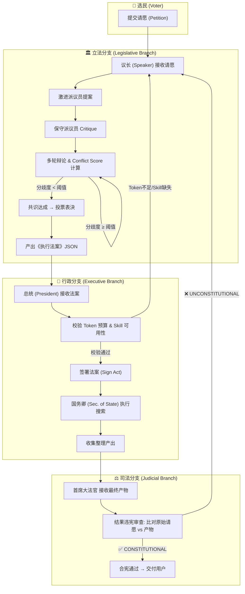
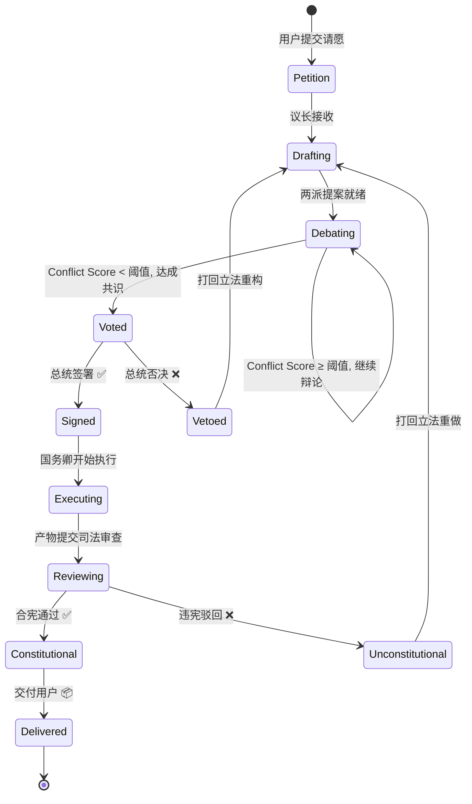

# 🏛️ OpenClaw Republic 任务执行全流程演绎

> **示例任务**：*"整理最新的石油产业分析报告给我，特别是美伊关系对产业的影响"*

---

## 全流程概览



---

## 第 0 幕 · 选民请愿 (Petition)

```
用户在前端输入框中提交原始需求（Prompt）：
"整理最新的石油产业分析报告给我，特别是美伊关系对产业的影响"
```

**系统行为**：
1. 前端通过 `POST /petition` 将请愿文本发送至后端
2. 后端创建一个新的 **法案生命周期状态机** 实例，初始状态为 `Petition`
3. **消息总线** 将请愿分发至 **立法分支**
4. 前端进入 **🏛️ 议会大厅** 场景

> [!NOTE]
> WebSocket 推送：`{"action": "petition_received", "content": "整理最新的石油产业分析报告..."}`
> 像素动画：信使小人捧着信件跑进议会大厅

---

## 第 1 幕 · 立法分支：议会辩论 🏛️

### 1.1 议长接收 & 开场

**议长 (Speaker)** 接收请愿后：
- 状态机进入 `Drafting` → `Debating`
- 解析用户需求的核心关键词：`石油产业`、`分析报告`、`美伊关系`、`影响`
- 评估需求类型 → 判定为 **信息检索 + 综合分析** 类任务
- 将请愿发给两派议员，要求各自提案

### 1.2 激进派议员提案 (Radical MP)

> 📜 *激进派通过 `SOUL.md` 中注入的极客/激进人设，偏好大胆和高效的方案*

激进派提案概要：

```json
{
  "proposal": "radical_v1",
  "steps": [
    {
      "step": 1,
      "description": "使用多个搜索引擎同时并发搜索，关键词覆盖中英文",
      "tool": "Search",
      "queries": [
        "2026 oil industry analysis report",
        "US Iran relations oil market impact 2026",
        "石油产业 2026 最新分析",
        "美伊关系 石油 影响",
        "OPEC latest decision crude oil",
        "Iran sanctions oil supply chain"
      ]
    },
    {
      "step": 2, 
      "description": "深入爬取前 20 个高质量信源的全文内容",
      "tool": "WebBrowser"
    },
    {
      "step": 3,
      "description": "调用 LLM 对所有收集的内容做一次性综合分析，直接输出完整报告",
      "tool": "TextGeneration"
    }
  ],
  "estimated_tokens": 50000,
  "rationale": "并发搜索效率最高，一次性分析避免重复推理消耗"
}
```

> [!TIP]
> WebSocket 推送：`{"action": "propose", "agent": "radical_mp", "emotion": "excited"}`
> 像素动画：激进派议员走上演讲台，展开卷轴，头顶气泡打字机效果显示方案

---

### 1.3 保守派 Critique (Conservative MP)

> 🛡️ *保守派通过 `SOUL.md` 注入防御性/保守人设（Red Team），天生的找茬者*

**保守派对激进派提案的 Critique**：

| # | 质疑点 | 严重度 |
|---|--------|--------|
| 1 | "前 20 个信源全文爬取" — Token 消耗可能爆预算，且大量内容可能是广告/不相关 | 🔴 高 |
| 2 | "一次性综合分析" — 单次 Context Window 塞不下 20 篇全文，可能导致幻觉级联 | 🔴 高 |
| 3 | 缺乏信源可信度筛选，可能混入虚假信息或过期数据 | 🟡 中 |
| 4 | 没有分步验证机制，如果中间某步搜索失败则全链路崩溃 | 🟡 中 |
| 5 | 英文信源搜索结果需要翻译处理，增加 Token 消耗和误差 | 🟢 低 |

**保守派的替代/修正方案**：

```json
{
  "proposal": "conservative_v1",
  "steps": [
    {
      "step": 1,
      "description": "先搜索 3-5 个权威信源（Reuters、Bloomberg、OPEC官网、中国能源报等）",
      "tool": "Search",
      "queries": ["site:reuters.com oil market 2026", "site:bloomberg.com US Iran oil"]
    },
    {
      "step": 2,
      "description": "对每个信源逐一摘要（而非全文），提取核心数据点",
      "tool": "WebBrowser"
    },
    {
      "step": 3,
      "description": "分类汇总：(a)石油产业总体趋势 (b)美伊关系现状 (c)美伊→石油影响链路",
      "tool": "TextGeneration"
    },
    {
      "step": 4,
      "description": "交叉验证关键数据点，标注信源出处",
      "tool": "Search"
    },
    {
      "step": 5,
      "description": "生成结构化分析报告，附参考文献",
      "tool": "TextGeneration"
    }
  ],
  "estimated_tokens": 25000,
  "rationale": "分步验证避免幻觉，权威信源保证质量，逐步摘要控制 Token"
}
```

> [!IMPORTANT]
> 此时 **Conflict Score** 飙升至 **75**（接近 Lv2 阈值）
> WebSocket：`{"action": "brawl", "intensity": 6}`
> 像素动画：Lv1 — 两排议员座位上的小人交替冒出气泡

---

### 1.4 激进派反驳 (Rebuttal)

激进派的 Rebuttal：

> *"分 5 步太慢了！用户要的是'最新'的报告，你这个方案搜索 → 摘要 → 汇总 → 验证 → 报告，
> Token 虽然少了但延迟翻倍。而且只看 3-5 个信源太少，容易以偏概全。
> 不过...我承认一次性塞 20 篇全文确实不现实。"*
>
> **让步点**：同意控制爬取深度，每个信源只取摘要/关键段落（~500 字）
> **坚持点**：并发搜索不能少于 8 个关键词，信源不少于 10 个

### 1.5 保守派二次 Critique

> *"10 个信源可以接受，但必须有信源筛选逻辑——优先官方/权威媒体。
> 每步之间需要有失败处理（fallback），如果某个搜索没结果，不能整体卡死。
> 最终报告必须标注每一条关键论断的出处。"*

> [!NOTE]
> 经过两轮辩论，**Conflict Score 从 75 降到 35**（低于阈值 40）
> 两派达成共识！

---

### 1.6 共识 & 表决

**议长判定**：分歧度已降至阈值以下，发起表决 🗳️

> WebSocket：`{"action": "vote_passed"}`
> 像素动画：议长敲槌一声定音 🔨，全场亮绿灯 ✅，卷轴经传送带发往白宫

### 1.7 最终《执行法案》(Act)

状态机进入 `Voted` 状态。议长产出如下结构化法案：

```json
{
  "act_id": "ACT-2026-0320-001",
  "petition_ref": "整理最新的石油产业分析报告给我，特别是美伊关系对产业的影响",
  "consensus_summary": "并发搜索 8+ 关键词，筛选 8-10 个权威信源，逐源摘要提取，分类汇总后生成带出处的结构化报告",
  "assigned_branch": "executive",
  "primary_executor": "sec_state",
  "steps": [
    {
      "step_id": 1,
      "action": "multi_search",
      "executor": "sec_state",
      "skill": "Search",
      "params": {
        "queries": [
          "石油产业 2026 最新分析报告",
          "美伊关系 石油 影响 2026",
          "oil industry analysis 2026",  
          "US Iran relations oil market impact",
          "OPEC decision crude oil price 2026",
          "Iran sanctions oil production",
          "中东局势 石油供应链",
          "国际油价走势分析"
        ],
        "priority_sources": ["reuters.com", "bloomberg.com", "opec.org", "iea.org", "中国能源报"]
      },
      "estimated_tokens": 3000,
      "acceptance_criteria": "返回至少 8 个有效搜索结果链接"
    },
    {
      "step_id": 2,
      "action": "source_scraping",
      "executor": "sec_state",
      "skill": "WebBrowser",
      "params": {
        "max_sources": 10,
        "extract_mode": "summary_and_key_paragraphs",
        "max_chars_per_source": 2000,
        "fallback": "skip_and_log_if_unreachable"
      },
      "estimated_tokens": 8000,
      "acceptance_criteria": "成功提取不少于 6 个信源的摘要内容"
    },
    {
      "step_id": 3,
      "action": "structured_analysis",
      "executor": "sec_state",
      "skill": "TextGeneration",
      "params": {
        "output_structure": {
          "sections": [
            "一、全球石油产业总体趋势 (供需、价格、产量)",
            "二、美伊关系现状 (制裁、谈判、最新动态)",
            "三、美伊关系对石油产业的影响链路分析",
            "四、未来展望与风险提示",
            "附录：参考信源列表"
          ]
        },
        "citation_required": true,
        "language": "zh-CN"
      },
      "estimated_tokens": 12000,
      "acceptance_criteria": "报告包含所有 5 个章节，每个关键论断有出处标注"
    }
  ],
  "total_estimated_tokens": 23000,
  "token_budget": 30000,
  "acceptance_criteria_global": "用户收到一份结构化的石油产业分析报告，重点覆盖美伊关系影响，所有关键论断有信源出处"
}
```

---

## 第 2 幕 · 行政分支：执行任务 🏢

### 2.1 总统接收 & 校验

**总统 (President)** 接收《执行法案》后：

| 校验项 | 检查内容 | 结果 |
|--------|---------|------|
| Token 预算 | 法案预估 23,000 tokens，预算上限 30,000 | ✅ 通过 |
| Skill 可用性 | 需要 `Search` ✅、`WebBrowser` ✅、`TextGeneration` ✅ | ✅ 全部可用 |
| 执行角色 | 主执行者 `sec_state`（国务卿）—— 挂载了 `WebBrowser` + `Search` | ✅ 角色匹配 |
| 安全审查 | 无代码执行、无文件系统操作、无数据库操作 | ✅ 低风险 |

**总统判定**：校验全部通过 → **签署法案** ✍️

> WebSocket：`{"action": "sign_act"}`
> 像素动画：总统拿起羽毛笔签字，触发绿色 `APPROVED` 盖章特效 ✅

> [!TIP]
> 如果此时 Token 预算不足（比如只剩 10,000），总统会行使 **行政否决权 (Veto)**：
> WebSocket：`{"action": "veto", "reason": "Token budget insufficient: required 23000, available 10000"}`
> 像素动画：总统甩出红色 `VETO` 盖章 ❌，法案卷轴弹回议会

### 2.2 任务派发给国务卿

法案签署后，总统拆解 Task 并派发给 **国务卿 (Sec. of State)**。

> 因为此任务是**信息检索 + 综合分析**类，不涉及代码执行，所以完全由国务卿负责。
> 如果法案中有代码编写相关步骤，则会被派发给 **工程部长 (Sec. of Engineering)**。

### 2.3 国务卿执行 Step 1：多源搜索

国务卿调用 `Search` Skill，并发执行 8 个关键词搜索：

```
🔍 "石油产业 2026 最新分析报告"  → 12 条结果
🔍 "美伊关系 石油 影响 2026"     → 9 条结果
🔍 "oil industry analysis 2026" → 15 条结果
🔍 "US Iran relations oil..."   → 11 条结果
🔍 "OPEC decision crude..."     → 8 条结果
🔍 "Iran sanctions oil..."      → 7 条结果
🔍 "中东局势 石油供应链"          → 6 条结果
🔍 "国际油价走势分析"            → 10 条结果
```

> WebSocket：`{"action": "tool_call", "skill": "search", "status": "running"}`
> 像素动画：格子间里的国务卿小人头顶冒出放大镜 🔍，屏幕闪烁搜索结果流

从搜索结果中，按信源优先级筛选出 Top 10：

| # | 信源 | 标题 | 优先级 |
|---|------|------|--------|
| 1 | Reuters | "Oil prices surge amid US-Iran tensions..." | 🔴 最高 |
| 2 | Bloomberg | "2026 Oil Market Outlook: Iran factor..." | 🔴 最高 |
| 3 | IEA | "Oil Market Report - March 2026" | 🔴 最高 |
| 4 | OPEC | "OPEC Monthly Oil Market Report" | 🔴 最高 |
| 5 | 中国能源报 | "美伊博弈下的全球石油产业格局变化" | 🟡 高 |
| 6 | Financial Times | "Iran sanctions reshape oil supply chains" | 🟡 高 |
| 7 | 新华社 | "国际油价波动分析：中东因素深度解读" | 🟡 高 |
| 8 | S&P Global | "Iran oil exports and sanctions impact" | 🟡 高 |
| 9 | 中国石油经济 | "2026年一季度石油市场回顾" | 🟢 中 |
| 10 | Al Jazeera | "How US-Iran standoff affects global oil" | 🟢 中 |

**✅ Step 1 验收**：返回 10 个有效链接 ≥ 8 个 → 通过

### 2.4 国务卿执行 Step 2：信源爬取 & 摘要

国务卿调用 `WebBrowser` Skill，逐一访问 10 个信源，提取摘要和关键段落：

- 每源控制在 ~2000 字以内
- 不可达的信源跳过并记录日志（fallback 机制）
- 实际成功爬取 **9/10**（1 个因付费墙跳过）

> WebSocket：`{"action": "tool_call", "skill": "web_browse", "status": "running"}`
> 像素动画：国务卿小人疯狂敲击键盘 ⌨️，屏幕闪烁网页内容流

> [!NOTE]
> **司法分支旁路监听中** ⚖️
> 首席大法官在此过程中实时监控国务卿的网络请求——确认没有越权访问内部系统、没有泄露私密数据。
> 此步骤为 **网页只读爬取**，属于低风险操作 → 放行 ✅

**✅ Step 2 验收**：成功提取 9 个信源摘要 ≥ 6 个 → 通过

### 2.5 国务卿执行 Step 3：结构化分析 & 报告生成

国务卿调用 `TextGeneration` Skill，输入 9 个信源摘要，按法案要求的大纲结构生成报告：

```
📝 生成中...
├── 一、全球石油产业总体趋势 ✅
├── 二、美伊关系现状 ✅  
├── 三、美伊关系对石油产业的影响链路分析 ✅
├── 四、未来展望与风险提示 ✅
└── 附录：参考信源列表 ✅
```

> WebSocket：`{"action": "tool_call", "skill": "text_gen", "status": "completed"}`
> 像素动画：国务卿小人停下键盘，捧起一叠报告，移交给总统

**✅ Step 3 验收**：报告包含全部 5 个章节，关键论断均标注了信源出处 → 通过

### 2.6 行政产出汇总

总统收到国务卿的最终产物，打包为 **《总统交付备忘录》**，提交至司法分支进行审查。

---

## 第 3 幕 · 司法分支：违宪审查 ⚖️

### 3.1 首席大法官接收

**首席大法官 (Chief Justice)** 接收最终产物，进入 **结果违宪审查** 阶段。

> 像素动画：全黑背景，聚光灯打在高高在上的大法官身上

### 3.2 审查内容

大法官对照《选民原始请愿》与《最终产物》进行比对：

| 审查维度 | 原始请愿要求 | 产出是否满足 | 判定 |
|----------|-------------|-------------|------|
| **主题相关性** | "石油产业分析报告" | 报告标题和内容聚焦石油产业 | ✅ |
| **专题覆盖** | "特别是美伊关系对产业的影响" | 第二、三章专门分析美伊关系及其影响 | ✅ |
| **时效性** | "最新的" | 信源日期均在近期，包含 2026 年数据 | ✅ |
| **完整性** | 分析报告（非简单列表） | 包含趋势分析、影响链路、展望等深度内容 | ✅ |
| **可信度** | （隐含要求） | 引用 Reuters、Bloomberg、IEA 等权威信源 | ✅ |
| **安全合规** | 无敏感操作 | 纯信息检索，无代码执行/文件修改 | ✅ |

**产出偏离度评估**：**低** — 产物与请愿高度对齐

### 3.3 判决

大法官判定：**✅ 合宪 (CONSTITUTIONAL)**

> WebSocket：`{"action": "constitutional"}`
> 像素动画：法官高举法槌落下 🔨，闪烁绿光 💚，浮现 `CONSTITUTIONAL`

> [!WARNING]
> 如果大法官发现报告跑题了（比如写成了天然气报告，或美伊关系部分完全缺失），
> 会判定 **❌ 违宪 (UNCONSTITUTIONAL)**：
> WebSocket：`{"action": "unconstitutional"}`
> 像素动画：屏幕剧烈震动 💥，红光警报 🔴，法槌重砸，`UNCONSTITUTIONAL` 印章甩出，卷轴碎裂燃烧 🔥
> 然后整个法案被打回立法分支重做

---

## 第 4 幕 · 交付用户 📦

审查通过后，最终报告连同信源出处一起打包交付给用户：

```
━━━━━━━━━━━━━━━━━━━━━━━━━━━━━━━━━━━━━━━━━━━━━━
📋 石油产业分析报告 (2026.03)
   —— 聚焦美伊关系对产业的影响
━━━━━━━━━━━━━━━━━━━━━━━━━━━━━━━━━━━━━━━━━━━━━━

一、全球石油产业总体趋势
   [供需分析、价格走势、主要产油国产量数据...]

二、美伊关系现状
   [最新制裁政策、谈判进展、双方立场...]

三、美伊关系对石油产业的影响链路
   [制裁对伊朗出口的影响、替代供应源、
    价格传导机制、地缘政治风险溢价...]

四、未来展望与风险提示
   [情景分析：制裁放松/加码对油价的影响...]

附录：参考信源
   [1] Reuters - "Oil prices surge amid US-Iran tensions..."
   [2] Bloomberg - "2026 Oil Market Outlook..."
   [3] IEA - "Oil Market Report - March 2026"
   ...
━━━━━━━━━━━━━━━━━━━━━━━━━━━━━━━━━━━━━━━━━━━━━━
```

---

## 📊 全流程状态机转换



---

## 📈 本次任务关键指标

| 指标 | 数值 |
|------|------|
| **总辩论轮次** | 2 轮 (激进提案 → 保守 Critique → 激进 Rebuttal → 保守二次 Critique) |
| **最高 Conflict Score** | 75 (Lv1 辩论级别) |
| **最终 Conflict Score** | 35 (低于阈值 40) |
| **法案步骤数** | 3 步 |
| **Token 预算** | 30,000 |
| **实际 Token 消耗** | ~23,000 |
| **信源数量** | 10 个搜索 / 9 个成功爬取 |
| **Veto 次数** | 0 |
| **违宪驳回** | 0 |
| **主执行者** | 国务卿 (Sec. of State) |
| **参与 Agent** | 议长 + 激进派 + 保守派 + 总统 + 国务卿 + 首席大法官 = **6 个** |

---

## 🎮 像素动画时间线

````carousel
### 🏛️ 议会大厅
```
[信使送信] → [激进派上台提案] → [保守派 Critique 气泡] 
→ [Lv1 辩论: 小人交替冒气泡] → [议长判定] → [敲槌 🔨 + 亮绿灯 ✅]
→ [卷轴经传送带发往白宫]
```
<!-- slide -->
### 🏢 行政格子间
```
[总统接收卷轴] → [检查 → 签字 → APPROVED 盖章 ✅]
→ [国务卿疯狂敲键盘 ⌨️] → [屏幕闪烁搜索结果 & 网页内容]  
→ [停止敲键盘 → 捧报告交给总统]
```
<!-- slide -->
### ⚖️ 最高法院
```
[全黑背景 + 聚光灯 🔦]
→ [大法官审阅产物...]
→ [法槌高举 → 落下 🔨]
→ [闪烁绿光 💚 → CONSTITUTIONAL 浮现]
→ [报告打包 → 交付用户 📦]
```
````

---

## 💡 架构优势总结

通过这个任务我们可以看到「赛博三权分立」架构的核心价值：

1. **防幻觉** — 激进派提出"并发爬 20 篇全文一次性分析"的方案，被保守派揪出"Token 爆预算、幻觉级联"的风险，辩论对抗后达成更可靠的折中方案
2. **质量保证** — 每一步都有验收标准（至少 8 个搜索结果、至少 6 个信源摘要、报告包含所有章节），不是"黑箱出结果"
3. **安全护栏** — 司法分支全程旁路监听，确保没有越权操作；结果审查确保产出不跑题
4. **可观赏性** — 用户在前端看到议员吵架 → 总统签字 → 国务卿干活 → 法官敲槌的完整过程，而不是"等一个 loading 条"
5. **可追溯性** — 每个环节都有结构化事件日志，用户可以回放查看辩论细节和决策过程
