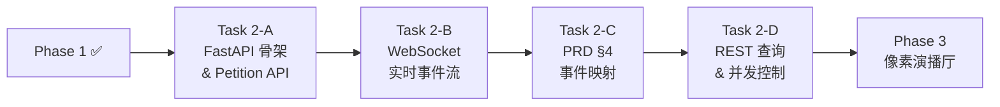

# Phase 2 · 通信桥接层 (API & WebSocket)

> **目标**：将后端 Agent 的运行时状态暴露为 API 和实时流，供前端消费。
> **前置依赖**：Phase 1（三权 Agent 状态机 CLI demo 跑通）
> **预估复杂度**：⭐⭐ 中
> **优先级**：🟡 紧跟 — Phase 1 CLI demo 跑通后立即开始

---

## 2.1 FastAPI 应用骨架

| 序号 | 工作项 | 说明 |
|------|--------|------|
| 2.1.1 | **FastAPI 应用初始化** | `openclaw_republic/server/app.py`，CORS、中间件、生命周期管理 |
| 2.1.2 | **提交请愿 API** | `POST /petition` — 接收选民 Prompt，创建任务，触发三权状态机 |
| 2.1.3 | **任务状态查询** | `GET /task/{id}/status` — 返回法案当前生命周期状态 |

## 2.2 WebSocket 实时事件流

| 序号 | 工作项 | 说明 |
|------|--------|------|
| 2.2.1 | **WebSocket 端点** | `/ws/task/{id}` — 推送实时 Agent 事件流 |
| 2.2.2 | **事件序列化层** | Phase 1.5.3 的结构化事件 → PRD §4 JSON 格式 (`action`, `emotion`, `intensity` 等) |

## 2.3 完整事件映射 (PRD §4) [已完成]

实现对标 PRD v3 定义的全部 9 种事件类型：

| 事件 Action | 触发条件 | 关键字段 |
|------------|---------|---------|
| `propose` | 议员输出提案草案 | `emotion`, `text` |
| `brawl` | 分歧度 > 80 | `intensity` (0~10) |
| `order` | 议长介入控场 | `intensity` |
| `vote_passed` | 共识达成，生成法案 | — |
| `sign_act` | 总统签署法案 | — |
| `veto` | 总统否决 | `reason` |
| `tool_call` | 内阁调用 Skill | `skill`, 执行状态 |
| `constitutional` | 合宪通过 | — |
| `unconstitutional` | 违宪驳回 | `reason`, `traceback` |

## 2.4 会话 & 任务管理

| 序号 | 工作项 | 说明 |
|------|--------|------|
| 2.4.1 | **任务队列** | 异步任务调度，防止同时跑多个重任务 |
| 2.4.2 | **并发控制** | Token 预算全局管理，避免多任务竞争 |
| 2.4.3 | **任务持久化** | SQLite (开发) / Redis (生产) 存储任务状态和历史 |

## 2.5 REST 查询 API

| 序号 | 工作项 | 说明 |
|------|--------|------|
| 2.5.1 | **历史任务列表** | `GET /tasks` — 分页查询历史任务 |
| 2.5.2 | **法案详情** | `GET /task/{id}/act` — 查看法案内容 |
| 2.5.3 | **辩论记录** | `GET /task/{id}/debate` — 辩论日志 + Conflict Score 曲线数据 |
| 2.5.4 | **审判结果** | `GET /task/{id}/verdict` — 司法判决详情 |

---

## 验收标准

- [x] `POST /petition` 可提交 Prompt 并触发后端流水线
- [ ] `wscat` 连接 `/ws/task/{id}` 可实时收到 9 种事件类型的 JSON 流
- [x] `GET /task/{id}/status` 返回正确的法案生命周期状态
- [ ] 历史任务、辩论记录、审判结果可通过 REST API 查询
- [x] Swagger 文档自动生成 (`/docs`)

---

## Task 拆分

Phase 2 拆分为 4 个独立闭环的开发任务，按顺序执行：

| Task | 标题 | 涵盖子项 | 预估 | 状态 |
|------|------|---------|------|------|
| [Task 2-A](task2.1_fastapi_skeleton.md) | FastAPI 应用骨架 & 核心 Petition API | 2.1 全部 + 2.4.3 SQLite 持久化 | 1 会话 | ✅ 完成 |
| [Task 2-B](task2.2_websocket_events.md) | WebSocket 实时事件流 | 2.2 全部 | 1 会话 | ✅ 完成 |
| [Task 2-C](task2.3_event_mapping.md) | PRD §4 完整事件映射 & Pipeline 埋点 | 2.3 全部 | 1-2 会话 | ✅ 完成 |
| [Task 2-D](task2.4_rest_query_and_concurrency.md) | REST 查询 API & 并发控制 | 2.4.1~2.4.2 + 2.5 全部 | 1 会话 | ✅ 完成 |

**依赖关系**：`Task 2-A` → `Task 2-B` → `Task 2-C` → `Task 2-D`

---

## 后续衔接

- ← 前置：[Phase 1 · 后端核心](../phase1/phase1_overview.md)
- → 后续：[Phase 3 · 像素演播厅前端](../phase3/phase3_overview.md)
- → 并行：Phase 3 的美术资源制作可与 Phase 2 同步进行
