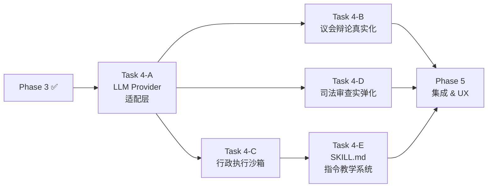

# Phase 4 · 真实沙箱与指令集外挂引擎 (The Sandbox Engine)

> **目标**：打通 Agent 全链路真实执行能力——替换所有 Mock，接入 LLM API、本地沙箱、CLI 工具链，使三权分立系统具备物理世界交互能力。
> **前置依赖**：Phase 1（三权 Agent 状态机） + Phase 2（通信桥接） + Phase 3（像素演播厅）
> **预估复杂度**：⭐⭐⭐⭐ 高
> **优先级**：🔴 核心 — 系统灵魂所在

---

## 📌 为什么需要这个 Phase？

当前系统存在 **两层 Mock**，导致端到端虽然表面能跑，但内核完全是"念台词"：

1. **LLM Mock**：所有 Agent 的 `_call_llm()` 返回硬编码字符串（`radical_mp.py` 返回固定的激进派宣言、`conservative_mp.py` 返回固定批评、`speaker.py` 返回空字符串）。辩论没有真正的博弈。
2. **工具执行 Mock**：`sec_engineering.py` 和 `sec_state.py` 的 `execute_task()` 直接返回 `TaskResult(status="success", output="[Mock]...")`。系统从来没有执行过一行真实的代码。

> 参考 [danghuangshang](https://github.com/wanikua/danghuangshang) 项目的设计哲学：Agent 通过 `SKILL.md` 自然语言教学 + CLI 命令行二进制 (`gh`, `browser-use`) 实现工具调用，底层走 `subprocess` 执行。我们将借鉴此模式。

---

## 4.1 LLM Provider 适配层

| 序号 | 工作项 | 说明 |
|------|--------|------|
| 4.1.1 | **统一 LLM Client 抽象** | 定义 `LLMProvider` 协议，支持 OpenAI / Claude / 本地 Ollama 等多后端切换 |
| 4.1.2 | **`_call_llm()` 真实化** | 替换 `BaseAgent._call_llm()` 底层为真实 API 调用（含 System Prompt / SOUL.md 注入） |
| 4.1.3 | **Token 计量与回传** | 每次 LLM 调用返回实际消耗 Token 数，注入到事件流中供前端遥测大屏消费 |
| 4.1.4 | **配置外化** | `config/llm.yaml`：API Key、模型选择（强力/快速）、温度参数、超时设置 |
| 4.1.5 | **Mock 模式保留** | 提供 `MOCK_LLM=true` 环境变量开关，方便无 API Key 时跑测试和前端开发 |

---

## 4.2 议会辩论真实化

| 序号 | 工作项 | 说明 |
|------|--------|------|
| 4.2.1 | **议员 LLM 提案/反驳** | `radical_mp.propose()` / `conservative_mp.critique()` 接入真实 LLM |
| 4.2.2 | **议长 LLM 控场与法案生成** | `speaker.intervene()` 和 `speaker.generate_act()` 接入真实 LLM，产出多步骤结构化 Act |
| 4.2.3 | **Conflict Score LLM 化** | 考虑用 LLM-as-a-Judge 辅助计算分歧度（可选，也可保持规则引擎） |
| 4.2.4 | **投票逻辑真实化** | 移除 `_force_vote_passed()` 的硬编码保底，让议员基于真实 LLM 判断 |

---

## 4.3 行政执行沙箱

| 序号 | 工作项 | 说明 |
|------|--------|------|
| 4.3.1 | **Sandbox 工作区隔离** | 为每个任务创建独立的 `/tmp/openclaw_sandbox/<task_id>/` 临时工作目录 |
| 4.3.2 | **Python 解释器 Skill** | 工程部长可调用 `asyncio.create_subprocess_exec` 执行 Python 脚本，捕获 stdout/stderr |
| 4.3.3 | **Bash/Shell Skill** | 通用命令行执行能力，受限于白名单（禁止 `rm -rf /`、`DROP TABLE` 等危险指令） |
| 4.3.4 | **LLM 驱动的代码生成** | 工程部长收到 `ExecutionTask` 后，调用 LLM 生成执行代码，再提交沙箱运行 |
| 4.3.5 | **执行结果回收** | 将 stdout/stderr/exit_code 封装为真实 `TaskResult`，替换当前的 `[Mock]` 输出 |
| 4.3.6 | **超时与资源限制** | 单步执行超时 (30s)、内存上限、禁止网络访问（可配置） |

---

## 4.4 司法审查实弹化

| 序号 | 工作项 | 说明 |
|------|--------|------|
| 4.4.1 | **过程审查接入真实执行** | `ProcessReviewer` 监听真实的 `tool_call` 事件，检测执行日志中的危险模式 |
| 4.4.2 | **结果审查 LLM 化** | `ResultReviewer` 改用 LLM-as-a-Judge 对比原始请愿 vs 真实产物，计算偏离度评分 |
| 4.4.3 | **Kill Switch 真实化** | 违宪判定后真正终止沙箱子进程（`process.kill()`），而非仅记录日志 |

---

## 4.5 SKILL.md 指令教学系统

| 序号 | 工作项 | 说明 |
|------|--------|------|
| 4.5.1 | **Skill 注册表** | `config/skills/` 目录，每个 Skill 一个 `SKILL.md`，描述工具能力与调用方法 |
| 4.5.2 | **Skill 上下文注入** | Agent 初始化时，将挂载的 `SKILL.md` 文本追加到 System Prompt |
| 4.5.3 | **首批 Skill 编写** | 编写 `CodeExecution.md`、`Python_Interpreter.md`、`Search.md` 三份指令教学文件 |

---

## 验收标准

- [ ] 所有 Agent 的 `_call_llm()` 可接入真实 LLM API 并返回有意义的回复
- [ ] 议会辩论产生真实的多轮博弈（观察不同请愿产生截然不同的辩论内容）
- [ ] `speaker.generate_act()` 产出包含多步骤的结构化法案（而非单步占位）
- [ ] 工程部长可在沙箱中执行真实 Python 代码并返回 stdout/stderr
- [ ] 带 `rm -rf` 等危险指令的请愿能被司法分支的过程审查真实拦截
- [ ] 提供 `MOCK_LLM=true` 开关，关闭 LLM 后系统仍可用原有 Mock 行为跑通
- [ ] 环境变量 `OPENAI_API_KEY`（或等效配置）设定后，全链路可用真实 AI 跑通

---

## Task 拆分

Phase 4 拆分为 5 个单会话闭环的开发任务：

| Task | 标题 | 涵盖子项 | 预估 | 状态 |
|------|------|---------|------|------|
| [Task 4-A](task4.1_llm_provider.md) | LLM Provider 适配层 | 4.1 | 1 会话 | ⏳ 待处理 |
| [Task 4-B](task4.2_debate_real.md) | 议会辩论真实化 | 4.2 | 1 会话 | ⏳ 待处理 |
| [Task 4-C](task4.3_sandbox_engine.md) | 行政执行沙箱引擎 | 4.3 | 1 会话 | ⏳ 待处理 |
| [Task 4-D](task4.4_judicial_real.md) | 司法审查实弹化 | 4.4 | 1 会话 | ⏳ 待处理 |
| [Task 4-E](task4.5_skill_system.md) | SKILL.md 指令教学系统 | 4.5 | 1 会话 | ⏳ 待处理 |

`Task 4-A` 是一切的地基（LLM 调用能力），之后 `4-B`、`4-C`、`4-D` 可一定程度并行。`4-E` 需在 `4-C` 之后或同步进行。

---

## 后续衔接

- ← 前置：[Phase 1](../phase1/phase1_overview.md) + [Phase 2](../phase2/phase2_overview.md) + [Phase 3](../phase3/phase3_overview.md)
- → 后续：[Phase 5 · 集成 & UX 优化](../phase5/phase5_overview.md)
