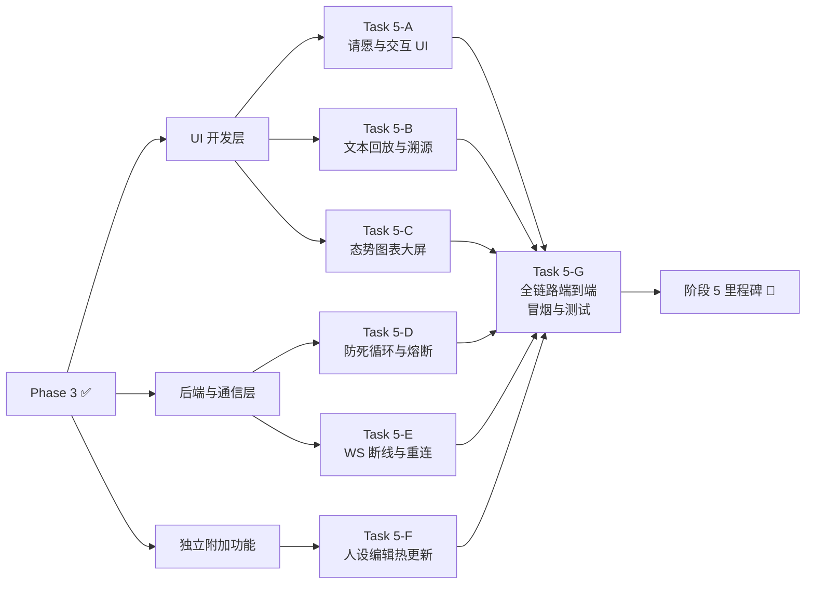

# Phase 5 · 集成、端到端串联 & UX 优化

> **目标**：三层打通，全流程可跑，用户体验打磨。
> **前置依赖**：Phase 1 ~ Phase 4（三层基本就绪 + 沙箱引擎接入）
> **预估复杂度**：⭐⭐⭐ 中高
> **优先级**：🟢 后续

---

## 5.1 端到端集成测试

| 序号 | 工作项 | 说明 |
|------|--------|------|
| 5.1.1 | **全链路冒烟测试** | 完整 Petition → 辩论 → 表决 → 签署/否决 → 执行 → 审判 → 前端动画 |
| 5.1.2 | **异常路径测试** | Veto → 重回辩论 → 再表决 → 违宪 → 重做 → 最终通过 |
| 5.1.3 | **性能基准** | 单任务全链路耗时、Token 消耗分布、前端渲染帧率 |

---

## 5.2 选民请愿 UI

| 序号 | 工作项 | 说明 |
|------|--------|------|
| 5.2.1 | **Prompt 输入面板** | 用户提交需求（Petition），支持多行文本、快捷模板 |
| 5.2.2 | **任务状态卡片** | 实时展示法案生命周期状态 + 当前激活场景指示 |
| 5.2.3 | **Conflict Score 仪表** | 实时可视化辩论分歧度变化曲线 |

---

## 5.3 结果展示 UI

| 序号 | 工作项 | 说明 |
|------|--------|------|
| 5.3.1 | **总统交付备忘录** | 任务完成后的成果面板：代码/文件/文本输出 |
| 5.3.2 | **判决书展示** | 司法审查结果详情：合宪理由 / 违宪理由 + Traceback |

---

## 5.4 辩论回放 & 日志

| 序号 | 工作项 | 说明 |
|------|--------|------|
| 5.5.1 | **辩论时间线** | 可点击查看每轮 Critique/Rebuttal 的详细 CoT 日志 |
| 5.5.2 | **Conflict Score 曲线** | 历史 Conflict Score 变化图表 |
| 5.5.3 | **分支活动日志** | 按立法/行政/司法分组的事件流时间线 |

---

## 5.5 Token 仪表盘

| 序号 | 工作项 | 说明 |
|------|--------|------|
| 5.5.1 | **实时 Token 消耗** | 各分支（立法/行政/司法）的 Token 消耗分布饼图 |
| 5.5.2 | **辩论轮次计数** | 当前/历史辩论轮次统计 |
| 5.5.3 | **执行耗时指标** | 每步 Skill 调用的耗时瀑布图 |

---

## 5.6 错误处理 & 重试

| 序号 | 工作项 | 说明 |
|------|--------|------|
| 5.6.1 | **LLM 超时/限流** | 自动重试 + 指数退避 + 用户通知 |
| 5.6.2 | **Skill 执行失败** | 错误上报行政分支 → 判断是否需要 Veto |
| 5.6.3 | **Veto 重入循环** | 设置最大 Veto 次数防死循环 |
| 5.6.4 | **违宪重做上限** | 设置最大重做次数，超过后降级为人工处理 |
| 5.6.5 | **WebSocket 断线重连** | 前端自动重连 + 事件补发 |

---

## 5.7 SOUL.md 热编辑

| 序号 | 工作项 | 说明 |
|------|--------|------|
| 5.7.1 | **在线 SOUL 编辑器** | 前端提供 Markdown 编辑器，可在线修改 Agent 人设 |
| 5.7.2 | **热更新机制** | 修改后无需重启，下一轮对话自动加载新 SOUL |
| 5.7.3 | **预设人设库** | 提供多套预设人设模板：激进/温和/极端保守 等 |

> 用户界面的「给官员换脑子」按钮 — 调整政策基调，促进社区二创。

---

## 验收标准

- [ ] 端到端全链路可在浏览器完成：输入 Prompt → 观看像素动画 → 获取结果
- [ ] 异常路径（Veto、违宪）可正确触发重入并最终完成
- [ ] Token 仪表盘和 Conflict Score 实时展示
- [ ] SOUL.md 热编辑可用
- [ ] WebSocket 断线重连稳定

---

## Task 拆分

为保证高质量与单会话的单路闭环，Phase 5 深度拆解为以下 7 个 Task：

| Task | 标题 | 涵盖子项 | 预估 | 状态 |
|------|------|---------|------|------|
| [Task 5-A](task5.1_basic_io_ui.md) | 基础交互舱 (输入与交付 UI) | 5.2.1-2, 5.3 | 1 会话 | ⏳ 待处理 |
| [Task 5-B](task5.2_replay_timeline.md) | 深度追踪流 (回放与日志系统) | 5.4 | 1 会话 | ⏳ 待处理 |
| [Task 5-C](task5.3_visual_dashboard.md) | 可视化遥测大屏 (图表组件) | 5.5, 5.2.3 | 1 会话 | ⏳ 待处理 |
| [Task 5-D](task5.4_backend_resilience.md) | 业务规则防线 (LLM 与循环熔断) | 5.6.1-4 | 1 会话 | ⏳ 待处理 |
| [Task 5-E](task5.5_ws_reliability.md) | 通信韧性底座 (WS 断线重连) | 5.6.5 | 1 会话 | ⏳ 待处理 |
| [Task 5-F](task5.6_soul_hotload.md) | SOUL.md 在线编辑与热重载 | 5.7 | 1 会话 | ⏳ 待处理 |
| [Task 5-G](task5.7_e2e_benchmark.md) | 最终防线战 (端到端基准测试) | 5.1 | 1 会话 | ⏳ 待处理 |

`Task 5-A` 必须优先完成，作为系统的核心骨架。`Task 5-B` 到 `Task 5-F` 可不同程度并行开发。所有逻辑就绪后最终收口于 `Task 5-G`。

---

## 后续衔接

- ← 前置：[Phase 1](../phase1/phase1_overview.md) + [Phase 2](../phase2/phase2_overview.md) + [Phase 3](../phase3/phase3_overview.md) + [Phase 4](../phase4/phase4_overview.md)
- → 后续：[Phase 6 · 极致发布](../phase6/phase6_overview.md)
