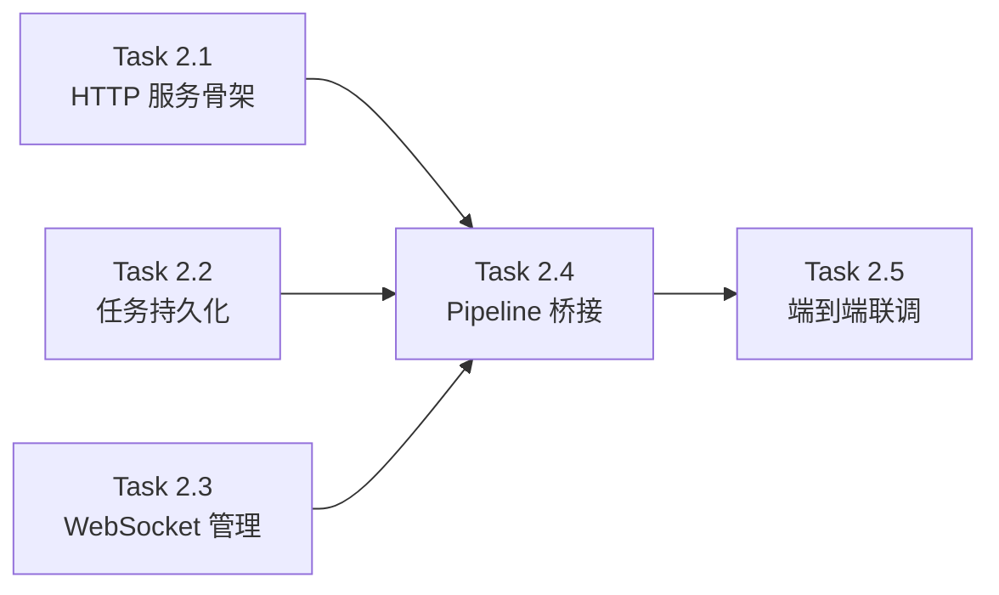

# Phase 2 · Server 层 & WebSocket 前后端打通

> **目标**：在 Phase 1 完成的核心编排层之上，搭建 HTTP/WebSocket 服务器，将 Pipeline 事件实时推送给像素演播厅前端。最终产出：浏览器能观看完整的三权分立动画。
> **前置依赖**：[Phase 1](../phase1/phase1_overview.md) 完成（核心编排层 TypeScript 翻译）
> **总预估耗时**：5 个会话

---

## 设计理念

Phase 2 的核心任务是 **将 Python 版的 FastAPI Server 层 1:1 翻译为 TypeScript（Express.js/Fastify）**，同时保持与前端 `useWebSocket.ts` 的完全兼容。

### 关键约束

1. **WebSocket 消息格式不变**：前端 `EventMapper.ts` 期望的 `WSEventPayload` 格式（`action`, `source_agent`, `intensity`, `emotion`, `timestamp`, `payload`）必须原样保留
2. **REST API 接口不变**：`POST /petition`、`GET /task/:id/status`、`GET /tasks` 等端点保持 URL 和响应结构兼容
3. **Vite 代理已就绪**：前端 `vite.config.ts` 已配置 `/api/*` → `localhost:8000` 和 `/ws/*` → `ws://localhost:8000` 代理规则，TS 后端需监听 8000 端口
4. **前端零改动**：Phase 2 完成后，现有前端无需任何修改即可与 TS 后端协同工作

### Python → TypeScript 对照

| Python 源文件 | 行数 | TS 目标文件 | 翻译复杂度 |
|--------------|------|------------|-----------|
| `server/app.py` | 140 | `server/app.ts` | ⭐⭐ 中低 |
| `server/routes.py` | 215 | `server/routes.ts` | ⭐⭐⭐ 中 |
| `server/websocket.py` | 78 | `server/websocket.ts` | ⭐⭐ 中低 |
| `server/ws_manager.py` | 92 | `server/ws-manager.ts` | ⭐⭐ 低 |
| `server/task_queue.py` | 74 | `server/task-queue.ts` | ⭐⭐ 低 |
| `server/task_store.py` | 315 | `server/task-store.ts` | ⭐⭐⭐ 中 |
| `server/schemas.py` | 49 | `server/schemas.ts` | ⭐ 低 |
| **合计** | **~960 行** | | |

---

## 拆解策略

将 960 行 Python Server 层按**数据流方向**和**依赖拓扑**拆分为 5 个严格单会话闭环的 Task：

| 任务 | 核心范围 | 预估代码量 | 为什么能单次会话闭环？ |
|------|---------|------------|----------------------|
| ✅ **[2.1 HTTP 服务骨架与路由](task2.1_http_server.md)** | `server/app.ts`, `server/routes.ts`, `server/schemas.ts` | ~500 行 | Express 应用搭建 + REST API + Zod 校验，经 8 轮 QA 修复 18 处隐患（含 5 个致命级），34 个防弹单测 |
| ✅ **[2.2 任务持久化与队列](task2.2_task_store.md)** | `server/task-store.ts`, `server/task-queue.ts` | ~370 行 | better-sqlite3 + 手写 semaphore 队列，32 个单测 |
| **[2.3 WebSocket 连接管理与事件推送](task2.3_websocket.md)** | `server/ws-manager.ts`, `server/websocket.ts` | ~200 行 | WS 连接管理器 + 端点实现，需要桥接 `MessageBus` → WS broadcast |
| **[2.4 Pipeline 桥接与事件流集成](task2.4_pipeline_bridge.md)** | 修改 `server/app.ts`（lifespan 逻辑）、事件桥接 | ~200 行 | 将 `CyberGovernment.bus` 订阅的事件桥接到 WS 和 DB 持久化，实现完整的事件流转链路 |
| **[2.5 端到端联调验证](task2.5_e2e_verification.md)** | E2E 测试脚本、Vite 代理验证 | ~150 行 | 启动 TS 后端 + 前端，提交 Petition，验证 WS 事件触发像素动画 |

---

## 依赖关系

> ✅ Task 2.1、2.2 已完成（共 66 个单测全绿）。下一步推进 Task 2.3 WebSocket 管理。
> Task 2.4 必须等 2.1~2.3 全部完成后才能集成。
> Task 2.5 是最终验收里程碑。

---

## 新增依赖

Phase 2 需要新增以下 npm 依赖到 `backend/package.json`：

| 包名 | 用途 | 类别 |
|------|------|------|
| `express` | HTTP 服务器框架 | dependencies |
| `cors` | CORS 中间件 | dependencies |
| `better-sqlite3` | SQLite 持久化（同步，性能好） | dependencies |
| `@types/express` | Express 类型定义 | devDependencies |
| `@types/cors` | CORS 类型定义 | devDependencies |
| `@types/better-sqlite3` | better-sqlite3 类型定义 | devDependencies |

> **为何选 Express 而非 Fastify？**
> - Phase 1 已有 `ws` 包，Express + `ws` 是 Node.js WebSocket 最成熟的组合
> - Express 中间件生态最丰富，社区文档最齐全
> - 前端 Vite 代理已配置指向 `localhost:8000`，与框架无关
>
> **为何选 better-sqlite3 而非 aiosqlite？**
> - Node.js 中 `better-sqlite3` 是同步 API + C++ binding，性能远超 JS 实现
> - 适合小型单机 SQLite 场景，无需引入异步复杂度

---

## 验收标准（Phase 2 整体）

1. `npm run dev` 启动 TS 后端，监听 8000 端口
2. `POST /petition` → 返回 `202 Accepted` + `task_id`
3. `GET /task/:id/status` → 返回任务当前状态
4. `GET /tasks` → 分页返回历史任务列表
5. `wscat -c ws://localhost:8000/ws/task/{task_id}` 建立 WS 连接，实时接收 Pipeline 事件 JSON 流
6. 启动前端 `npm run dev`（端口 3000），提交 Petition → 像素演播厅场景正确切换、动画正确触发
7. 所有单元测试通过（`npm test`）

---

## 不变量清单

> 复述自 Master Plan，Phase 2 实现过程中**绝对不能破坏**的约束：

1. **WebSocket 事件格式不变** — `EventMapper.ts` 期望的 JSON 字段名必须保持
2. **法案生命周期状态机不变** — 11 态 + 合法转换表
3. **RBAC 权限模型不变** — 5 权限 + 3 分支
4. **constitution.yaml / SOUL.md 格式不变**
5. **前端代码零改动**
