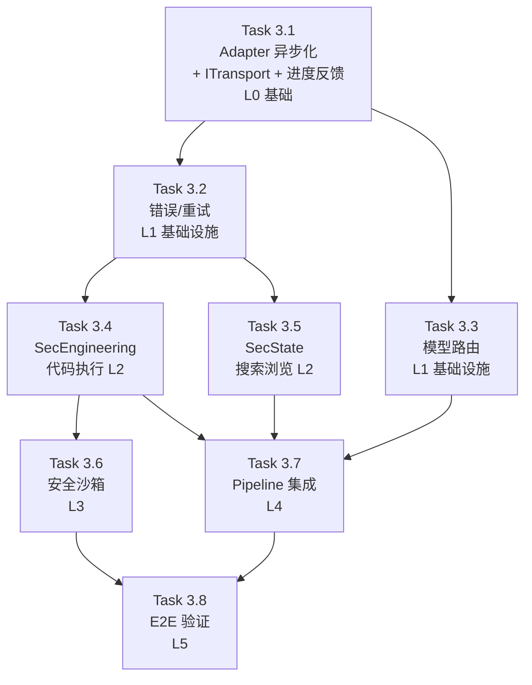

# Phase 3 · OpenClaw 深度集成 & 真实执行

> **目标**：将 CyberGovernment 从"CLI subprocess + Mock 执行"模式切换为 **异步通信 + 真实 LLM 调用 + 真实工具执行**，同时引入分角色模型路由和真实执行错误处理体系。
> **前置依赖**：[Phase 1](../phase1/phase1_overview.md) + [Phase 2](../phase2/phase2_overview.md) 完成
> **总预估耗时**：4-5 个会话

---

## 现状分析 & 核心痛点

| 编号 | 痛点 | 现状 | Phase 3 目标 |
|------|------|------|-------------|
| P1 | **`execSync` 阻塞事件循环** | `adapter.ts:295-309` 使用 `execSync` 调 CLI，每次 LLM 调用冻结整个 Node.js 30-120s | 异步子进程 (`spawn`) + 等待期用户反馈 |
| P2 | **执行引擎 Mock** | `sec-engineering.ts:31` / `sec-state.ts:31` 返回 `[Mock]` 硬编码文本 | 真实调用 OpenClaw Skill |
| P3 | **单一模型全场景** | 所有 Agent 共享同一个 `defaultModel`，无法差异化 | 按角色灵活配置模型（用户自定义） |
| P4 | **非确定性错误无感知** | LLM 截断 JSON / 超时 / Gateway 断连缺乏统一处理 | 结构化错误分类 + 重试 + 熔断 |
| P5 | **代码执行无安全约束** | Gateway exec Skill 有基础保护，但编排层无预检查 | L2 层轻量安全沙箱 |

---

## 关键设计决策

### 决策 1：Adapter 通信方式 → CLI `spawn` + 进度反馈 + WebSocket Hook

**采纳方案**：`child_process.spawn` 异步子进程

- 将 `execSync` 替换为 `spawn` + Promise，**事件循环不再阻塞**
- **等待期间推送进度事件**给用户（如 `{ action: "llm_thinking", agent: "speaker", elapsed_seconds: 5 }`），让前端可以展示 loading/thinking 动画
- **预留 WebSocket 直连 Hook**：Adapter 采用接口抽象（`ITransport`），当前实现 `CliTransport`，未来可无缝替换为 `WebSocketTransport`

```typescript
// 预留的接口抽象 (adapter.ts)
interface ITransport {
  send(args: string[]): Promise<string>;           // CLI spawn 或 WS send
  onProgress?(callback: (msg: string) => void): void; // 进度回调
}

class CliTransport implements ITransport { ... }     // Phase 3 实现
class WebSocketTransport implements ITransport { ... } // Phase 4+ 实现
```

### 决策 2：模型路由 → 用户灵活配置

**采纳方案**：`constitution.yaml` 中的 `model_routing` 段完全由用户自定义

- **不硬编码 Opus/Sonnet** — 用户自由配置 `role → model` 映射
- 支持 `default` 兜底：未显式配置的角色 fallback 到 `default` 模型
- 配置示例：

```yaml
# constitution.yaml
model_routing:
  default: "anthropic/claude-sonnet-4-20250514"   # 全局默认
  chief_justice: "anthropic/claude-opus-4-20250514"   # 大法官用强模型
  radical_mp: "deepseek/deepseek-chat"             # 或者用便宜模型辩论
  # 未列出的角色自动使用 default
```

### 决策 3：安全约束 → 轻量预检

**采纳方案**：编排层做最基本的预检查

- 代码长度 ≤ 10KB、超时 ≤ 60s、输出截断 ≤ 50KB、危险命令正则拦截
- 不限制网络/文件系统（实验项目需要灵活性）
- Gateway L1 内置沙箱作为兜底

---

## 拆解策略

将 Phase 3 按**依赖拓扑**和**风险递减**原则拆分为 **8 个 Task**，每个 0.5 会话闭环：

| 任务 | 核心范围 | 预估代码量 | 风险 | 层级 |
|------|---------|------------|------|------|
| **[3.1 Adapter 异步化重构](task3.1_adapter_async.md)** ✅ | `adapter.ts` execSync→spawn + ITransport 抽象 + 进度回调 | ~250 行改动 | ⭐⭐⭐⭐ 高 | L0 基础 |
| **[3.2 错误分类与重试基础设施](task3.2_error_retry.md)** | `errors.ts` + `retry.ts` 新建 | ~200 行新增 | ⭐⭐ 低 | L1 基础设施 |
| **[3.3 模型路由与 Agent 配置](task3.3_model_routing.md)** | `config/` + `base.ts` + `constitution.yaml` | ~150 行 | ⭐⭐ 低 | L1 基础设施 |
| **[3.4 SecEngineering 真实代码执行](task3.4_sec_engineering.md)** | `sec-engineering.ts` 重构 | ~200 行改动 | ⭐⭐⭐⭐ 高 | L2 执行层 |
| **[3.5 SecState 搜索与浏览对接](task3.5_sec_state.md)** | `sec-state.ts` 重构 | ~120 行改动 | ⭐⭐⭐ 中 | L2 执行层 |
| **[3.6 安全沙箱与执行约束](task3.6_sandbox.md)** | `sandbox.ts` 新建 + 集成 | ~150 行新增 | ⭐⭐⭐ 中 | L3 安全层 |
| **[3.7 Pipeline 集成调试](task3.7_pipeline_integration.md)** | `government.ts` 调整 + 联调 | ~100 行改动 | ⭐⭐⭐ 中 | L4 集成层 |
| **[3.8 端到端真实验证](task3.8_e2e_verification.md)** | E2E 测试 + 全路径覆盖 | ~350 行测试 | ⭐⭐ 低 | L5 验证层 |

---

## 依赖关系



> **并行机会**：
> - Task 3.2 与 3.3 可并行（都只依赖 3.1）
> - Task 3.4 与 3.5 可并行（都只依赖 3.2）

---

## Task 3.1: Adapter 异步化重构 <a id="task-31"></a>

> **目标**：将 OpenClaw CLI 调用从 `execSync` 切换为 `spawn` 异步，增加 **进度回调机制** + **`ITransport` 接口抽象**为未来 WebSocket 直连铺路。
> **对应文件**：`backend/src/openclaw/adapter.ts`
> **预估耗时**：0.5 会话

### 设计要点

#### 1) ITransport 接口抽象（Phase 4 WebSocket Hook）

```typescript
// openclaw/transport.ts — 传输层接口
export interface ITransport {
  /** 发送命令并等待完整响应 */
  send(args: string[]): Promise<string>;
  /** 注册进度回调（可选） */
  onProgress?(callback: (elapsed: number) => void): void;
  /** 关闭连接/清理资源 */
  dispose?(): void;
}

// 当前实现
export class CliTransport implements ITransport { ... }

// 未来实现 (Phase 4+)
// export class WebSocketTransport implements ITransport { ... }
```

#### 2) 等待期进度反馈

```typescript
// 在 LLM 调用期间，每隔 N 秒通过 MessageBus 发布进度事件
// 前端可展示 "Speaker 正在思考… (12s)" 的 loading 动画
private startProgressHeartbeat(agentRole: string, taskId: string): NodeJS.Timeout {
  let elapsed = 0;
  return setInterval(() => {
    elapsed += 3;
    this.bus?.publish('lifecycle', {
      action: 'llm_thinking',
      source_agent: agentRole,
      payload: { elapsed_seconds: elapsed },
      task_id: taskId,
    });
  }, 3000);
}
```

### 交付物

| 文件 | 改动类型 | 说明 |
|------|---------|------|
| `openclaw/transport.ts` | **新增** | `ITransport` 接口 + `CliTransport` 实现 |
| `adapter.ts` | **重构** | 依赖 `ITransport`；`runCliCommand` → `CliTransport.send()`；新增进度回调 |
| `adapter.ts` | **删除** | `execSync` + `/tmp/` 临时文件方案 |
| `tests/openclaw/adapter.test.ts` | **修改** | 异步行为 + 超时 + 并发 + 进度回调测试 |

### 验收标准

- [x] `callLLM()` 执行期间，Express HTTP 请求正常响应（事件循环不阻塞）
- [x] WS 心跳在 LLM 调用期间不丢失
- [x] 进度事件每 3 秒推送一次 `llm_thinking` 到 MessageBus
- [x] `ITransport` 接口已定义，未来可直接实现 `WebSocketTransport` 替换
- [x] 所有现有 242 测试通过（回归）— 265 tests (242 + 23 new)
- [x] 新增超时测试 + 并发测试 + maxBuffer测试 + 误检测防护测试
- [x] 深度审查 6 轮，修复 10 个 Bug（1 Fatal + 4 High + 3 Medium + 2 Low）

---

## Task 3.2: 错误分类与重试基础设施 <a id="task-32"></a>

> **目标**：建立统一的非确定性错误分类、重试和熔断机制。
> **对应文件**：`backend/src/openclaw/` 新建 2 个文件
> **前置依赖**：Task 3.1
> **预估耗时**：0.5 会话

### 错误分类体系

```typescript
// openclaw/errors.ts
enum OpenClawErrorType {
  // ── 可重试 ──
  LLM_TIMEOUT        = 'LLM_TIMEOUT',
  LLM_RATE_LIMIT     = 'LLM_RATE_LIMIT',
  JSON_PARSE_ERROR   = 'JSON_PARSE_ERROR',
  GATEWAY_DISCONNECT = 'GATEWAY_DISCONNECT',

  // ── 不可重试 ──
  MODEL_NOT_FOUND      = 'MODEL_NOT_FOUND',
  SKILL_NOT_AVAILABLE  = 'SKILL_NOT_AVAILABLE',
  AUTH_FAILED          = 'AUTH_FAILED',
  CODE_EXECUTION_CRASH = 'CODE_EXEC_CRASH',
  CONTENT_FILTERED     = 'CONTENT_FILTERED',
}
```

### 重试策略矩阵

| 错误类型 | 最大重试 | 退避策略 | 说明 |
|---------|---------|---------|------|
| `LLM_TIMEOUT` | 2 次 | 指数退避 (2s, 4s) | Gateway 暂时过载 |
| `JSON_PARSE_ERROR` | 2 次 | 立即重试 | LLM 随机性（Phase 2 已验证） |
| `LLM_RATE_LIMIT` | 3 次 | 指数退避 (5s, 10s, 20s) | 等限流窗口过期 |
| `GATEWAY_DISCONNECT` | 1 次 | 固定 3s | 重新连接 |
| 其他不可重试 | 0 次 | — | 直接传播 |

### 交付物

| 文件 | 改动类型 | 说明 |
|------|---------|------|
| `openclaw/errors.ts` | **新增** | `OpenClawError` 基类 + 枚举 + 错误工厂 |
| `openclaw/retry.ts` | **新增** | `withRetry<T>(fn, config): Promise<T>` |
| `adapter.ts` | **修改** | 错误分类 + `callLLM`/`executeCode` 内部包裹 `withRetry` |
| `tests/openclaw/errors.test.ts` | **新增** | 错误分类单测 |
| `tests/openclaw/retry.test.ts` | **新增** | 重试策略单测 |

### 验收标准

- [ ] 可重试错误执行指定次数重试 + 退避
- [ ] 不可重试错误立即传播
- [ ] 结构化日志 `[Retry] attempt 2/3 for LLM_TIMEOUT`
- [ ] 所有现有测试通过

---

## Task 3.3: 模型路由与 Agent 配置 <a id="task-33"></a>

> **目标**：让不同 Agent 使用不同 LLM 模型，**完全由用户在 `constitution.yaml` 中灵活配置**。
> **对应文件**：`config/`, `base.ts`, `constitution.yaml`, `adapter.ts`, `government.ts`
> **前置依赖**：Task 3.1
> **预估耗时**：0.5 会话

### 配置格式设计

```yaml
# constitution.yaml — model_routing 段（可选）
model_routing:
  # 全局默认模型（必填，如果 model_routing 段存在）
  default: "anthropic/claude-sonnet-4-20250514"

  # 按角色覆盖（可选，未列出的角色使用 default）
  overrides:
    chief_justice: "anthropic/claude-opus-4-20250514"
    radical_mp: "deepseek/deepseek-chat"
    conservative_mp: "deepseek/deepseek-chat"
    # speaker, president, sec_engineering, sec_state → 使用 default
```

### Zod Schema

```typescript
// config/models.ts
const ModelRoutingConfigSchema = z.object({
  default: z.string().describe('全局默认模型 ref'),
  overrides: z.record(z.string(), z.string()).optional()
    .describe('role → model 覆盖映射'),
}).optional();
```

### 交付物

| 文件 | 改动类型 | 说明 |
|------|---------|------|
| `config/models.ts` | **修改** | 新增 `ModelRoutingConfig` Zod schema |
| `constitution.yaml` | **修改** | 新增 `model_routing` 可选段 |
| `config/loader.ts` | **修改** | 解析 `model_routing`，缺失时 fallback |
| `base.ts` | **修改** | 新增 `modelRef` 属性 + `callLLM` 自动传入 |
| `adapter.ts` | **修改** | `callLLM(systemPrompt, userMessage, model?)` 增加可选参数 |
| `government.ts` | **修改** | 初始化时从 `constitution.model_routing` 注入 |
| `tests/config/model-routing.test.ts` | **新增** | schema 校验 + fallback + 注入链测试 |

### 验收标准

- [ ] `constitution.yaml` 新增 `model_routing` 段，用户可自由配置 `role → model`
- [ ] LLM 调用日志中可见各 Agent 使用了不同模型
- [ ] 未配置 `model_routing` 段 → 所有 Agent 使用 `adapter.config.defaultModel`（向后兼容）
- [ ] 未在 `overrides` 中列出的角色 → 使用 `model_routing.default`
- [ ] 所有现有测试通过

---

## Task 3.4: SecEngineering 真实代码执行 <a id="task-34"></a>

> **目标**：将 `SecretaryOfEngineering` 从 Mock 切换为真实调用 OpenClaw CodeExecution Skill。
> **对应文件**：`backend/src/agents/executive/sec-engineering.ts`
> **前置依赖**：Task 3.1 + Task 3.2
> **预估耗时**：0.5-1 会话

### 两阶段执行设计

```
阶段 1: 代码生成 (LLM Call)
  Input:  step.description ("用 Python 编写一个 hello world 程序")
  Output: { language: "python", code: "print('hello world')" }

阶段 2: 代码执行 (adapter.executeCode)
  Input:  code + language
  Output: ExecResult { stdout, stderr, exitCode }
  
映射: ExecResult → TaskResult
  exitCode == 0 → status: 'success', output: stdout
  exitCode != 0 → status: 'failed', error: stderr
```

### Fallback 策略

| 场景 | 处理 |
|------|------|
| 代码生成 JSON 解析失败 | `withRetry` 重试 1 次 |
| 语言不在白名单 | Fallback 到 Python |
| 执行超时 (>60s) | `failed` + timeout 错误 |
| exitCode ≠ 0 | `failed` + stderr |
| 两阶段全失败 | 结构化 `TaskResult`，不阻塞 Pipeline |

### 交付物

| 文件 | 改动类型 | 说明 |
|------|---------|------|
| `sec-engineering.ts` | **重构** | Mock → 两阶段真实执行 |
| `sec-engineering.ts` | **新增** | `_generateCode()`, `_extractCodeFromLLM()` |
| `tests/agents/executive/sec-engineering.test.ts` | **修改** | Mock adapter 验证调用链 |

### 验收标准

- [ ] "写 hello world" → 真实生成 + 执行 → stdout 包含 "hello"
- [ ] 执行失败 → `TaskResult.status = 'failed'` + 有意义错误
- [ ] 畸形 JSON → 重试 → 仍失败则 `failed` 但不崩溃
- [ ] 所有现有测试通过

---

## Task 3.5: SecState 搜索与浏览对接 <a id="task-35"></a>

> **目标**：将 `SecretaryOfState` 从 Mock 切换为真实调用 OpenClaw Search/WebBrowser Skill。
> **对应文件**：`backend/src/agents/executive/sec-state.ts`
> **前置依赖**：Task 3.1 + Task 3.2
> **预估耗时**：0.5 会话

### 单阶段 LLM 委托模式

与 SecEngineering 的两阶段不同，SecState 直接通过 LLM 对话委托 OpenClaw Agent 使用 Search/WebBrowser：

```
SecState.executeTask(step) →
  adapter.callLLM(systemPrompt, taskPrompt) →
    OpenClaw Agent 自行决策工具调用 →
    返回结果文本
  → 映射为 TaskResult
```

### 交付物

| 文件 | 改动类型 | 说明 |
|------|---------|------|
| `sec-state.ts` | **重构** | Mock → LLM 委托搜索/浏览 |
| `sec-state.ts` | **新增** | `_buildSearchPrompt()`, `_buildBrowsePrompt()` |
| `tests/agents/executive/sec-state.test.ts` | **修改** | Mock adapter 验证调用链 |

### 验收标准

- [ ] Search 步骤 → SecState 调用 LLM → 返回搜索结果
- [ ] WebBrowser 步骤 → SecState 调用 LLM → 返回页面摘要
- [ ] 搜索/浏览失败 → `TaskResult.status = 'failed'`
- [ ] 所有现有测试通过

---

## Task 3.6: 安全沙箱与执行约束 <a id="task-36"></a>

> **目标**：在编排层 (L2) 做轻量安全预检查。
> **对应文件**：`backend/src/openclaw/sandbox.ts` 新建
> **前置依赖**：Task 3.4
> **预估耗时**：0.5 会话

### L2 层约束清单

| 约束 | 规则 | 实现 |
|------|------|------|
| **代码长度** | ≤ 10KB | `validateCode()` 入口校验 |
| **语言白名单** | `python`, `javascript`, `bash` | 已有，保持 |
| **超时** | ≤ 60s/步 | `adapter.executeCode` timeout override |
| **输出截断** | ≤ 50KB | `truncateOutput()` |
| **危险命令** | `rm -rf /`, `mkfs`, `dd`, fork bomb | 正则 `hasDangerousCommand()` |

### 交付物

| 文件 | 改动类型 | 说明 |
|------|---------|------|
| `openclaw/sandbox.ts` | **新增** | `validateCode()`, `hasDangerousCommand()`, `truncateOutput()` |
| `sec-engineering.ts` | **修改** | 入口调用 `validateCode()`，返回前 `truncateOutput()` |
| `tests/openclaw/sandbox.test.ts` | **新增** | 拦截 + 截断 + 白名单测试 |

### 验收标准

- [ ] >10KB 代码 → 拒绝
- [ ] `rm -rf /` → 拦截
- [ ] 正常代码 → 不误拦
- [ ] >50KB 输出 → 截断 + `[OUTPUT TRUNCATED]`

---

## Task 3.7: Pipeline 集成调试 <a id="task-37"></a>

> **目标**：将真实执行能力接回 `government.ts` 完整 Pipeline，验证真实数据在全链路上正确传播。
> **前置依赖**：Task 3.3 + 3.4 + 3.5 + 3.6
> **预估耗时**：0.5 会话

### 潜在集成风险

| 风险 | 检查点 |
|------|--------|
| **偏离度评分漂移** — 真实 stdout vs Mock 中文描述 | `chief-justice.ts:_createDeviationScorer` |
| **Token 统计偏差** — Mock 时硬编码 `estimated_tokens` | `sec-engineering.ts` 返回值 |
| **输出格式差异** — ANSI 转义码/换行符 | `ExecutionReport.task_results[].output` |
| **执行时间变长** | Pipeline 超时保护 |

### 交付物

| 文件 | 改动类型 | 说明 |
|------|---------|------|
| `government.ts` | **微调** | 适配真实执行数据（如有必要） |
| `chief-justice.ts` | **微调** | deviation scorer prompt 适配代码输出 |
| 集成测试 | **新增** | Mock adapter Pipeline 全链路测试 |

### 验收标准

- [ ] Pipeline 全链路走通：Petition → 辩论 → 签署 → 真实执行 → 审查 → 交付
- [ ] `ExecutionReport` 包含真实输出（非 `[Mock]`）
- [ ] 大法官偏离度评分合理
- [ ] 事件总线正确推送所有事件

---

## Task 3.8: 端到端真实验证 <a id="task-38"></a>

> **目标**：真实 LLM + 真实 Skill 全量 E2E 回归。
> **前置依赖**：Task 3.1 ~ 3.7
> **预估耗时**：0.5-1 会话

### 测试矩阵

| 场景 | 请愿 | 预期路径 | 验证点 |
|------|------|---------|--------|
| Happy Path | "写 Python hello world" | 辩论→签署→真实执行→合宪→交付 | stdout 含 "hello" |
| 多步法案 | "写计算器+测试" | 多步执行→合宪 | 多个 `tool_call` 事件 |
| VETO | 高预算请愿 | 否决→重试 | `veto` 事件 |
| 执行失败 | "运行 1/0" | 执行报错→违宪 | `failed` 状态 |
| 模型路由 | 任意 | 全路径 | 日志验证不同模型 |
| 并发安全 | 同时 2 个 | 独立运行 | 不阻塞 |
| 安全拦截 | "rm -rf /" | 沙箱拦 | 不到达 Gateway |
| 进度反馈 | 任意 | 全路径 | WS 收到 `llm_thinking` 事件 |

### 交付物

| 文件 | 说明 |
|------|------|
| `tests/e2e/phase3-integration.test.ts` | E2E 测试 |
| `docs/plan_ts/phase3/e2e_bugs.md` | 联调 Bug 记录 |

### 验收标准

- [ ] 所有现有测试零回归
- [ ] 新增 E2E 全绿
- [ ] 真实 LLM + CodeExecution 走通 Happy Path
- [ ] Pipeline 期间 HTTP API 正常响应
- [ ] 前端像素演播厅正确渲染
- [ ] `llm_thinking` 进度事件正确推送
- [ ] 分支覆盖率 ≥ Phase 2 的 11/11

---

## 不变量清单

1. **WebSocket 事件格式不变** — `EventMapper.ts` 期望的字段保持
2. **`adapter.ts` 公共 API 签名不变** — `callLLM()`, `executeCode()`, `healthCheck()` 向后兼容
3. **法案生命周期状态机不变** — 11 态 + 合法转换表
4. **RBAC 权限模型不变** — 5 权限 + 3 分支
5. **constitution.yaml 向后兼容** — `model_routing` 为可选段
6. **前端代码零改动**
7. **TaskResult / ExecutionReport 接口不变** — 只改内容，不改结构

---

## 新增依赖

Phase 3 **无需新增 npm 依赖**。基于 Node.js 内置 `child_process.spawn` 和现有依赖。

---

## 风险预案

| 风险 | 影响 | 预案 |
|------|------|------|
| `spawn` 引入竞态 | 并发干扰 | 每次 spawn 隔离进程 + 独立 stdout — ✅ 已验证（Task 3.1 并发测试通过） |
| exec Skill 输出不可控 | 解析失败 | Adapter 格式归一化 + LLM 后处理 |
| 真实 LLM 辩论波动 | E2E 不稳定 | E2E 用 mock adapter；联调用真实 LLM |
| Token 成本累积 | 预算超支 | 开发全 Sonnet；最终验证才启用贵模型 |
| 代码执行副作用 | 宿主机受损 | L1 (Gateway) + L2 (sandbox) 双层防御 |
| deviation scorer 误判代码输出 | 合理输出被判违宪 | 调优 scorer prompt |
