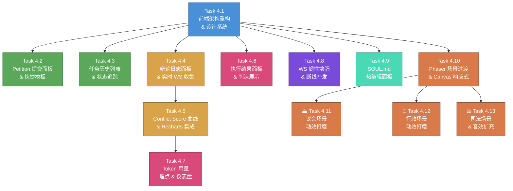

# Phase 4 — UX 优化 & 产品化 详细规划白皮书

> **起草日期**：2026-03-25
> **前置条件**：Phase 2 (Server + WS) ✅ 封板 · Phase 3 (深度集成 + 真实执行) ✅ 封板
> **目标**：将开发者级原型升级为产品级体验——用户输入需求 → 观看 AI 辩论动画 → 获得执行结果 → 查看详细日志

---

## 1. 核心痛点分析

当前前端(`App.tsx` 210行)存在以下产品级痛点：

| 痛点 | 现状 | 目标 |
|------|------|------|
| **请愿入口粗糙** | 底部裸 `<input>` + `Send` 按钮，无快捷模板，无任务状态卡片 | 精致的 Petition 提交面板 + 快捷模板 + 任务列表 |
| **无结果展示** | 后端已有 `/task/:id/act`、`/task/:id/verdict` API，但前端完全未消费 | 总统交付备忘录面板（代码/文件/文本输出） |
| **辩论过程黑箱** | 后端已推送 `propose`/`debate`/`brawl` WS 事件，但前端仅播放动画无文字日志 | 可点击查看每轮 Critique/Rebuttal 的详细日志面板 |
| **关键数据不可见** | 无 Conflict Score 曲线、无 Token 消耗统计 | 实时仪表盘 |
| **充斥调试按钮** | 页面上散布 12 个 Debug 按钮（行 97~204） | 清除所有调试控件，仅保留正式 UI |
| **场景切换生硬** | `SceneManager.switchTo()` 使用 raw `scene.start()` 无过渡，坐标硬编码不响应窗口变化，PRD 中的卷轴传送带/信使角色/聚光灯效果未实现 | 平滑 fade 过渡 + Canvas 响应式 + PRD 完整动效实现 |
| **无断线容错** | WS 断线后仅固定 3s 重连，无事件补发机制 | 指数退避重连 + 断线期间事件缓冲 + 重连后历史补发 |
| **SOUL 配置不灵活** | 修改 Agent 人设需要改 `config/souls/*.md` 文件并重启服务 | 前端在线 Markdown 编辑器 |

---

## 2. 关键架构决策

### 2.1 前端状态管理：React Context + useReducer

**决策**：**不引入 Redux/Zustand**，使用 React 内置的 `useContext` + `useReducer` 组合。

**理由**：
- 状态来源单一：绝大多数数据来自 WebSocket 事件流（已有 RxJS `Subject`）和 REST API 拉取
- 组件数量有限（预计 15-20 个 React 组件），不需要全局状态库的复杂性
- 保持依赖最简（应用当前仅依赖 `react` + `phaser` + `rxjs`）

**状态树设计**：
```
AppContext (useReducer)
  ├── petition: { prompt, status, taskId }
  ├── tasks: TaskSummary[]
  ├── debate: { rounds[], conflictScores[], currentRound }
  ├── execution: { steps[], currentStep, toolCalls[] }
  ├── verdict: { ruling, constitutional, evidence[] }
  ├── tokens: { legislative, executive, judicial, total }
  └── connection: { isConnected, reconnectAttempts, lastEventId }
```

### 2.2 图表库：Recharts (轻量 + React 原生)

**决策**：使用 **Recharts** 作为 Conflict Score 曲线和 Token 仪表盘的图表库。

**理由**：
- 基于 React 声明式 API，与组件树天然融合
- 包体积远小于 ECharts（~40KB vs ~800KB gzipped）
- SVG 渲染，足以应对曲线图 + 饼图/柱状图需求
- 零配置即可生成动画过渡

### 2.3 Markdown 编辑器：@uiw/react-md-editor

**决策**：SOUL.md 热编辑器使用 `@uiw/react-md-editor`（轻量 ~100KB gzipped，开箱即用带预览模式）。

### 2.4 前端 CSS 策略：Vanilla CSS + CSS Variables

**决策**：保持现有的 Vanilla CSS 路线，不引入 Tailwind。利用 CSS Variables 构建设计系统（暗色主题、颜色令牌、间距系统）。

### 2.5 接口对接策略

后端已有完整的 REST API 和 WS 推送：

| 数据需求 | 数据源 | 方式 | 状态 |
|----------|--------|------|------|
| 提交请愿 | `POST /petition` | REST | ✅ 已有 |
| 任务列表 | `GET /tasks` | REST 轮询 | ✅ 已有 |
| 任务状态 | `GET /task/:id/status` | REST | ✅ 已有 |
| 实时事件 | `WS /ws/task/:id` | WebSocket 推送 | ✅ 已有 |
| 辩论详情 | `GET /task/:id/debate` | REST 拉取 | ✅ 已有 |
| 法案详情 | `GET /task/:id/act` | REST 拉取 | ✅ 已有 |
| 判决详情 | `GET /task/:id/verdict` | REST 拉取 | ✅ 已有 |
| SOUL 文件 | `GET/PUT /config/souls/:name` | REST | ❌ 需新增 |
| Token 统计 | WS 事件 `token_usage` | WS 推送 | ❌ 需新增 |
| 事件补发 | WS 指令 `replay` | WS 指令 | ❌ 需新增 |

---

## 3. 独立任务拆解（13 Tasks）

> **拆分原则**：每个 Task 必须在一个独立会话中完成开发 + 测试 + Bug 修复闭环。
> 涉及前后端双端改造、多个独立 UI 子系统的原始任务已进一步拆分。

### 3.0 任务总览表

| 编号 | 任务目标 | 涉及端 | 核心文件 | 前置依赖 | 预估 |
|------|---------|--------|---------|----------|------|
| **4.1** | 前端架构重构 & 设计系统 (✅ 完成) | 🖥️ 前端 | `AppContext.tsx`, `AppShell.tsx`, `design-system.css`, `App.tsx` | 无 | ⭐⭐⭐ |
| **4.2** | Petition 提交面板 & 快捷模板 (✅ 完成) | 🖥️ 前端 | `PetitionPanel.tsx`, `useApi.ts`, REST `/petition` | 4.1 | ⭐⭐ |
| **4.3** | 任务历史列表 & 状态追踪 (✅ 完成) | 🖥️ 前端 | `TaskList.tsx`, `TaskCard.tsx`, REST `/tasks` + `/task/:id/status` | 4.1 | ⭐⭐ |
| **4.4** | 辩论日志面板 & 实时 WS 事件收集 | 🖥️ 前端 | `DebateLogPanel.tsx`, `DebateRoundCard.tsx`, AppContext debate reducer | 4.1 | ⭐⭐⭐ |
| **4.5** | Conflict Score 曲线 & 图表集成 | 🖥️ 前端 | Recharts 安装, `ConflictScoreChart.tsx`, REST `/task/:id/debate` | 4.4 | ⭐⭐ |
| **4.6** | 执行结果面板 & 判决展示 | 🖥️ 前端 | `ResultPanel.tsx`, `VerdictBanner.tsx`, REST `/task/:id/act` + `/verdict` | 4.1 | ⭐⭐⭐ |
| **4.7** | Token 用量统计埋点 & 仪表盘 | 🖥️🔧 前后端 | 后端 `government.ts` 埋点 + `events.ts` schema, 前端 `TokenDashboard.tsx` | 4.5 | ⭐⭐⭐ |
| **4.8** | WS 韧性增强 & 断线事件补发 | 🖥️🔧 前后端 | `useWebSocket.ts` 重构, `ws-manager.ts` Ring Buffer, `websocket.ts` replay | 4.1 | ⭐⭐⭐ |
| **4.9** | SOUL.md 热编辑面板 | 🖥️🔧 前后端 | `SoulEditor.tsx`, 后端 3 个新 API, `loader.ts` cache invalidation | 4.1 | ⭐⭐⭐ |
| **4.10** | Phaser 场景过渡 & Canvas 响应式 | 🎮 Phaser | `SceneManager.ts` fade 过渡 + stopAll, 三大 Scene 响应式坐标重构 | 4.1 | ⭐⭐ |
| **4.11** | 🏔️ 议会场景动效打磨 | 🎮 Phaser | `ParliamentScene.ts` 卷轴飞入/信使入场/辩论气泡精调/brawl Lv3 增强 | 4.10 | ⭐⭐ |
| **4.12** | 🏢 行政场景动效打磨 | 🎮 Phaser | `ExecutiveScene.ts` 双 Secretary/格子间布局/tool_call 代码流增强 | 4.10 | ⭐⭐ |
| **4.13** | ⚖️ 司法场景动效打磨 & 音效扩充 | 🎮 Phaser | `JudicialScene.ts` Bug 修复/聚光灯精调, `SoundManager.ts` 音效 key 补全 | 4.10 | ⭐⭐ |

### 3.1 各任务详细说明

---

#### Task 4.1 — 前端架构重构 & 设计系统

**目标**：清除开发者原型痕迹，建立产品级前端骨架。这是所有后续 UI 任务的基础。

**核心产出**：
- `contexts/AppContext.tsx` — 全局状态管理（useReducer + Context），包含完整的 Action/State 类型定义
- `components/layout/AppShell.tsx` — 三栏布局骨架（左侧面板 | 中央 Phaser Canvas | 右侧面板），含面板折叠/展开交互
- `styles/design-system.css` — CSS Variables 设计令牌（颜色调色板、字体级别、间距系统、阴影层级、动画曲线）
- `App.tsx` 重构 — 移除全部 12 个 Debug 按钮、重新组织为 AppShell 壳 + Context Provider

**文件清单**：
- `[NEW] frontend/src/contexts/AppContext.tsx`
- `[NEW] frontend/src/components/layout/AppShell.tsx`
- `[NEW] frontend/src/styles/design-system.css`
- `[MODIFY] frontend/src/App.tsx` — 移除 L97~L204 全部调试按钮，接入 AppShell
- `[MODIFY] frontend/src/App.css` — 清除遗留 Vite 脚手架样式

**验证方式**：`npm run dev` 启动前端 → Phaser Canvas 正常渲染 → 三栏布局骨架可见 → 无 Debug 按钮残留

**任务文档**：`docs/plan_ts/phase4/task4.1_frontend_architecture.md`

---

#### Task 4.2 — Petition 提交面板 & 快捷模板

**目标**：用户可以通过精致的 UI 面板提交请愿，并从预设模板快速选择常见任务类型。

**核心产出**：
- `components/petition/PetitionPanel.tsx` — 带快捷模板选择器的请愿提交表单（textarea + 模板气泡 + 提交按钮 + 加载状态）
- `hooks/useApi.ts` — REST API 封装（`postPetition()`, `fetchTasks()`, `fetchTaskStatus()` 等）
- 模板预设列表（如："帮我写一个 TODO App"、"搜索 Rust async 最新进展"、"⚠️ 危险测试: rm -rf /tmp/test"）

**后端对接**：`POST /petition`（已存在，无需后端修改）

**文件清单**：
- `[NEW] frontend/src/components/petition/PetitionPanel.tsx`
- `[NEW] frontend/src/hooks/useApi.ts`
- `[MODIFY] frontend/src/components/layout/AppShell.tsx` — 左栏挂载 PetitionPanel

**验证方式**：前端提交 Petition → 后端返回 `202` + `task_id` → UI 显示提交成功状态

**任务文档**：`docs/plan_ts/phase4/task4.2_petition_panel.md`

---

#### Task 4.3 — 任务历史列表 & 状态追踪

**目标**：用户可以查看历史任务列表，点击任务卡片切换当前追踪的活跃任务，实时显示任务状态。

**核心产出**：
- `components/petition/TaskList.tsx` — 任务列表容器（REST 轮询 + 下拉刷新）
- `components/petition/TaskCard.tsx` — 单个任务状态卡片（状态徽章 - 映射 11 种 BillState 为颜色、请愿摘要、时间戳）
- 点击 TaskCard → 切换当前 WS 订阅到该 task_id → Phaser 场景同步切换

**后端对接**：`GET /tasks`、`GET /task/:id/status`（已存在）

**文件清单**：
- `[NEW] frontend/src/components/petition/TaskList.tsx`
- `[NEW] frontend/src/components/petition/TaskCard.tsx`
- `[MODIFY] frontend/src/components/layout/AppShell.tsx` — 左栏挂载 TaskList
- `[MODIFY] frontend/src/hooks/useWebSocket.ts` — 支持动态切换 taskId

**验证方式**：提交 2+ 个 Petition → 任务列表正确显示 → 点击切换 → WS 连接切换到新 taskId → Phaser 场景跟随

**任务文档**：`docs/plan_ts/phase4/task4.3_task_history.md`

---

#### Task 4.4 — 辩论日志面板 & 实时 WS 事件收集

**目标**：将 WS 实时推送的 `propose`/`debate`/`brawl`/`order` 事件收集到 AppContext，并渲染为可视化辩论日志面板。

**核心产出**：
- `components/debate/DebateLogPanel.tsx` — 辩论日志面板（左右对抗时间线布局：左侧激进派红色气泡、右侧保守派蓝色气泡、Speaker 介入居中黄色条）
- `components/debate/DebateRoundCard.tsx` — 单轮辩论详情卡片（折叠/展开查看完整 CoT 文本）
- `contexts/AppContext.tsx` 增强 — 添加 `DEBATE_EVENT` action，WS 事件 → debate state 写入。自动识别轮次递增

**不含**：Conflict Score 曲线图（拆分到 Task 4.5）

**文件清单**：
- `[NEW] frontend/src/components/debate/DebateLogPanel.tsx`
- `[NEW] frontend/src/components/debate/DebateRoundCard.tsx`
- `[MODIFY] frontend/src/contexts/AppContext.tsx` — 添加 debate reducer
- `[MODIFY] frontend/src/components/layout/AppShell.tsx` — 右栏挂载 DebateLogPanel

**验证方式**：触发一轮真实辩论 → 右侧面板实时显示双方发言气泡 → Speaker ORDER! 事件在面板中显示为"议长介入"标记

**任务文档**：`docs/plan_ts/phase4/task4.4_debate_log.md`

---

#### Task 4.5 — Conflict Score 曲线 & 图表集成

**目标**：安装 Recharts，将辩论过程中的 Conflict Score 变化渲染为实时折线图。

**核心产出**：
- 安装 `recharts` npm 依赖
- `components/debate/ConflictScoreChart.tsx` — Conflict Score 实时折线图（X 轴=辩论轮次，Y 轴=分歧度 0~100，标注阈值线）
- 支持两种数据源：实时 WS 事件流（AppContext 中的 conflictScores 数组）、历史 REST 回填（`GET /task/:id/debate` 的 `conflict_score_curve`）

**前置依赖**：Task 4.4（依赖 AppContext 中的 debate state 数据结构）

**文件清单**：
- `[NEW] frontend/src/components/debate/ConflictScoreChart.tsx`
- `[MODIFY] frontend/src/components/debate/DebateLogPanel.tsx` — 嵌入 Chart 组件
- `[MODIFY] package.json` — 添加 recharts 依赖

**验证方式**：辩论进行时 → 折线图实时更新新数据点 → 历史任务切换 → 图表回填历史 curve

**任务文档**：`docs/plan_ts/phase4/task4.5_conflict_score_chart.md`

---

#### Task 4.6 — 执行结果面板 & 判决展示

**目标**：展示行政分支的执行产物和司法分支的判决结果。

**核心产出**：
- `components/result/ResultPanel.tsx` — 总统交付备忘录面板（展示法案步骤执行结果、代码块语法高亮、Markdown 渲染、错误栈追踪红色标记）
- `components/result/VerdictBanner.tsx` — 司法判决结果横幅：
  - 合宪 → 绿色大法官法槌图标 + `CONSTITUTIONAL` + ruling 文本
  - 违宪 → 红色警报 + `UNCONSTITUTIONAL` + evidence 列表
- 面板随 BillState 自动显示（`CONSTITUTIONAL`/`UNCONSTITUTIONAL`/`DELIVERED` 状态自动切换到结果面板）

**后端对接**：`GET /task/:id/act`、`GET /task/:id/verdict`（已存在，无需后端修改）

**文件清单**：
- `[NEW] frontend/src/components/result/ResultPanel.tsx`
- `[NEW] frontend/src/components/result/VerdictBanner.tsx`
- `[MODIFY] frontend/src/components/layout/AppShell.tsx` — 右栏根据状态切换 DebateLog / Result 面板

**验证方式**：完整 Pipeline run → 进入 DELIVERED 状态 → ResultPanel 展示执行结果 → VerdictBanner 显示合宪/违宪

**任务文档**：`docs/plan_ts/phase4/task4.6_result_panel.md`

---

#### Task 4.7 — Token 用量统计埋点 & 仪表盘

**目标**：在后端 Pipeline 各阶段埋入 Token 用量 WS 事件，前端渲染消耗分布图表。

**核心产出**：

**后端（埋点）**：
- `schemas/events.ts` — 新增 `TOKEN_USAGE` EventAction + `TokenUsageEvent` 类型
- `government.ts` — 在辩论结束、法案签署、执行完成、审查完成 4 个节点推送 `token_usage` 事件
- 事件 payload: `{ branch: 'legislative'|'executive'|'judicial', tokens_used: number, cumulative: number }`

**前端（仪表盘）**：
- `components/metrics/TokenDashboard.tsx` — 三分支 Token 消耗饼图（Recharts PieChart）+ 累计折线（轮次维度）
- AppContext 添加 `TOKEN_USAGE` action

**前置依赖**：Task 4.5（Recharts 已安装）

**文件清单**：
- `[NEW] frontend/src/components/metrics/TokenDashboard.tsx`
- `[MODIFY] backend/src/schemas/events.ts` — 添加 TokenUsageEvent
- `[MODIFY] backend/src/government.ts` — 4 个埋点
- `[MODIFY] frontend/src/contexts/AppContext.tsx` — tokens reducer

**验证方式**：完整 Pipeline run → 后端日志可见 `token_usage` 事件 → 前端仪表盘显示三分支消耗分布饼图

**任务文档**：`docs/plan_ts/phase4/task4.7_token_dashboard.md`

---

#### Task 4.8 — WS 韧性增强 & 断线事件补发

**目标**：企业级 WebSocket 连接韧性——指数退避重连、断线期间事件不丢失、重连后自动补发。

**核心产出**：

**前端**：
- `hooks/useWebSocket.ts` 重构：
  - 指数退避重连（base 1s, cap 30s, ±20% jitter）
  - 记录 `lastEventId`（每条事件带递增 ID）
  - 重连后自动发送 `{ action: 'replay', data: { after_event_id: N } }` 指令
  - 连接状态 UI 指示器（连接中/已连接/重连中/离线）

**后端**：
- `ws-manager.ts` — 每任务事件缓冲区（Ring Buffer, max 500 条），每条事件标记递增 `event_id`
- `websocket.ts` — 支持 `replay` 客户端指令：读取缓冲区中 `> after_event_id` 的事件，逐条补发
- `schemas/events.ts` — 所有事件 payload 添加可选 `event_id: number` 字段

**文件清单**：
- `[MODIFY] frontend/src/hooks/useWebSocket.ts` — 指数退避 + replay
- `[MODIFY] backend/src/server/ws-manager.ts` — Ring Buffer + event_id
- `[MODIFY] backend/src/server/websocket.ts` — replay 指令处理
- `[MODIFY] backend/src/schemas/events.ts` — event_id 字段

**验证方式**：
1. 启动 Pipeline → 中途手动断网 → 恢复网络 → 确认重连后缺失事件自动补发
2. 单测：Ring Buffer 边界测试（满/空/越界）
3. 单测：replay 指令正确性（补发 > after_event_id 的事件子集）

**任务文档**：`docs/plan_ts/phase4/task4.8_ws_resilience.md`

---

#### Task 4.9 — SOUL.md 热编辑面板

**目标**：用户可在前端在线编辑 Agent 人设文件，保存后即时生效无需重启。

**核心产出**：

**前端**：
- `components/config/SoulEditor.tsx` — 左导航列出 7 个 SOUL 文件（speaker, radical_mp, conservative_mp, president, sec_engineering, sec_state, chief_justice），点击进入 Markdown 编辑/预览模式，保存按钮

**后端（3 个新 API）**：
- `GET /config/souls` — 列出 `config/souls/` 目录下所有 `.md` 文件名
- `GET /config/souls/:name` — 读取指定 SOUL 文件 Markdown 内容
- `PUT /config/souls/:name` — 保存修改（写入文件 + 触发 `SoulCache.invalidate(name)` 清除缓存，下次 Agent 调用自动加载新内容）
- `config/loader.ts` — 添加 `invalidateSoul(name: string)` 方法

**安全防护**：`PUT` 接口需要路径遍历防护（`..` 过滤 + 白名单校验）

**文件清单**：
- `[NEW] frontend/src/components/config/SoulEditor.tsx`
- `[MODIFY] backend/src/server/routes.ts` — 添加 3 个 SOUL 路由
- `[MODIFY] backend/src/config/loader.ts` — 添加 cache invalidation

**验证方式**：
1. 前端打开 SoulEditor → 选择 `radical_mp.md` → 修改文本 → 保存
2. 再次发起 Petition → 确认激进派议员发言风格已改变
3. 单测：路径遍历攻击 `../../etc/passwd` 被拒绝

**任务文档**：`docs/plan_ts/phase4/task4.9_soul_editor.md`

---

#### Task 4.10 — Phaser 场景过渡 & Canvas 响应式

**目标**：解决场景切换的硬切问题（加入 fade 过渡），并将三大场景的硬编码坐标全部改为响应式相对定位。

**现状审计（本 Task 聚焦的 3 项差距）**：

| 类目 | PRD 规定 | 现状 | 差距 |
|------|---------|------|------|
| **场景切换** | 卷轴经传送带发往白宫、fade 过渡 | `scene.start()` 硬切，无过渡（`SceneManager.ts` L31-33） | ❌ 缺失 |
| **Canvas 响应式** | 自适应窗口大小 | ExecutiveScene 硬编码 `(400,300)`、JudicialScene 硬编码 `(400,200)` | ❌ 硬编码 |
| **vote_passed 过渡** | 议会→行政有卷轴传送过渡 | `ParliamentScene` L402 直接 `scene.start('ExecutiveScene')` 无动画 | ❌ 缺失 |

**核心产出**：

1. **SceneManager 过渡引擎**：
   - `switchTo()` 重写：`fadeOut(600ms) → scene.start() → fadeIn(600ms)` 双向过渡
   - 防重入保护：过渡进行中忽略重复 `switchTo` 调用

2. **ExecutiveScene 响应式改造**：
   - 所有 sprite 坐标从硬编码 `(180, 400)` 等改为 `(width * 0.25, height * 0.67)` 相对定位
   - 背景图自适应 `setDisplaySize(width, height)`

3. **JudicialScene 响应式改造**：
   - 同理：justice sprite、bill sprite、spotlight、redOverlay 全部改为相对坐标
   - 背景图自适应

4. **ParliamentScene vote_passed 过渡**：
   - 移除末尾的直接 `scene.start('ExecutiveScene')` 调用
   - 改为通过 SceneManager 的 fade 过渡触发

**文件清单**：
- `[MODIFY] frontend/src/game/SceneManager.ts` — fade 过渡引擎 + 防重入
- `[MODIFY] frontend/src/game/scenes/ExecutiveScene.ts` — 响应式坐标
- `[MODIFY] frontend/src/game/scenes/JudicialScene.ts` — 响应式坐标
- `[MODIFY] frontend/src/game/scenes/ParliamentScene.ts` — vote_passed 过渡改造

**验证方式**：
1. 手动触发场景切换 → 观察 fade 过渡是否流畅、无闪烁
2. 调整浏览器窗口大小 → Executive/Judicial 场景角色位置自适应
3. 触发 vote_passed → 确认议会→行政使用 fade 而非硬切

**任务文档**：`docs/plan_ts/phase4/task4.10_scene_transitions.md`

---

#### Task 4.11 — 🏔️ 议会场景动效打磨 (Parliament Scene Polish)

**目标**：增强议会场景的动画精度，按 PRD §3.1 补齐缺失的卷轴/信使入场效果，精调现有辩论和 brawl 动画。

**现状审计**（`ParliamentScene.ts` 409行）：
- ✅ 已有：traggerPropose/triggerDebate 气泡动画、triggerBrawl Lv1/Lv2 报纸团/皋鞋抛物线、triggerOrder “肃静！”飘字、triggerVotePassed 绿灯 + 印章
- ❌ 缺失：PRD 规定的信使送信入场、卷轴展开效果
- ⚠️ 可优化：气泡字体、brawl Lv3 议长敲槌连击效果、辩论轮次角标注

**核心产出**：
1. **卷轴/信使入场动画**：
   - `triggerPropose()` 增强：添加卷轴 sprite 从画面底部飞入 → 议员位置处展开 → 再弹出文字气泡
   - 如有信使 sprite 资源则使用信使递送过场、否则用卷轴飞入简化版
2. **Brawl Lv3 议长敲槌连击**：
   - 当 intensity ≥ 8 时，议长连续敲槌 3 次（带音效循环）而非单次
3. **气泡精调**：
   - 调整气泡字体大小、背景色对比度、消失动画平滑度
   - 添加激进派/保守派气泡颜色区分（红/蓝边框）

**文件清单**：
- `[MODIFY] frontend/src/game/scenes/ParliamentScene.ts` — 全部改动

**验证方式**：
1. 触发 propose → 观察卷轴飞入动画
2. 触发 brawl(intensity=9) → 议长连续敲槌
3. 触发 debate → 确认激进派红边框 vs 保守派蓝边框气泡

**任务文档**：`docs/plan_ts/phase4/task4.11_parliament_polish.md`

---

#### Task 4.12 — 🏢 行政场景动效打磨 (Executive Scene Polish)

**目标**：增强行政场景的动画精度，按 PRD §3.2 补齐双部长格子间、优化代码流显示和签署/否决特效。

**现状审计**（`ExecutiveScene.ts` 200行）：
- ✅ 已有：triggerSign/triggerVeto/triggerToolCall/triggerError 基础动画
- ❌ 缺失：只有 1 个 secretary，PRD 规定多部长并行工作
- ⚠️ 可优化：tool_call 代码流效果过于简单（只是单行文本上滑），sign 印章可用 sprite 替代纯文本

**核心产出**：
1. **双 Secretary 格子间**：
   - 添加第二个 secretary sprite（SecState），分左右格子间布局
   - `tool_call` 事件时两 sprite 并行 `secretary_type` 动画
2. **代码流增强**：
   - `triggerToolCall()` 从单行文本改为多行逐行打印 CLI 效果（绿字黑底、光标闪烁）
3. **签署/否决印章优化**：
   - 如有 `ui_stamps` sprite→ 用 sprite 替代纯文本“批准/否决”

**文件清单**：
- `[MODIFY] frontend/src/game/scenes/ExecutiveScene.ts` — 全部改动

**验证方式**：
1. 触发 tool_call → 两个 secretary 同时敲键盘 + 代码逐行流
2. 触发 sign → 确认印章效果
3. 触发 veto → 确认卷轴弹回效果

**任务文档**：`docs/plan_ts/phase4/task4.12_executive_polish.md`

---

#### Task 4.13 — ⚖️ 司法场景动效打磨 & 音效扩充 (Judicial Scene Polish + SoundManager)

**目标**：修复司法场景已知 Bug，增强判决动画视觉冲击力，并完成全局 SoundManager 音效库扩充。

**现状审计**（`JudicialScene.ts` 181行）：
- ✅ 已有：triggerConstitutional 绿光法槌、triggerUnconstitutional 红光警报 + 粒子碎裂 + 火焰
- ❌ Bug：`resetSceneState()` L172 的 `setScale(1)` 与 `setDisplaySize(64,64)` 冲突（注释已标注）
- ⚠️ 可优化：聚光灯效果是静态三角形（可改为动态摸索效果）、警报音效单调

**核心产出**：
1. **resetSceneState Bug 修复**：
   - 统一使用 `setDisplaySize()` 控制 bill 尺寸，删除 `setScale()` 调用
   - 测试 unconstitutional → constitutional 连续调用块 scale 残留
2. **聚光灯动态化**：
   - 蜻气光束轻微摇摆效果（tween 微调 alpha + 宽度）
3. **判决动画增强**：
   - 合宪：法槌落下后添加“卷轴发光”效果（代表交付成功）
   - 违宪：增强屏幕抖动强度 + 红光闪烁频率
4. **SoundManager 全局音效扩充**：
   - 补充缺失音效 key（议会喧嚣 `murmur_long`、碰撞 `crash`、签字 `pen_scratch`）
   - 场景切换时 `SceneManager` 调用 `stopAll()` 防止音效跨场景泄漏
   - 音频资源不存在时优雅降级（已有 try/catch，确认覆盖新增 key）

**文件清单**：
- `[MODIFY] frontend/src/game/scenes/JudicialScene.ts` — Bug 修复 + 聚光灯 + 判决动画
- `[MODIFY] frontend/src/game/SoundManager.ts` — 音效 key 补充
- `[MODIFY] frontend/src/game/SceneManager.ts` — 切场时 stopAll()

**验证方式**：
1. 依次触发 unconstitutional → constitutional → 确认 bill sprite 尺寸正确、无 scale 残留
2. 观察聚光灯摇摆效果是否自然
3. 切换场景后 Console 无音效相关 warn

**任务文档**：`docs/plan_ts/phase4/task4.13_judicial_polish.md`

---

## 4. 模块依赖拓扑图



> **关键路径**：`4.1 → 4.4 → 4.5 → 4.7`（辩论面板 → 图表集成 → Token 仪表盘链条最长）
>
> **最大并行度**：Task 4.1 完成后，4.2 / 4.3 / 4.4 / 4.6 / 4.8 / 4.9 / 4.10 共 7 个可并行；Task 4.10 完成后 4.11 / 4.12 / 4.13 三场景可并行。
>
> **建议执行顺序**：4.1 → 4.10 → 4.11 → 4.12 → 4.13 → 4.2 → 4.3 → 4.4 → 4.5 → 4.6 → 4.7 → 4.8 → 4.9
> （架构 → 场景过渡 → 议会打磨 → 行政打磨 → 司法打磨+音效 → 请愿 → 任务列表 → 辩论 → 图表 → 结果 → Token → WS → SOUL）

---

## 5. 原始 4.1~4.8 ↔ 新 Task 映射

| 原始编号 | 原始工作项 | 新 Task 归属 | 拆分/合并说明 |
|----------|-----------|-------------|-------------|
| 4.1 | 选民请愿 UI | **4.2** + **4.3** | 🔀 拆分：提交面板(4.2) 与任务列表(4.3) 独立闭环 |
| 4.2 | 结果展示 UI | **4.6** | 独立 Task |
| 4.3 | Conflict Score 实时仪表 | **4.5** | 🔀 从辩论面板拆出，依赖 Recharts |
| 4.4 | Token 仪表盘 | **4.7** | 🔀 需后端埋点，拆为独立前后端联合任务 |
| 4.5 | 辩论回放日志 | **4.4** | 🔀 与文本日志合并，不含 Chart |
| 4.6 | SOUL.md 热编辑 | **4.9** | 独立 Task |
| 4.7 | 错误处理 & 重试 | **4.8** | WS 韧性为核心 |
| 4.8 | Discord 渠道集成 | **↘️ Phase 5** | 降级：与 Web UX 正交，移入发布阶段 |
| _(新增)_ | 前端架构重构 | **4.1** | ✨ 新增：所有 UI 任务的公共基础 |
| _(新增)_ | Phaser 场景过渡 & Canvas 响应式 | **4.10** | ✨ 新增：SceneManager fade 过渡 + 三大场景响应式坐标改造 |
| _(新增)_ | 议会场景动效打磨 | **4.11** | ✨ 新增：卷轴飞入/信使入场/brawl Lv3 增强/气泡精调 |
| _(新增)_ | 行政场景动效打磨 | **4.12** | ✨ 新增：双 Secretary 格子间/代码流增强/印章优化 |
| _(新增)_ | 司法场景动效 & 音效扩充 | **4.13** | ✨ 新增：resetState Bug 修复/聚光灯动态化/SoundManager 补全 |

---

## 6. 技术风险与预案

| 风险 | 影响 | 预案 |
|------|------|------|
| Recharts 与 Phaser Canvas 共存的 Z-index 冲突 | SVG 渲染层叠问题 | React UI 层覆盖在 Phaser Canvas 上方，使用 `pointer-events: none` 隔离非交互区 |
| WS 事件补发数据量过大 | 重连后大量事件涌入卡顿前端 | Ring Buffer 限制 500 条 + 前端节流渲染（每 100ms 批量处理） |
| SOUL.md 编辑后缓存一致性 | 编辑保存后旧缓存仍生效 | `PUT` API 成功后主动调用 `SoulCache.invalidate()` |
| Token 统计精准度 | OpenClaw 可能不返回精确 usage | 降级：按 prompt/completion 字符数估算（4 chars ≈ 1 token） |
| 动态切换 taskId 导致 WS 连接泄漏 | 切换任务时旧连接未关闭 | `useWebSocket` 内部管理连接生命周期，切换前显式 close 旧连接 |
| React 异步状态重绘导致的 Phaser 幽灵切场 | 网络延迟引起的旧 Status 配置到新 TaskId 上 | 全局路由层强制增加 `taskStatus.task_id === activeTaskId` 的瞬时幂等判断锁 |
| Python/JS 数据字典大小写不对齐 | 'running' 与 'EXECUTING' 的状态覆盖导致 fallback 到初始场景 | 前端做 `toUpperCase()` 装甲并将业务域 `bill_state` 绝对提权 |

---

## 7. 将生成的任务文档列表

| 文件名 | 对应任务 |
|--------|---------|
| `docs/plan_ts/phase4/task4.1_frontend_architecture.md` | 前端架构重构 & 设计系统 |
| `docs/plan_ts/phase4/task4.2_petition_panel.md` | Petition 提交面板 & 快捷模板 |
| `docs/plan_ts/phase4/task4.3_task_history.md` | 任务历史列表 & 状态追踪 |
| `docs/plan_ts/phase4/task4.4_debate_log.md` | 辩论日志面板 & 实时 WS 事件收集 |
| `docs/plan_ts/phase4/task4.5_conflict_score_chart.md` | Conflict Score 曲线 & Recharts 集成 |
| `docs/plan_ts/phase4/task4.6_result_panel.md` | 执行结果面板 & 判决展示 |
| `docs/plan_ts/phase4/task4.7_token_dashboard.md` | Token 用量统计埋点 & 仪表盘 |
| `docs/plan_ts/phase4/task4.8_ws_resilience.md` | WS 韧性增强 & 断线事件补发 |
| `docs/plan_ts/phase4/task4.9_soul_editor.md` | SOUL.md 热编辑面板 |
| `docs/plan_ts/phase4/task4.10_scene_transitions.md` | Phaser 场景过渡 & Canvas 响应式 |
| `docs/plan_ts/phase4/task4.11_parliament_polish.md` | 🏔️ 议会场景动效打磨 |
| `docs/plan_ts/phase4/task4.12_executive_polish.md` | 🏢 行政场景动效打磨 |
| `docs/plan_ts/phase4/task4.13_judicial_polish.md` | ⚖️ 司法场景动效 & 音效扩充 |
