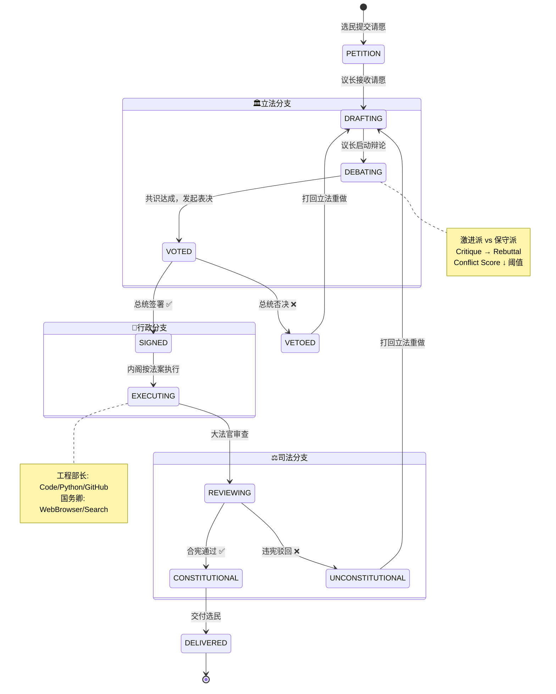
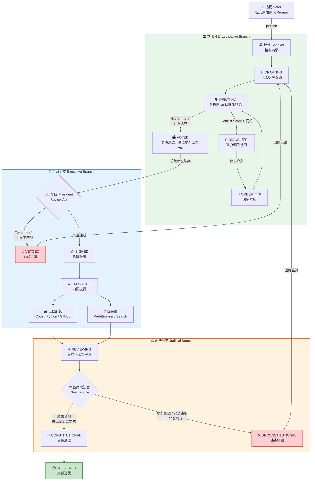

# 产品需求文档 (PRD)：OpenClaw 「赛博三权分立」可视化多智能体系统

**项目代号**：OpenClaw-Republic / DangZongTong (当总统)
**文档版本**：V 3.0 (整合 V1 场景设计 + V2 架构精度)
**产品基调**：极客浪漫、政治模拟、可视化工作流、像素风 (Pixel Art)
**底层驱动**：OpenClaw / TypeScript

---

## 1. 产品概述 (Product Overview)

### 1.1 项目背景与核心理念

传统的"集权式"单向工作流（中央控制器下发指令 ➔ 规划器拆解任务 ➔ 执行器干活）在执行确定性任务时效率极高，但在面对复杂、发散性需求时，容易产生大模型"幻觉（Hallucination）"的级联放大（即"屎山代码传递"），且底层高危工具的调用缺乏旁路制衡。

本项目旨在完成从"集权式单体"到"共和制分权"的架构进化。借鉴美式三权分立（Separation of Powers）理念，基于 **[OpenClaw](https://github.com/openclaw/openclaw)** 构建**"三权分立"（立法 Legislative、行政 Executive、司法 Judicial）**多智能体系统，引入 Agent 间的**横向制衡（Checks and Balances）、对抗辩论（Debate Prompting）与物理熔断机制**。并配以 WebSocket 驱动的**像素风动态演播厅**，将枯燥的后台运行日志转化为极具观赏性的"赛博政局"与"电子政治盆栽"。

### 1.2 与 OpenClaw 的关系

本项目是 **OpenClaw 生态的上层编排变体**。[OpenClaw](https://github.com/openclaw/openclaw) 是一个通用型个人 AI 助手框架，提供 Gateway 控制平面、60+ 内置 Skill（CodeExecution、Browser、GitHub、Search 等）、LLM Provider 管理（Claude / GPT / Qwen / DeepSeek）以及 20+ 渠道接入（Discord / 飞书 / Telegram 等）。

类似的上层项目 [danghuangshang（当皇上）](https://github.com/wanikua/danghuangshang) 以明朝内阁制为蓝本，通过纯配置的方式在 OpenClaw 上搭建了多 Agent 协作的"集权式调度"系统。

**本项目的差异化在于：**

| 维度 | danghuangshang (当皇上) | OpenClaw-Republic (当总统) |
|------|------------------------|---------------------------|
| **政体隐喻** | 帝制 — 皇帝→司礼监→六部 | 共和制 — 选民→三权分立 |
| **编排方式** | 纯 OpenClaw 配置 + SOUL 文件 | **独立编排层**（TypeScript 手写 RBAC + 状态机 + 辩论引擎） |
| **辩论机制** | ❌ 无内置对抗辩论 | ✅ 激进/保守双派辩论 + Conflict Score 量化 |
| **安全护栏** | 都察院事后 Code Review | **双通道违宪审查**（实时沙箱监听 + 交付偏离度检测 + 物理熔断） |
| **前端** | Discord/飞书 纯文字 | **8-bit 像素演播厅**（Phaser.js 三大场景实时动画） |
| **底层能力** | OpenClaw 全部 | OpenClaw Skill 引擎 + LLM Provider |

简言之：**OpenClaw 提供"操作系统"级的底层能力（LLM、工具、渠道），本项目在其之上构建"三权分立"的编排逻辑和像素演播厅的可视化体验。**

### 1.3 核心目标

1. **多视角辩论（防幻觉）**：剥离规划权与执行权。通过左右翼议员激辩达成共识，利用大模型的自我纠偏生成最优执行法案（SOP）。
2. **绝对安全合规（防越权）**：行政分支无规划权（只能按法案调 Tool 干活），司法分支有一票否决权（监控沙箱，对高危行为进行物理熔断）。
3. **高观赏性监控（可视化）**：将 Token 消耗、状态流转、CoT（思维链）映射为生动的 8-bit 像素动画（提案、议员吵架、法官敲槌）。

---

## 2. 核心架构：职能映射与权限隔离 (Core Agentic Orchestration)

> **✨ 架构设计原则**：全面采用"政体职能隐喻"和独立的 **`SOUL.md`** 人设配置。严格执行 RBAC（基于角色的权限控制）和 Workspace 物理隔离。

在系统中，**用户不再是"皇帝"，而是"选民 (Voter)"**。选民通过前端提交原始需求（请愿/Prompt），触发国家机器运转：

### 2.1 🏛️ 立法分支 (Legislative Branch) —— "方案规划与红蓝对抗"

- **架构本质**：Planner & Router。
- **权限设定**：**绝对无执行权**。被物理剥夺调用代码/终端/文件系统的权限，只能进行纯文本推理与架构设计。
- **Agent 角色矩阵 (目录: `agents/legislative/`)**：
  - **议长 (Speaker)**：流程控制枢纽。接收选民请愿，控制两派议员的辩论 Token 消耗，判定何时终止辩论并发起表决，最终产出结构化 JSON 格式的《执行法案 (Act)》。
  - **激进派议员 (Radical MP)**：通过 `SOUL.md` 注入极客/激进人设。偏好前沿技术栈，追求代码极简和效率，提议大胆但容易产生边界幻觉。
  - **保守派议员 (Conservative MP)**：通过 `SOUL.md` 注入防御性/保守人设（Red Team）。天生的 Critique（找茬者），专挑性能瓶颈、内存泄漏、安全漏洞的刺。
- **核心机制【议会辩论】**：
  - 方案必须经过两派的互相 Critique（互评）→ Rebuttal（反驳），激进与保守互相博弈强制对齐。
  - 直到分歧度（Conflict Score）降至阈值以下，达成共识并投票通过，生成正式的《执行法案》（JSON 格式的工作流描述）。

### 2.2 🏢 行政分支 (Executive Branch) —— "工具调用与苦力干活"

- **架构本质**：Worker Nodes 集群。
- **权限设定**：**满载执行工具，但无自主规划权**。只能严格按照《执行法案》的内容，调用 OpenClaw 的底层 Skills 照章办事。
- **Agent 角色矩阵 (目录: `agents/executive/`)**：
  - **总统 (President)**：任务分派枢纽。接收法案，拥有**【行政否决权 (Veto)】**——若校验发现 Token 预算不足，或当前系统未挂载法案要求的底层 Tools，直接打回立法分支重构。校验通过后，拆解 Task 派发给内阁。
  - **工程部长 (Sec. of Engineering)**：挂载 `CodeExecution`, `Python_Interpreter`, `GitHub` 技能，负责实际编码与环境操作。
  - **国务卿 (Sec. of State)**：挂载 `WebBrowser`, `Search` 技能，负责联网查阅最新文档与外部 API 交互。

### 2.3 ⚖️ 司法分支 (Judicial Branch) —— "合规审查与安全护栏"

- **架构本质**：LLM-as-a-Judge (最终 QA 与安全沙箱)。
- **权限设定**：全局只读监控权 + 最高级别的**物理熔断权 (Kill Switch)**。系统最底层的 Guardrails。
- **Agent 角色矩阵 (目录: `agents/judicial/`)**：
  - **首席大法官 (Chief Justice)**：配置最高级别的安全审查提示词。
- **核心机制【违宪审查】**：
  - **过程违宪审查（旁路沙箱监听）**：实时监控行政分支的 Shell/Python 动作。若检测到 `rm -rf`、死循环、越权读取私钥等危险操作，大法官立刻判定**"违宪 (Unconstitutional)"**，强制物理 Kill 容器。
  - **结果违宪审查（交付验收）**：在交付前，比对《选民原始请愿》与《最终产物》。如果行政部写跑题了（大模型幻觉），敲下法槌，将 Error Traceback 和判决书打回立法重做。

---

## 3. 动态像素场景引擎 (Pixel Art Visual Dashboard) ⭐ 核心高光

前端通过 WebSocket 实时解析 OpenClaw 后端 Agent 的通信日志流与大模型情感（CoT），驱动 2D 像素引擎（如 Phaser.js / PixiJS），实现行为高度可视化。

### 3.1 场景一：🏛️ 议会大厅 (The Parliament)

- **视觉布局**：左右对立的阶梯状议席，中央为演讲台。
- **【提案环节】**：
  - 代表用户 Prompt 的信使将信件送入大厅。
  - 议员小人走上【演讲台】，展开卷轴，头顶冒出气泡（打字机效果显示方案拆解步骤）。
- **【名场面：议员吵架】**：当激进派与保守派 Agent 产生逻辑分歧，进入对齐阶段时触发。
  - **Lv1 正常辩论**：座位上的小人交替冒出文字气泡（如："这会导致内存泄漏！"）。
  - **Lv2 激烈冲突**：当分歧度（Conflict Score）飙升，两拨小人脸部变红，离开议席互相靠近。**画面中开始跨党派互扔像素纸团、皮鞋、咖啡杯（带抛物线物理特效）**，气泡爆出 `🤬`、`💢`。
  - **Lv3 议长控场**：屏幕微震，议长疯狂敲击法槌，伴随 8-bit `咚咚咚` 音效和巨大 `ORDER!` 飘字，强制双方冷静。
- **【表决通过】**：议长敲槌一声定音，全场亮绿灯，卷轴经传送带发往白宫。

### 3.2 场景二：🏢 行政格子间 (The Oval Office & Bureaucracy)

- **视觉布局**：横向卷轴的总统办公室与下属格子间。
- **动态交互**：
  - 法案通过后，总统拿起羽毛笔签字，触发绿色 `APPROVED` 盖章特效。
  - 格子间里的"部长"小人们开始疯狂敲击键盘，屏幕闪烁代码流（代表 OpenClaw 正在调用 Skill 执行耗时操作）。
  - 报错时小人头上会冒黑烟 💨。
  - Token 预算不足时，总统甩出红色 `VETO` 盖章，法案卷轴弹回议会。

### 3.3 场景三：⚖️ 最高法院 (The Supreme Court)

- **视觉布局**：全黑背景，聚光灯打在高高在上的像素大法官身上。
- **动态交互**：任务交付前进入审查期。
  - **合宪通过 ✅**：法官高举法槌落下，闪烁绿光，浮现 `CONSTITUTIONAL`，任务成果打包发给用户。
  - **违宪驳回 ❌**：屏幕剧烈震动，红光警报。法槌重砸，甩出红色 `UNCONSTITUTIONAL` 印章，法案卷轴碎裂燃烧，强制退回议会重做。

### 3.4 美术资源清单

| 类别 | 资源项 | 说明 |
|------|--------|------|
| **Sprite Sheets** | 角色帧动画 | 议员(站/坐/说话/扔东西/脸红)、总统(签字/盖章)、法官(敲槌/宣判)、信使 |
| **场景背景** | Tilemap | 议会大厅、白宫办公室+格子间、法院 |
| **道具特效** | 投掷物 & 印章 | 纸团、皮鞋、咖啡杯（带抛物线）、卷轴、APPROVED/VETO/印章、火焰碎裂 |
| **音效** | 8-bit SFX | 法槌敲击、扔东西碰撞、打字机、议会喧嚣、红色警报 |

---

## 4. 数据字典与事件流 (WebSocket Event Mapping)

为实现后端逻辑与前端渲染的解耦，定义统一的 JSON 事件推送流：

| 触发阶段 | OpenClaw 后端状态 / 判定          | WebSocket 推送指令 (示例)                     | 前端像素动画响应 |
| :------- | :-------------------------------- | :-------------------------------------------- | :--------------- |
| **立法** | `radical_mp` 输出提案草案         | `{"action": "propose", "emotion": "excited"}` | 议员上台，展开卷轴，打字机气泡 |
| **立法** | 分歧度飙升 (Conflict_Score > 80)  | `{"action": "brawl", "intensity": 9}`         | Lv2 互扔纸团/皮鞋，爆出 `🤬` |
| **立法** | 议长介入控场                      | `{"action": "order", "intensity": 10}`        | Lv3 屏幕微震 + `ORDER!` 飘字 |
| **立法** | 共识达成，生成《执行法案》        | `{"action": "vote_passed"}`                   | 议长敲槌，全场亮绿灯，卷轴发往白宫 |
| **行政** | 总统签署法案                      | `{"action": "sign_act"}`                      | 总统签字 + `APPROVED` 盖章 |
| **行政** | 总统否决                          | `{"action": "veto", "reason": "..."}`         | `VETO` 盖章，卷轴弹回议会 |
| **行政** | `cabinet_eng` 调用 Skill 运行代码 | `{"action": "tool_call", "skill": "code"}`    | 部长敲键盘，屏闪代码。报错冒黑烟 |
| **司法** | 合宪通过                          | `{"action": "constitutional"}`                | 法官敲槌绿光，`CONSTITUTIONAL` |
| **司法** | 触发安全护栏 / 判定跑题           | `{"action": "unconstitutional"}`              | 法槌重砸，红色印章，卷轴碎裂燃烧，全屏震动 |

---

## 5. 工程化设计 (Engineering Design)

### 5.1 SOUL.md 人设配置驱动

将所有 Agent 的 Prompt、性格设定、能力边界，全部抽离到 `config/souls/` 目录下的 Markdown 文件中（如 `radical_mp.md`, `chief_justice.md`）。用户只需修改文本，就能"给官员换脑子"，调整整个国家的政策基调，极大地促进社区二创。

### 5.2 宪法配置 (`constitution.yaml`)

全局红线配置文件，定义司法分支的违宪审查规则：
- 黑名单命令列表（`rm -rf`, `DROP TABLE`, etc.）
- Token 预算上限
- 最大辩论轮次
- 产出偏离度阈值

### 5.3 终极起飞：`inaugurate()`

用户配置完环境后，只需几行代码即可启动整个 AI 国家：

```typescript
import { CyberGovernment } from 'openclaw-republic'
import { loadConstitution } from 'openclaw-republic/config'

// 载入宪法（全局红线配置）与 SOUL 矩阵
const republic = new CyberGovernment({
  constitution: loadConstitution('constitution.yaml')
})

// 核心魔法：一行代码启动整个国家的引擎，并自动弹开浏览器进入 8-bit 演播厅
republic.inaugurate({ port: 8080 })  // inaugurate: 举行总统就职典礼，AI 国家开始运转
```

或使用 CLI 一键启动：

```bash
npx openclaw-republic --port 8080
```

---

## V3.1 技术栈变更补记

> **变更日期**：2026-03-21
> **变更性质**：技术实现层变更，**产品需求与用户体验定义不变**。

### 变更内容

| 维度 | V3.0 (原) | V3.1 (现) |
|------|----------|----------|
| **后端语言** | Python 3.11 | TypeScript 5.x / Node.js 20+ |
| **底层 Skill 引擎** | 自行 Mock 实现 | **OpenClaw Gateway**（复用 60+ Skill、LLM Provider 管理、多渠道接入） |
| **LLM 调用** | `_call_llm()` 占位 | 通过 OpenClaw 适配层调用真实模型 (Claude / GPT / Qwen) |
| **Web 框架** | FastAPI (uvicorn) | Fastify / Express.js |
| **类型系统** | Pydantic BaseModel | TypeScript interface + Zod schema |
| **像素演播厅前端** | Vite + React + Phaser.js | **不变，完全复用** |

### 不变项

- 三权分立核心架构（§2）：Agent 角色矩阵、RBAC 权限隔离、辩论-表决-执行-审判 Pipeline
- 像素场景引擎（§3）：三大场景、所有动画细节、美术资源
- WebSocket 事件协议（§4）：9 种事件类型、JSON 格式、前端 EventMapper 契约
- 配置体系（§5.1, §5.2）：SOUL.md 人设 + constitution.yaml 宪法红线

### 变更动机

1. **与 OpenClaw 同生态对齐**：OpenClaw 为 Node.js/TypeScript 项目，后端同栈可深度集成其 Skill 引擎和 LLM 管理
2. **前后端共享类型**：全栈 TypeScript 可共享 WebSocket 事件类型定义，消除前后端 JSON 格式不一致风险
3. **真实 AI 能力落地**：从 Mock 占位升级为调用真实大模型和工具执行，系统可实际完成编码/搜索/审查任务

详见：[TypeScript 重构开发总体规划](../development_master_plan_ts.md)

---

## 6. 原始需求（请愿）生命周期 (Petition Lifecycle)

> 法案（Bill）共 **11 个状态**，含 2 条回路（Veto / Unconstitutional），1 个终态（Delivered）。最大重试次数为 1，防止无限回路。

### 6.1 状态机总览



### 6.2 端到端 Pipeline 流程



### 6.3 状态合法转换表

| 当前状态 | 合法目标状态 | 触发条件 |
|---------|------------|---------|
| `PETITION` | `DRAFTING` | 议长接收选民请愿 |
| `DRAFTING` | `DEBATING` | 议长启动辩论 |
| `DEBATING` | `VOTED` | 共识达成，表决通过 |
| `VOTED` | `SIGNED` / `VETOED` | 总统签署 or 否决 |
| `SIGNED` | `EXECUTING` | 内阁开始执行 |
| **`VETOED`** | **`DRAFTING`** | **🔄 回路：打回立法重做** |
| `EXECUTING` | `REVIEWING` | 执行完成，进入审查 |
| `REVIEWING` | `CONSTITUTIONAL` / `UNCONSTITUTIONAL` | 大法官判决 |
| `CONSTITUTIONAL` | `DELIVERED` | 交付最终产物 |
| **`UNCONSTITUTIONAL`** | **`DRAFTING`** | **🔄 回路：打回立法重做** |
| `DELIVERED` | _(终态)_ | 生命周期结束 |

### 6.4 WebSocket 事件映射

| 阶段 | 事件 Action | 前端像素动画响应 |
|------|-----------|---------|
| 立法 | `propose` | 议员上台，打字机气泡 |
| 立法 | `brawl` | 互扔纸团/皮鞋 🤬 |
| 立法 | `order` | 屏幕震动 + ORDER! 飘字 |
| 立法 | `vote_passed` | 敲槌亮绿灯，卷轴发往白宫 |
| 行政 | `sign_act` | 总统签字 + APPROVED 盖章 |
| 行政 | `veto` | VETO 盖章，卷轴弹回 |
| 行政 | `tool_call` | 部长敲键盘，代码闪烁 |
| 司法 | `constitutional` | 法槌绿光，CONSTITUTIONAL |
| 司法 | `unconstitutional` | 红色警报，卷轴碎裂 |
